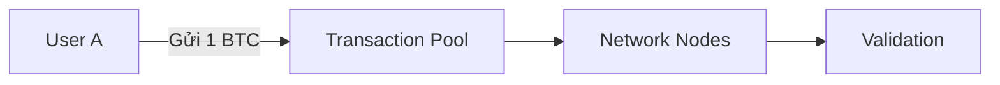
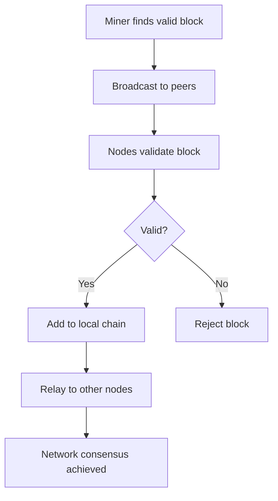

# ⚙️ Blockchain hoạt động như thế nào?

## 🎯 Mục tiêu bài học

Sau bài học này, bạn sẽ:
- Hiểu chi tiết cách blockchain hoạt động từng bước
- Nắm được quy trình xác thực giao dịch
- Hiểu cơ chế đồng thuận (consensus)
- Biết cách dữ liệu được lưu trữ và bảo mật

## 🔄 Quy trình hoạt động của Blockchain

### 1. Khởi tạo giao dịch (Transaction Initiation)



**Các bước:**
1. User A muốn gửi 1 BTC cho User B
2. Giao dịch được tạo với digital signature
3. Giao dịch được broadcast tới network
4. Giao dịch vào mempool (waiting queue)

### 2. Xác thực giao dịch (Transaction Validation)

**Kiểm tra:**
- ✅ Digital signature hợp lệ
- ✅ User A có đủ balance
- ✅ Transaction format đúng
- ✅ Không phải double spending

```javascript
// Ví dụ validation logic
function validateTransaction(tx) {
    if (!verifySignature(tx.signature, tx.data, tx.publicKey)) {
        return false;
    }
    if (getBalance(tx.from) < tx.amount) {
        return false;
    }
    return true;
}
```

### 3. Tạo block mới (Block Creation)

**Block structure:**
```
Block Header:
├── Previous Hash: 0x1a2b3c4d...
├── Merkle Root: 0x5e6f7g8h...
├── Timestamp: 1640995200
├── Difficulty: 20
├── Nonce: 123456789
└── Block Hash: 0x9i0j1k2l...

Block Body:
├── Transaction 1: A→B (1 BTC)
├── Transaction 2: C→D (0.5 BTC)
├── Transaction 3: E→F (2 BTC)
└── ... (up to ~2000 transactions)
```

### 4. Mining/Consensus Process

#### Proof of Work (Bitcoin)
```python
def mine_block(block):
    target = 2 ** (256 - difficulty)
    nonce = 0
    
    while True:
        block_data = f"{block.previous_hash}{block.merkle_root}{block.timestamp}{nonce}"
        hash_result = sha256(block_data)
        
        if int(hash_result, 16) < target:
            block.nonce = nonce
            block.hash = hash_result
            return block
        
        nonce += 1
```

#### Proof of Stake (Ethereum 2.0)
- Validators được chọn based on stake amount
- No energy-intensive mining
- Faster block times (12 seconds vs 10 minutes)

### 5. Block Propagation & Consensus



## 🔐 Bảo mật và Immutability

### 1. Cryptographic Hashing
```
Block 1: Hash = SHA256(Data1)
Block 2: Hash = SHA256(Block1.Hash + Data2)
Block 3: Hash = SHA256(Block2.Hash + Data3)
```

**Tính chất:**
- Deterministic: Cùng input → cùng output
- Avalanche effect: Thay đổi 1 bit → hoàn toàn khác
- Irreversible: Không thể tính ngược

### 2. Merkle Tree Structure
```
        Root Hash
       /          \
   Hash12        Hash34
   /    \        /    \
Hash1  Hash2  Hash3  Hash4
 |      |      |      |
Tx1   Tx2    Tx3    Tx4
```

**Lợi ích:**
- Efficient verification
- Tamper detection
- Reduced storage

### 3. Digital Signatures
```javascript
// Tạo giao dịch với signature
const transaction = {
    from: "1A2B3C...",
    to: "4D5E6F...",
    amount: 1.5,
    timestamp: Date.now()
};

const signature = sign(transaction, privateKey);
const isValid = verify(transaction, signature, publicKey);
```

## 🌐 Network Consensus

### 1. Longest Chain Rule
- Valid chain = chain with most cumulative work
- Forks are resolved automatically
- Prevents double spending

### 2. Consensus Algorithms Comparison

| Algorithm | Energy | Speed | Security | Decentralization |
|-----------|--------|-------|----------|------------------|
| PoW | High ⚡⚡⚡ | Slow 🐌 | High 🔒🔒🔒 | High 🌍🌍🌍 |
| PoS | Low ⚡ | Fast 🚀 | High 🔒🔒 | Medium 🌍🌍 |
| DPoS | Low ⚡ | Very Fast 🚀🚀 | Medium 🔒 | Low 🌍 |

## 💡 Ví dụ thực tế: Bitcoin Transaction

### Step by step:
1. **Alice** muốn gửi 0.1 BTC cho **Bob**
2. Alice tạo transaction với private key
3. Transaction được broadcast tới Bitcoin network
4. Miners collect transaction vào block candidate
5. Miners compete để solve PoW puzzle
6. Winner miner broadcasts solved block
7. Network validates và accepts block
8. Transaction confirmed sau 6 blocks (~1 hour)

### Transaction lifecycle:
```
Unconfirmed → Mempool → Block → 1 conf → 6 conf → Final
   (0s)       (vary)    (10m)    (20m)    (60m)    (100%)
```

## 🔍 Hands-on Exercise

### Bài tập 1: Hash Calculation
Tính SHA256 hash của string "Hello Blockchain":
```bash
echo -n "Hello Blockchain" | sha256sum
```

### Bài tập 2: Block Explorer
1. Truy cập https://blockchair.com/bitcoin
2. Tìm latest block
3. Analyze block structure
4. Follow một transaction

### Bài tập 3: Merkle Tree
Vẽ Merkle tree cho 8 transactions:
```
Tx1, Tx2, Tx3, Tx4, Tx5, Tx6, Tx7, Tx8
```

## 📝 Key Takeaways

1. **Blockchain = Distributed Database** với consensus mechanism
2. **Security** đạt được thông qua cryptography + decentralization
3. **Immutability** thanks to chaining và proof-of-work
4. **Transparency** vì mọi transaction đều public
5. **No single point of failure** vì distributed nature

## 🔗 Liên kết

- [[01-What-is-Blockchain]] - Khái niệm cơ bản
- [[03-Types-of-Blockchain]] - Các loại blockchain
- [[09-Hash-Functions]] - Chi tiết về hash functions
- [[12-Consensus-Mechanisms]] - Các cơ chế đồng thuận

## ✅ Checklist hoàn thành

- [ ] Hiểu quy trình tạo và xác thực giao dịch
- [ ] Nắm được cách tạo block và mining
- [ ] Hiểu Merkle tree structure
- [ ] Biết các consensus algorithms khác nhau
- [ ] Hoàn thành hands-on exercises
- [ ] Có thể giải thích blockchain workflow cho người khác

---

**Next:** [[03-Types-of-Blockchain]] - Tìm hiểu các loại blockchain khác nhau
