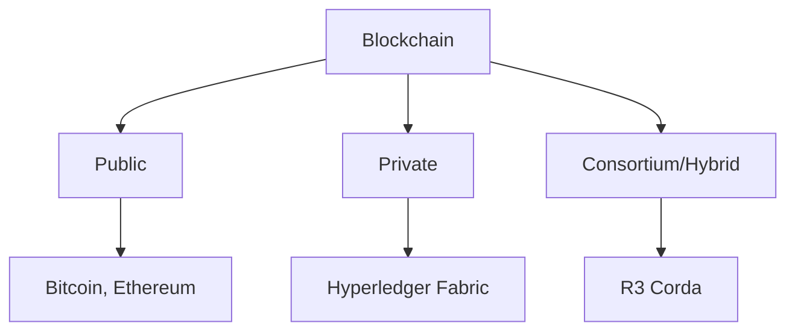

# 🏗️ Các loại Blockchain

## 🎯 Mục tiêu bài học

Sau bài học này, bạn sẽ:

- Phân biệt được các loại blockchain khác nhau
- Hiểu ưu nhược điểm của từng loại
- Biết khi nào nên sử dụng loại blockchain nào
- Nắm được các use cases thực tế

## 📊 Phân loại Blockchain

### Theo quyền truy cập (Access Permission)



## 🌍 1. Public Blockchain

### Đặc điểm:

- **Hoàn toàn mở**: Ai cũng có thể tham gia
- **Phi tập trung**: Không có authority trung tâm
- **Minh bạch**: Tất cả giao dịch đều công khai
- **Bất biến**: Rất khó thay đổi dữ liệu

### Ví dụ điển hình:

| Blockchain | Consensus | TPS | Use Case |
|-----------|-----------|-----|----------|
| Bitcoin | PoW | 7 | Digital currency |
| Ethereum | PoS | 15 | Smart contracts |
| Litecoin | PoW | 56 | Faster payments |
| Cardano | PoS | 1000 | Sustainable DApps |

### Ưu điểm:

- ✅ **Decentralization tối đa**: Không single point of failure
- ✅ **Security cao**: Nhiều nodes validate
- ✅ **Transparency**: Auditability tốt
- ✅ **Censorship resistance**: Không thể bị block

### Nhược điểm:

- ❌ **Scalability thấp**: TPS limited
- ❌ **Energy consumption**: Đặc biệt PoW
- ❌ **Transaction cost**: Gas fees cao
- ❌ **Governance khó**: Hard to upgrade

### Use Cases:

- Cryptocurrency và digital payments
- DeFi protocols
- NFT marketplaces
- Decentralized social networks

## 🏢 2. Private Blockchain

### Đặc điểm:

- **Controlled access**: Chỉ invited members
- **Tập trung hơn**: Organization quản lý
- **Permissioned**: Cần authorization
- **Faster**: Ít nodes = faster consensus

### Architecture:

```
┌─────────────┐    ┌─────────────┐    ┌─────────────┐
│   Node 1    │────│   Node 2    │────│   Node 3    │
│ (Authorized)│    │ (Authorized)│    │ (Authorized)│
└─────────────┘    └─────────────┘    └─────────────┘
       │                   │                   │
       └───────────────────┼───────────────────┘
                          │
                ┌─────────────┐
                │Central Admin│
                │  Authority  │
                └─────────────┘
```

### Ví dụ thực tế:

- **JPMorgan's JPM Coin**: Interbank transfers
- **Walmart's Food Traceability**: Supply chain tracking
- **Maersk's TradeLens**: Shipping logistics

### Ưu điểm:

- ✅ **High performance**: Faster transactions
- ✅ **Low cost**: Minimal mining/staking costs
- ✅ **Privacy**: Sensitive data protection
- ✅ **Compliance**: Easier regulatory compliance

### Nhược điểm:

- ❌ **Centralization**: Single point of control
- ❌ **Trust issues**: Requires trust in authority
- ❌ **Limited innovation**: Closed ecosystem
- ❌ **Vendor lock-in**: Dependency on provider

## 🤝 3. Consortium/Hybrid Blockchain

### Đặc điểm:

- **Semi-decentralized**: Controlled by group
- **Selected nodes**: Pre-approved validators
- **Faster than public**: But still secure
- **Shared control**: Multiple organizations

### Governance Model:

```
┌─────────────┐    ┌─────────────┐    ┌─────────────┐
│   Bank A    │    │   Bank B    │    │   Bank C    │
│ (Validator) │    │ (Validator) │    │ (Validator) │
└─────────────┘    └─────────────┘    └─────────────┘
       │                   │                   │
       └───────────────────┼───────────────────┘
                          │
                ┌─────────────┐
                │  Consortium │
                │ Governance  │
                └─────────────┘
```

### Real-world Examples:

#### R3 Corda (Banking)

- **Participants**: 200+ financial institutions
- **Use Case**: Trade finance, payments
- **Benefits**: Regulatory compliance + efficiency

#### Energy Web Chain (Energy Sector)

- **Participants**: Energy companies
- **Use Case**: Renewable energy trading
- **Consensus**: Proof of Authority (PoA)

### Ưu điểm:

- ✅ **Balance**: Decentralization + control
- ✅ **Efficiency**: Better than public
- ✅ **Trust**: Known participants
- ✅ **Compliance**: Industry-specific rules

### Nhược điểm:

- ❌ **Limited access**: Not truly open
- ❌ **Coordination complexity**: Multiple parties
- ❌ **Potential collusion**: Between consortium members

## 📋 So sánh chi tiết

| Aspect | Public | Private | Consortium |
|--------|--------|---------|------------|
| **Access** | Open to all | Restricted | Semi-restricted |
| **Control** | Distributed | Centralized | Shared |
| **Speed** | Slow (7-15 TPS) | Fast (1000+ TPS) | Medium (100-1000 TPS) |
| **Cost** | High | Low | Medium |
| **Security** | Very High | Medium | High |
| **Privacy** | Low | High | Medium-High |
| **Immutability** | Very High | Low | Medium |
| **Energy** | High (PoW) | Low | Low-Medium |

## 🎯 Choosing the Right Type

### Use Public When:

- Building global applications
- Need maximum decentralization
- Transparency is critical
- Creating tokens/cryptocurrencies

**Example**: DeFi protocol, NFT marketplace

### Use Private When:

- Internal business processes
- High privacy requirements
- Regulatory compliance needed
- Cost efficiency is priority

**Example**: Supply chain management, internal payments

### Use Consortium When:

- Industry-wide collaboration
- Shared infrastructure needs
- Partial decentralization desired
- Regulatory oversight required

**Example**: Banking networks, healthcare records

## 🔄 Emerging Trends

### 1. Interoperability Solutions

```
Public Chain A ←→ Bridge ←→ Private Chain B
      ↕                        ↕
 Consortium C ←→ Protocol ←→ Public Chain D
```

### 2. Layer 2 Solutions

- **State Channels**: Lightning Network
- **Sidechains**: Polygon, BSC
- **Rollups**: Optimism, Arbitrum

### 3. Permissioned DeFi

- Regulated DeFi protocols
- KYC/AML compliance
- Institutional adoption

## 💡 Hands-on Exercise

### Exercise 1: Network Analysis

Compare these networks:

1. **Bitcoin**: Public PoW blockchain
2. **Hyperledger Fabric**: Private permissioned
3. **Binance Smart Chain**: Consortium-like

**Tasks**:

- Analyze transaction speed
- Check validator count
- Review governance model

### Exercise 2: Use Case Mapping

For each scenario, choose blockchain type:

1. **Global remittance service** → ?
2. **Hospital patient records** → ?
3. **Interbank settlement** → ?
4. **Supply chain tracking** → ?

**Answers**:

1. Public (Bitcoin/stablecoins)
2. Private/Consortium (privacy needed)
3. Consortium (multiple banks)
4. Private/Consortium (business efficiency)

## 📚 Deep Dive Resources

### Technical Papers:

- [Hyperledger Fabric Architecture](https://hyperledger-fabric.readthedocs.io/)
- [R3 Corda Whitepaper](https://www.corda.net/whitepaper/)
- [Ethereum 2.0 Specifications](https://github.com/ethereum/eth2.0-specs)

### Tools to Explore:

- **Hyperledger Composer**: Business network modeling
- **Corda Enterprise**: Commercial blockchain platform
- **Quorum**: Enterprise Ethereum platform

## ✅ Key Takeaways

1. **No one-size-fits-all**: Each type serves different purposes
2. **Trade-offs**: Decentralization vs Performance vs Privacy
3. **Evolution**: Hybrid solutions are emerging
4. **Context matters**: Choose based on specific requirements
5. **Interoperability**: Future lies in connected blockchains

## 🔗 Navigation

- **Previous**: [[02-How-Blockchain-Works]] - Cách blockchain hoạt động
- **Next**: [[04-Blockchain-vs-Traditional-Database]] - So sánh với database truyền thống
- **Related**: [[12-Consensus-Mechanisms]] - Các cơ chế đồng thuận

## ✅ Progress Checklist

- [ ] Hiểu 3 loại blockchain chính
- [ ] Biết ưu nhược điểm của từng loại  
- [ ] Có thể chọn đúng type cho use case
- [ ] Hoàn thành exercises
- [ ] Khám phá tools thực tế

---

**Status**: ✅ Completed | **Next**: [[04-Blockchain-vs-Traditional-Database]]
