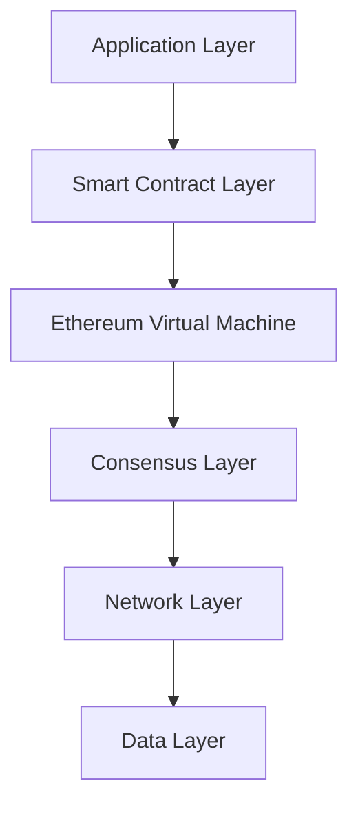
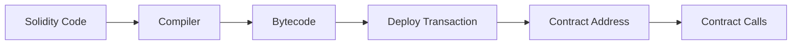

# 🏗️ Kiến trúc Ethereum

## 🎯 Mục tiêu bài học

Sau bài học này, bạn sẽ:

- Hiểu kiến trúc tổng thể của Ethereum
- Nắm được các thành phần chính của hệ thống
- Biết cách Ethereum khác biệt với Bitcoin
- Hiểu về Ethereum 2.0 và roadmap tương lai

## 🌍 Tổng quan về Ethereum

**Ethereum** là một nền tảng blockchain phân tán, open-source có thể thực thi smart contracts. Được gọi là "World Computer" vì khả năng chạy các ứng dụng phi tập trung (DApps).

### Điểm khác biệt chính với Bitcoin

| Aspect | Bitcoin | Ethereum |
|--------|---------|----------|
| **Purpose** | Digital currency | Programmable platform |
| **Script** | Limited scripting | Turing-complete |
| **Block time** | 10 minutes | 12 seconds |
| **Consensus** | PoW (SHA-256) | PoS (Casper) |
| **Supply** | 21M fixed | No hard cap |
| **Main use** | Store of value | Smart contracts, DApps |

## 🏗️ Kiến trúc Ethereum Stack

### Layer Structure



### 1. Data Layer (Tầng dữ liệu)

**Blockchain structure:**
```
Genesis Block → Block 1 → Block 2 → ... → Latest Block
```

**Block anatomy:**
```javascript
{
  "number": 18500000,
  "hash": "0x1a2b3c4d...",
  "parentHash": "0x5e6f7g8h...",
  "nonce": 12345,
  "timestamp": 1640995200,
  "gasLimit": 30000000,
  "gasUsed": 25000000,
  "transactions": [
    // Array of transactions
  ],
  "stateRoot": "0x9i0j1k2l...",
  "receiptsRoot": "0xmnop3456...",
  "logsBloom": "0x789..."
}
```

**State structure:**
- **Account state**: Balances, nonces, code
- **Storage state**: Smart contract data
- **Merkle Patricia Trie**: Efficient state verification

### 2. Network Layer (Tầng mạng)

**Node types:**

| Node Type | Function | Storage | Use Case |
|-----------|----------|---------|----------|
| **Full Node** | Complete validation | Full blockchain | Security, development |
| **Light Node** | Minimal validation | Headers only | Mobile, IoT |
| **Archive Node** | Historical data | Everything | Analytics, dApps |

**P2P networking:**
```
Node A ←→ Node B ←→ Node C
  ↕         ↕         ↕
Node D ←→ Node E ←→ Node F
```

**Communication protocols:**
- **devp2p**: Ethereum's networking stack
- **Discovery**: Finding peers
- **RLPx**: Encrypted transport
- **Wire protocol**: Block/transaction sync

### 3. Consensus Layer (Proof of Stake)

**Ethereum 2.0 architecture:**
```
┌─────────────────┐    ┌─────────────────┐
│  Beacon Chain   │    │  Shard Chain 1  │
│   (PoS coord)   │←──→│   (execution)   │
└─────────────────┘    └─────────────────┘
         ↕                       ↕
┌─────────────────┐    ┌─────────────────┐
│  Shard Chain 2  │    │  Shard Chain N  │
│   (execution)   │    │   (execution)   │
└─────────────────┘    └─────────────────┘
```

**Validator roles:**
- **Proposer**: Creates new blocks
- **Attester**: Validates proposed blocks  
- **Committee**: Random validator groups
- **Slasher**: Punishes malicious behavior

**Consensus process:**
```python
def consensus_round():
    # 1. Select random proposer
    proposer = select_validator_by_stake()
    
    # 2. Propose block
    block = proposer.create_block()
    
    # 3. Committee attestation
    committee = random.sample(validators, 128)
    attestations = [v.attest(block) for v in committee]
    
    # 4. Finalization (2/3 majority)
    if sum(attestations) >= 2/3 * len(committee):
        finalize_block(block)
```

### 4. Ethereum Virtual Machine (EVM)

**EVM characteristics:**
- **Stack-based**: 256-bit word size
- **Deterministic**: Same input = same output
- **Isolated**: No network/file system access
- **Gas-metered**: Every operation costs gas

**Execution model:**
```
Smart Contract Code → Bytecode → EVM → State Changes
```

**Memory areas:**
```javascript
// Stack: LIFO operations
PUSH 0x42    // Push value to stack
POP          // Remove top value

// Memory: Temporary storage
MSTORE 0x40, 0x123  // Store at memory position

// Storage: Permanent state
SSTORE 0x01, 0x456  // Store in contract storage
```

### 5. Smart Contract Layer

**Contract lifecycle:**


**Contract interaction:**
```javascript
// Contract deployment
const contract = await ContractFactory.deploy(
    constructorArgs,
    { gasLimit: 2000000 }
);

// Contract call
const result = await contract.methods.getValue().call();

// Contract transaction
await contract.methods.setValue(42).send({
    from: userAddress,
    gas: 100000
});
```

## ⚡ Ethereum 2.0 (The Merge & Beyond)

### The Merge (September 2022)

**What changed:**
```
Ethereum 1.0 (PoW) + Beacon Chain (PoS) = Ethereum 2.0 (PoS)
```

**Benefits:**
- ✅ 99.95% energy reduction
- ✅ Enhanced security
- ✅ Foundation for sharding
- ✅ Deflation pressure (EIP-1559 + staking)

### Roadmap phases

**The Surge (Sharding):**
```
Current: 15 TPS
Target: 100,000+ TPS across all shards
```

**The Verge (Verkle Trees):**
- Stateless clients
- Faster sync times
- Reduced storage requirements

**The Purge (Historical cleanup):**
- Remove old data
- Reduce node requirements
- Improve efficiency

**The Splurge (Everything else):**
- Account abstraction
- EVM improvements
- Research initiatives

## 🔧 Core Components Deep Dive

### 1. Accounts

**Two types:**

**Externally Owned Accounts (EOA):**
```javascript
{
  "address": "0x742d35cc6cf2532b7b8b3d5d8...",
  "balance": "1000000000000000000", // 1 ETH in wei
  "nonce": 42,                       // Transaction count
  "codeHash": "0x",                  // Empty for EOA
  "storageRoot": "0x"                // Empty for EOA
}
```

**Contract Accounts:**
```javascript
{
  "address": "0x1f9840a85d5af5bf1d1762f925bd...",
  "balance": "500000000000000000",    // 0.5 ETH
  "nonce": 1,                        // Always 1 for contracts
  "codeHash": "0xa94f5374fce5edbc...", // Contract bytecode hash
  "storageRoot": "0xb48e775..."      // Merkle root of storage
}
```

### 2. Transactions

**Transaction types (EIP-2718):**

**Type 0 (Legacy):**
```javascript
{
  "to": "0x...",
  "value": "1000000000000000000",
  "gas": 21000,
  "gasPrice": "20000000000",  // 20 gwei
  "data": "0x",
  "nonce": 0
}
```

**Type 2 (EIP-1559):**
```javascript
{
  "to": "0x...",
  "value": "1000000000000000000",
  "gas": 21000,
  "maxFeePerGas": "30000000000",      // 30 gwei
  "maxPriorityFeePerGas": "2000000000", // 2 gwei tip
  "data": "0x",
  "nonce": 0
}
```

### 3. Gas System

**Gas calculation:**
```javascript
// Simple transfer
baseFee = 20 gwei
priorityFee = 2 gwei
gasUsed = 21000
totalCost = (baseFee + priorityFee) * gasUsed
totalCost = (20 + 2) * 21000 = 462,000 gwei = 0.000462 ETH
```

**Dynamic fee market (EIP-1559):**
```python
def calculate_base_fee(parent_gas_used, parent_gas_limit, parent_base_fee):
    gas_target = parent_gas_limit // 2
    
    if parent_gas_used == gas_target:
        return parent_base_fee
    elif parent_gas_used > gas_target:
        # Increase base fee
        delta = parent_base_fee * (parent_gas_used - gas_target) // gas_target // 8
        return parent_base_fee + max(delta, 1)
    else:
        # Decrease base fee  
        delta = parent_base_fee * (gas_target - parent_gas_used) // gas_target // 8
        return parent_base_fee - delta
```

## 🌐 Network Topology

### Mainnet vs Testnets

**Production networks:**
- **Mainnet**: Real ETH, live environment
- **L2 networks**: Polygon, Arbitrum, Optimism

**Test networks:**
```
Goerli   → General testing (deprecated)
Sepolia  → Current primary testnet
Holesky  → Validator testing
```

### Client diversity

**Execution clients:**
- **Geth**: Go implementation (most popular)
- **Nethermind**: C# implementation  
- **Erigon**: Go implementation (archive-focused)
- **Besu**: Java implementation (enterprise)

**Consensus clients:**
- **Prysm**: Go implementation
- **Lighthouse**: Rust implementation
- **Teku**: Java implementation
- **Nimbus**: Nim implementation

## 🔍 Hands-on Exercise

### Exercise 1: Network Exploration

**Tasks:**
1. Visit etherscan.io
2. Examine latest block structure
3. Find largest transaction in recent blocks
4. Check current gas prices

### Exercise 2: Node Setup

**Run local node:**
```bash
# Install Geth
brew install ethereum

# Start development node
geth --dev --http --http.api eth,web3,personal

# Connect via web3
npm install web3
```

```javascript
const Web3 = require('web3');
const web3 = new Web3('http://localhost:8545');

// Check connection
console.log(await web3.eth.getBlockNumber());
```

### Exercise 3: Account Analysis

**Analyze account:**
1. Pick random Ethereum address
2. Check balance and transaction history
3. Identify if EOA or contract
4. Trace recent transactions

## 📊 Performance Metrics

### Current Ethereum Stats

| Metric | Value |
|--------|-------|
| **Block time** | ~12 seconds |
| **TPS** | 15 transactions/second |
| **Block size** | ~30KB average |
| **Gas limit** | 30M gas per block |
| **Total supply** | ~120M ETH |
| **Validator count** | 900,000+ |

### Scaling comparison

```
Ethereum 1.0: 15 TPS
Ethereum 2.0 (sharding): 100,000+ TPS
Visa network: 65,000 TPS
```

## 🔮 Future Developments

### Proto-Danksharding (EIP-4844)

**Blob transactions:**
- Temporary data storage
- 10-100x cheaper L2 costs
- Bridge to full sharding

### Account Abstraction (EIP-4337)

**Benefits:**
- Smart contract wallets as standard
- Social recovery mechanisms
- Gasless transactions (meta-transactions)
- Custom validation logic

### Verkle Trees

**Improvements:**
- Smaller proof sizes
- Stateless client possibility
- Faster sync times

## ✅ Key Takeaways

1. **Ethereum = World Computer** with programmable money
2. **Layered architecture** enables complex applications
3. **EVM provides deterministic** smart contract execution
4. **Proof of Stake** makes network more sustainable
5. **Roadmap focuses** on scalability and user experience
6. **Client diversity** strengthens network security

## 🔗 Navigation

- **Previous**: [[05-What-is-Cryptocurrency]] - Cryptocurrency basics
- **Next**: [[02-EVM-Ethereum-Virtual-Machine]] - EVM deep dive
- **Related**: [[06-Solidity-Basics]] - Smart contract programming

## ✅ Progress Checklist

- [ ] Hiểu kiến trúc tổng thể của Ethereum
- [ ] Nắm được sự khác biệt với Bitcoin
- [ ] Biết về Ethereum 2.0 roadmap
- [ ] Setup và interact với Ethereum node
- [ ] Phân tích accounts và transactions trên Etherscan

---

**Status**: ✅ Completed | **Next**: [[02-EVM-Ethereum-Virtual-Machine]]
