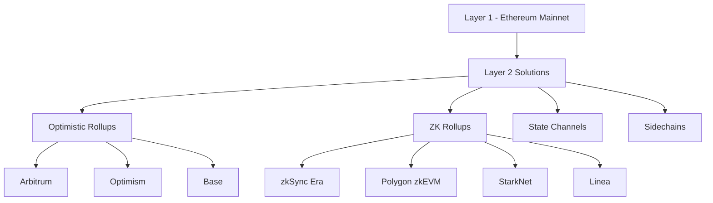
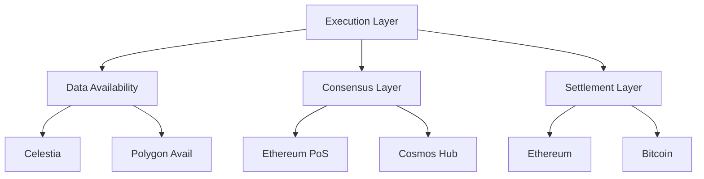

# 🚀 Layer 2 Solutions - The Future of Blockchain Scaling

## 🎯 Tổng quan

Layer 2 solutions là các giao thức scaling được xây dựng trên Layer 1 blockchains để cải thiện tốc độ, giảm phí giao dịch và tăng khả năng mở rộng.

## 🏗️ Kiến trúc Layer 2



## 🎪 Các loại Layer 2 Solutions

### 1. Optimistic Rollups

**Nguyên lý hoạt động:**
- Giả định tất cả giao dịch đều hợp lệ
- Sử dụng fraud proofs để phát hiện giao dịch sai
- Thời gian challenge period (7 ngày)

**Ưu điểm:**
```javascript
const optimisticRollups = {
  pros: [
    "EVM compatibility cao",
    "Dễ migrate từ Ethereum",
    "Chi phí phát triển thấp",
    "Hỗ trợ smart contracts phức tạp"
  ],
  cons: [
    "Withdrawal delay (7 ngày)",
    "Cần fraud proofs",
    "Bảo mật phụ thuộc vào watchers"
  ]
}
```

**Top Optimistic Rollups 2025:**

#### Arbitrum One
- **TVL**: $2.5B+ (2025)
- **TPS**: 40,000+
- **Ecosystem**: 600+ dApps
- **Notable projects**: Uniswap, SushiSwap, Curve

```javascript
// Arbitrum deployment example
const arbitrumConfig = {
  chainId: 42161,
  name: 'Arbitrum One',
  rpcUrl: 'https://arb1.arbitrum.io/rpc',
  blockExplorer: 'https://arbiscan.io',
  nativeCurrency: {
    name: 'Ether',
    symbol: 'ETH',
    decimals: 18
  }
}
```

#### Optimism
- **Superchain vision**: Chia sẻ bảo mật giữa các chains
- **OP Stack**: Modular framework cho rollups
- **RetroPGF**: Retroactive public goods funding

```solidity
// Deploy contract trên Optimism
contract OptimismExample {
    // L1 <-> L2 messaging
    address constant L2_CROSS_DOMAIN_MESSENGER = 0x4200000000000000000000000000000000000007;
    
    function sendMessageToL1(bytes memory _message) public {
        IL2CrossDomainMessenger(L2_CROSS_DOMAIN_MESSENGER).sendMessage(
            targetL1Contract,
            _message,
            1000000 // gas limit
        );
    }
}
```

#### Base (Coinbase)
- **Backing**: Coinbase ecosystem
- **Developer-friendly**: Gasless transactions
- **Mass adoption focus**: Consumer applications

### 2. ZK Rollups (Zero-Knowledge) - 2025 Update

**Nguyên lý hoạt động:**
- Sử dụng **validity proofs** (ZK proofs) thay vì fraud proofs
- **Instant finality** khi proof được verify trên L1
- **Cryptographic security** thay vì economic security

**Major ZK Rollups 2025:**

#### zkSync Era
```javascript
const zkSyncMetrics = {
  tps: "2000+",
  avgCost: "$0.05-0.15",
  finality: "~10 minutes (proof generation)",
  features: [
    "Account Abstraction native",
    "EVM compatible",
    "Native paymaster support"
  ]
}
```

#### StarkNet (Cairo VM)
```rust
// Cairo smart contract example
#[starknet::contract]
mod Counter {
    #[storage]
    struct Storage {
        counter: u128,
    }

    #[external(v0)]
    fn increase_counter(ref self: ContractState) {
        self.counter.write(self.counter.read() + 1);
    }
}
```

#### Polygon zkEVM
```solidity
// Full EVM compatibility
contract PolygonZkExample {
    mapping(address => uint256) public balances;
    
    function deposit() public payable {
        balances[msg.sender] += msg.value;
        // Works exactly like Ethereum
    }
}
```

**Technical comparison 2025:**
```python
def compare_rollup_types_2025():
    return {
        "optimistic": {
            "finality": "7 days (fraud proofs)",
            "gas_cost": "Lower proof generation",
            "computation": "Native EVM",
            "security": "Economic incentives",
            "tps": "2000-4000"
        },
        "zk": {
            "finality": "Instant (validity proofs)",
            "gas_cost": "Higher proof generation, lower verification",
            "computation": "VM (Cairo/zkEVM)",
            "security": "Cryptographic guarantees", 
            "tps": "2000-9000+",
            "privacy": "Enhanced through ZK"
        }
    }
            "gas_cost": "Higher (proof generation)",
            "computation": "zkEVM or custom VM",
            "security": "Cryptographic guarantees"
        }
    }
```

#### zkSync Era
- **zkEVM**: Fully EVM-compatible
- **Account Abstraction**: Native support
- **Paymaster**: Gasless transactions

```javascript
// zkSync Era features
const zkSyncFeatures = {
  accountAbstraction: {
    multiSig: "Built-in multisig wallets",
    socialRecovery: "Social recovery mechanisms",
    gasless: "Paymaster pays gas fees"
  },
  
  paymaster: {
    function: "Third party pays gas",
    useCases: ["Free trials", "Enterprise onboarding", "Better UX"]
  }
}

// Paymaster contract example
contract Paymaster {
    function validateAndPayForPaymasterTransaction(
        bytes32 _txHash,
        bytes32 _suggestedSignedHash,
        Transaction calldata _transaction
    ) external payable returns (bytes4 magic, bytes memory context) {
        // Validate transaction
        require(_transaction.paymasterInput.length >= 4, "Invalid input");
        
        // Pay for gas
        uint256 requiredETH = _transaction.gasLimit * _transaction.maxFeePerGas;
        require(address(this).balance >= requiredETH, "Insufficient balance");
        
        return (PAYMASTER_VALIDATION_SUCCESS_MAGIC, "");
    }
}
```

#### Polygon zkEVM
- **Type 2 zkEVM**: Ethereum-equivalent
- **Decentralized sequencer**: Multi-party sequencing
- **Bridge security**: Multiple proof systems

#### StarkNet
- **Cairo language**: Custom smart contract language
- **STARK proofs**: Quantum-resistant
- **Native Account Abstraction**

```rust
// Cairo contract example (StarkNet)
#[starknet::contract]
mod SimpleStorage {
    #[storage]
    struct Storage {
        stored_data: u256,
    }

    #[external(v0)]
    impl SimpleStorageImpl of super::ISimpleStorage<ContractState> {
        fn set(ref self: ContractState, x: u256) {
            self.stored_data.write(x);
        }

        fn get(self: @ContractState) -> u256 {
            self.stored_data.read()
        }
    }
}
```

### 3. Sidechains

#### Polygon PoS
- **Validators**: 100+ validators
- **Checkpoints**: Committed to Ethereum every ~30 minutes
- **Enterprise adoption**: Major brands integration

```javascript
// Polygon bridge example
const polygonBridge = {
  deposit: async (token, amount) => {
    const tx = await rootChainManager.depositFor(
      userAddress,
      token,
      amount
    );
    return tx;
  },
  
  withdraw: async (burnTxHash) => {
    // 1. Burn on Polygon
    // 2. Generate proof
    // 3. Exit on Ethereum
    const proof = await generateProof(burnTxHash);
    const tx = await rootChainManager.exit(proof);
    return tx;
  }
}
```

## 🔧 Development Tools cho Layer 2

### 1. Cross-chain Development

```javascript
// Layerzero integration (omnichain)
contract OmniChainContract {
    using BytesLib for bytes;
    
    function sendMessage(
        uint16 _dstChainId,
        bytes memory _payload
    ) public payable {
        _lzSend(
            _dstChainId,
            _payload,
            payable(msg.sender),
            address(0),
            bytes("")
        );
    }
    
    function _nonblockingLzReceive(
        uint16 _srcChainId,
        bytes memory _srcAddress,
        uint64 _nonce,
        bytes memory _payload
    ) internal virtual override {
        // Handle cross-chain message
        processMessage(_payload);
    }
}
```

### 2. Multichain Deployment Scripts

```javascript
// Hardhat deployment cho multiple L2s
const deployToL2s = async () => {
  const networks = ['arbitrum', 'optimism', 'polygon', 'base'];
  
  for (const network of networks) {
    console.log(`Deploying to ${network}...`);
    
    await hre.changeNetwork(network);
    const contract = await ethers.deployContract("MyContract");
    await contract.waitForDeployment();
    
    console.log(`Deployed to ${network}: ${contract.target}`);
    
    // Verify contract
    await hre.run("verify:verify", {
      address: contract.target,
      constructorArguments: []
    });
  }
}
```

## 📊 Layer 2 Performance Comparison (2025)

| Network | Type | TPS | Avg Fee | TVL | Ecosystem |
|---------|------|-----|---------|-----|-----------|
| **Arbitrum** | Optimistic | 40,000+ | $0.1-0.5 | $2.5B+ | 600+ dApps |
| **Optimism** | Optimistic | 2,000 | $0.1-0.3 | $1.8B+ | 400+ dApps |
| **Base** | Optimistic | 1,000 | $0.05-0.2 | $1.2B+ | 200+ dApps |
| **zkSync Era** | ZK Rollup | 2,000+ | $0.05-0.15 | $800M+ | 150+ dApps |
| **Polygon zkEVM** | ZK Rollup | 1,000 | $0.01-0.05 | $600M+ | 100+ dApps |
| **StarkNet** | ZK Rollup | 1,000 | $0.002-0.01 | $400M+ | 80+ dApps |

## 🌐 Use Cases thực tế

### 1. DeFi on Layer 2

```javascript
// Uniswap V3 trên Arbitrum
const uniswapL2 = {
  benefits: [
    "Gas fee: $0.1 vs $20 on mainnet",
    "Faster transactions: 1-2s vs 15s",
    "Same security as Ethereum",
    "Full composability"
  ],
  
  volume: {
    daily: "$100M+",
    protocols: ["Uniswap", "Curve", "Balancer", "GMX"]
  }
}
```

### 2. Gaming & NFTs

```javascript
// Gaming on Polygon
const gameFeatures = {
  fastTransactions: "Sub-second confirmations",
  lowFees: "$0.001 per transaction",
  massAdoption: "Millions of daily transactions",
  examples: ["Axie Infinity", "The Sandbox", "Decentraland"]
}
```

### 3. Payments & Consumer Apps

```javascript
// Base ecosystem for consumer apps
const consumerApps = {
  onboarding: "Gasless transactions",
  integration: "Coinbase ecosystem",
  fiat: "Easy fiat on/off ramps",
  examples: ["Friend.tech", "Farcaster", "Coinbase Wallet"]
}
```

## 🔮 Future Trends 2025

### 1. Modular Blockchain Architecture



### 2. Interoperability Protocols

```javascript
const interopProtocols = {
  layerzero: "Omnichain applications",
  chainlink: "Cross-chain messaging",
  axelar: "Universal web3 layer",
  wormhole: "Generic message passing"
}
```

### 3. Layer 3 Applications

```javascript
// Application-specific Layer 3
contract GameL3 {
    // Game logic runs on L3
    // Settles to L2 (Arbitrum/Optimism)
    // Final security from L1 (Ethereum)
    
    function processGameTurn(uint256 gameId, bytes memory moves) external {
        // Ultra-fast game state updates
        updateGameState(gameId, moves);
        
        // Batch settle to L2 every 100 turns
        if (turnCount % 100 == 0) {
            settleToL2(gameId);
        }
    }
}
```

## 🛠️ Hands-on Exercise

### Exercise 1: Deploy Multi-chain Contract

```bash
# Setup
npm install @nomiclabs/hardhat-etherscan
npm install @layerzerolabs/solidity-examples

# Deploy script
npx hardhat run scripts/deploy-multichain.js --network arbitrum
npx hardhat run scripts/deploy-multichain.js --network optimism
npx hardhat run scripts/deploy-multichain.js --network base
```

### Exercise 2: Cross-chain Bridge

```solidity
// Simple bridge contract
contract SimpleBridge {
    mapping(uint256 => bool) public processedNonces;
    
    event Deposit(address user, uint256 amount, uint256 nonce);
    event Withdraw(address user, uint256 amount, uint256 nonce);
    
    function deposit(uint256 amount, uint256 targetChain) external {
        token.transferFrom(msg.sender, address(this), amount);
        emit Deposit(msg.sender, amount, nonce++);
    }
    
    function withdraw(
        address user,
        uint256 amount,
        uint256 nonce,
        bytes memory signature
    ) external {
        require(!processedNonces[nonce], "Already processed");
        require(verifySignature(user, amount, nonce, signature), "Invalid signature");
        
        processedNonces[nonce] = true;
        token.transfer(user, amount);
        emit Withdraw(user, amount, nonce);
    }
}
```

## 🔍 Security Considerations

### 1. Bridge Risks

```javascript
const bridgeRisks = {
  smartContract: "Code vulnerabilities",
  centralization: "Trusted validators/relayers", 
  liquidity: "Insufficient funds on target chain",
  regulatory: "Compliance across jurisdictions"
}
```

### 2. Best Practices

```solidity
contract SecureL2Contract {
    // 1. Use established bridges
    address constant OFFICIAL_BRIDGE = 0x...;
    
    // 2. Implement timelock for critical functions
    uint256 constant TIMELOCK_DELAY = 2 days;
    
    // 3. Emergency pause mechanism
    bool public paused = false;
    
    modifier whenNotPaused() {
        require(!paused, "Contract is paused");
        _;
    }
    
    // 4. Validate cross-chain messages
    function processL1Message(bytes memory data) external {
        require(msg.sender == OFFICIAL_BRIDGE, "Unauthorized");
        // Process message
    }
}
```

## 📚 Resources & Tools

### Essential Tools:
- **Chainlist**: Network configurations
- **L2Beat**: Analytics và security scores
- **DeFiLlama**: Cross-chain TVL tracking
- **Orbiter Finance**: L2 bridge aggregator

### Developer Resources:
- **Arbitrum Docs**: https://docs.arbitrum.io/
- **Optimism Docs**: https://docs.optimism.io/
- **zkSync Docs**: https://docs.zksync.io/
- **Polygon Docs**: https://docs.polygon.technology/

## ✅ Key Takeaways

1. **Layer 2 = Essential**: Không thể phát triển dApp hiệu quả mà không hiểu L2
2. **Choose wisely**: Mỗi L2 có trade-offs riêng về bảo mật, tốc độ, chi phí
3. **Multichain future**: Apps sẽ deploy trên nhiều L2s đồng thời
4. **ZK Rollups trending**: Xu hướng chuyển từ Optimistic sang ZK
5. **Account Abstraction**: Cải thiện UX massive cho mainstream adoption

**Next**: [[08-Account-Abstraction]] - Tương lai của wallet experience
