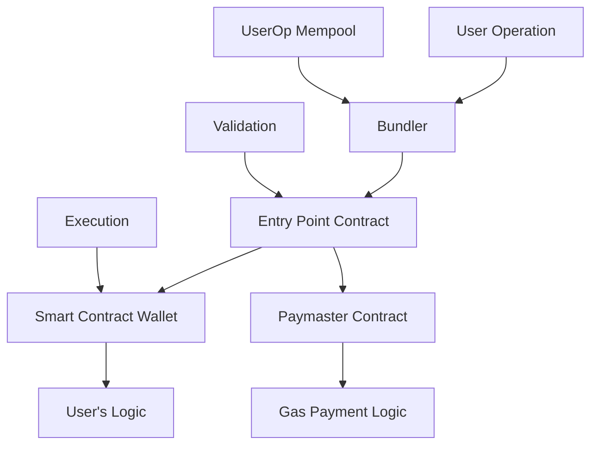

# 🤖 Account Abstraction (EIP-4337) - Tương lai của Wallet

## 🎯 Tổng quan

Account Abstraction là công nghệ cho phép smart contracts hoạt động như user accounts, mở ra khả năng tạo ra wallet experience linh hoạt và thân thiện với người dùng hơn.

## 🏗️ Kiến trúc Account Abstraction



## 🔧 Core Components

### 1. Smart Contract Accounts

```solidity
// Base Smart Contract Account
contract SmartAccount {
    address public owner;
    uint256 public nonce;
    
    mapping(address => bool) public guardians;
    mapping(bytes32 => bool) public approvedHashes;
    
    // EIP-4337 required functions
    function validateUserOp(
        UserOperation calldata userOp,
        bytes32 userOpHash,
        uint256 missingAccountFunds
    ) external returns (uint256 validationData) {
        // Validate signature
        require(validateSignature(userOp, userOpHash), "Invalid signature");
        
        // Pay for gas if needed
        if (missingAccountFunds > 0) {
            (bool success,) = payable(msg.sender).call{value: missingAccountFunds}("");
            require(success, "Payment failed");
        }
        
        return 0; // Success
    }
    
    // Custom validation logic
    function validateSignature(
        UserOperation calldata userOp,
        bytes32 userOpHash
    ) internal view returns (bool) {
        // Multi-sig validation
        if (guardians[ecrecover(userOpHash, userOp.signature)]) {
            return true;
        }
        
        // Owner validation
        return owner == ecrecover(userOpHash, userOp.signature);
    }
}
```

### 2. Paymaster Contracts

```solidity
// Gas Sponsorship Paymaster
contract SponsorshipPaymaster {
    address public owner;
    mapping(address => bool) public sponsoredContracts;
    mapping(address => uint256) public sponsorshipLimits;
    
    function validatePaymasterUserOp(
        UserOperation calldata userOp,
        bytes32 userOpHash,
        uint256 maxCost
    ) external view returns (bytes memory context, uint256 validationData) {
        // Check if this contract/user is sponsored
        address target = address(bytes20(userOp.callData[4:24]));
        require(sponsoredContracts[target], "Not sponsored");
        
        // Check spending limits
        require(maxCost <= sponsorshipLimits[userOp.sender], "Exceeds limit");
        
        return (abi.encode(userOp.sender, maxCost), 0);
    }
    
    function postOp(
        PostOpMode mode,
        bytes calldata context,
        uint256 actualGasCost
    ) external {
        if (mode == PostOpMode.opSucceeded) {
            (address user, uint256 maxCost) = abi.decode(context, (address, uint256));
            sponsorshipLimits[user] -= actualGasCost;
        }
    }
}
```

### 3. Bundler Implementation

```javascript
// Simplified Bundler logic
class Bundler {
    constructor(entryPoint, signer) {
        this.entryPoint = entryPoint;
        this.signer = signer;
        this.mempoolOps = [];
    }
    
    async addUserOperation(userOp) {
        // Validate UserOp
        const valid = await this.validateUserOp(userOp);
        if (!valid) throw new Error("Invalid UserOp");
        
        // Add to mempool
        this.mempoolOps.push(userOp);
        
        // Bundle if enough ops
        if (this.mempoolOps.length >= 10) {
            await this.bundleOperations();
        }
    }
    
    async bundleOperations() {
        const ops = this.mempoolOps.splice(0, 10);
        
        // Create bundle transaction
        const tx = await this.entryPoint.handleOps(ops, this.signer.address);
        
        // Submit to blockchain
        const receipt = await this.signer.sendTransaction(tx);
        console.log(`Bundle submitted: ${receipt.hash}`);
    }
    
    async validateUserOp(userOp) {
        try {
            await this.entryPoint.simulateValidation(userOp);
            return true;
        } catch (error) {
            console.log("Validation failed:", error);
            return false;
        }
    }
}
```

## 🎪 Advanced Features

### 1. Social Recovery

```solidity
contract SocialRecoveryWallet {
    address public owner;
    address[] public guardians;
    uint256 public threshold;
    
    mapping(address => bool) public isGuardian;
    mapping(bytes32 => uint256) public recoveryRequests;
    mapping(bytes32 => mapping(address => bool)) public approvals;
    
    struct RecoveryRequest {
        address newOwner;
        uint256 timestamp;
        uint256 approvalCount;
    }
    
    function requestRecovery(address newOwner) external {
        require(isGuardian[msg.sender], "Not a guardian");
        
        bytes32 requestId = keccak256(abi.encodePacked(newOwner, block.timestamp));
        recoveryRequests[requestId] = block.timestamp;
        approvals[requestId][msg.sender] = true;
        
        emit RecoveryRequested(newOwner, requestId);
    }
    
    function approveRecovery(bytes32 requestId) external {
        require(isGuardian[msg.sender], "Not a guardian");
        require(!approvals[requestId][msg.sender], "Already approved");
        
        approvals[requestId][msg.sender] = true;
        uint256 approvalCount = countApprovals(requestId);
        
        if (approvalCount >= threshold) {
            executeRecovery(requestId);
        }
    }
    
    function executeRecovery(bytes32 requestId) internal {
        require(
            block.timestamp >= recoveryRequests[requestId] + 2 days,
            "Recovery delay not met"
        );
        
        // Change owner
        address newOwner = extractNewOwner(requestId);
        owner = newOwner;
        
        emit OwnerRecovered(newOwner);
    }
}
```

### 2. Session Keys

```solidity
contract SessionKeyWallet {
    struct SessionKey {
        address key;
        uint256 validUntil;
        uint256 limit;
        uint256 spent;
        bytes4[] allowedSelectors;
    }
    
    mapping(address => SessionKey) public sessionKeys;
    
    function createSessionKey(
        address sessionKey,
        uint256 duration,
        uint256 spendingLimit,
        bytes4[] memory allowedSelectors
    ) external onlyOwner {
        sessionKeys[sessionKey] = SessionKey({
            key: sessionKey,
            validUntil: block.timestamp + duration,
            limit: spendingLimit,
            spent: 0,
            allowedSelectors: allowedSelectors
        });
    }
    
    function validateUserOp(
        UserOperation calldata userOp,
        bytes32 userOpHash,
        uint256 missingAccountFunds
    ) external override returns (uint256 validationData) {
        address signer = ecrecover(userOpHash, userOp.signature);
        
        // Check if session key
        if (sessionKeys[signer].validUntil > block.timestamp) {
            return validateSessionKey(signer, userOp);
        }
        
        // Check if owner
        if (signer == owner) {
            return 0; // Valid
        }
        
        return 1; // Invalid
    }
    
    function validateSessionKey(
        address sessionKey,
        UserOperation calldata userOp
    ) internal returns (uint256) {
        SessionKey storage session = sessionKeys[sessionKey];
        
        // Check expiry
        if (session.validUntil <= block.timestamp) {
            return 1; // Expired
        }
        
        // Check spending limit
        uint256 cost = userOp.maxFeePerGas * userOp.gasLimit;
        if (session.spent + cost > session.limit) {
            return 1; // Exceeds limit
        }
        
        // Check allowed functions
        bytes4 selector = bytes4(userOp.callData[:4]);
        bool selectorAllowed = false;
        for (uint i = 0; i < session.allowedSelectors.length; i++) {
            if (session.allowedSelectors[i] == selector) {
                selectorAllowed = true;
                break;
            }
        }
        
        if (!selectorAllowed) {
            return 1; // Function not allowed
        }
        
        // Update spending
        session.spent += cost;
        return 0; // Valid
    }
}
```

### 3. Batch Transactions

```solidity
contract BatchExecutionWallet {
    struct Call {
        address target;
        uint256 value;
        bytes data;
    }
    
    function executeBatch(Call[] calldata calls) external onlyOwner {
        for (uint256 i = 0; i < calls.length; i++) {
            (bool success, bytes memory result) = calls[i].target.call{
                value: calls[i].value
            }(calls[i].data);
            
            if (!success) {
                assembly {
                    revert(add(result, 32), mload(result))
                }
            }
        }
    }
    
    // EIP-4337 batch execution
    function validateUserOp(
        UserOperation calldata userOp,
        bytes32 userOpHash,
        uint256 missingAccountFunds
    ) external override returns (uint256 validationData) {
        // Validate signature
        require(validateSignature(userOp, userOpHash), "Invalid signature");
        
        // Handle batch execution in callData
        if (bytes4(userOp.callData[:4]) == this.executeBatch.selector) {
            Call[] memory calls = abi.decode(userOp.callData[4:], (Call[]));
            // Additional validation for batch calls
            validateBatchCalls(calls);
        }
        
        return 0;
    }
}
```

## 🌐 Real-world Implementations

### 1. zkSync Era Native AA

```javascript
// zkSync Era Account Abstraction
const zkSyncAAExample = {
  deployment: async () => {
    // Deploy factory contract
    const factory = await deployer.deploy("AccountFactory");
    
    // Create account
    const salt = ethers.utils.randomBytes(32);
    const account = await factory.deployAccount(salt, owner.address);
    
    return account;
  },
  
  paymasterIntegration: {
    gasless: async (userOp) => {
      // Paymaster covers gas
      userOp.paymasterAndData = paymasterContract.address;
      return userOp;
    },
    
    tokenPayment: async (userOp, token) => {
      // Pay gas with ERC20 tokens
      const paymasterData = ethers.utils.defaultAbiCoder.encode(
        ['address', 'uint256'],
        [token, amount]
      );
      userOp.paymasterAndData = paymasterContract.address + paymasterData.slice(2);
      return userOp;
    }
  }
}
```

### 2. Biconomy Smart Accounts

```javascript
// Biconomy SDK integration
import { BiconomySmartAccount } from "@biconomy/account";

const smartAccount = new BiconomySmartAccount({
  signer: signer,
  chainId: 137, // Polygon
  bundlerUrl: "https://bundler.biconomy.io/api/v2/137/xyz",
  paymasterUrl: "https://paymaster.biconomy.io/api/v1/137/xyz"
});

// Gasless transaction
const tx = {
  to: contractAddress,
  data: contractInterface.encodeFunctionData("transfer", [to, amount])
};

const userOp = await smartAccount.buildUserOp([tx]);
const userOpResponse = await smartAccount.sendUserOp(userOp);
```

### 3. Safe (Gnosis) Smart Accounts

```javascript
// Safe Account Factory
const safeFactory = new SafeFactory({
  ethAdapter: ethers,
  safeVersion: '1.4.1'
});

const safeSdk = await safeFactory.deploySafe({
  safeAccountConfig: {
    owners: [owner1, owner2, owner3],
    threshold: 2, // 2-of-3 multisig
  }
});

// Create and execute transaction
const transaction = {
  to: tokenContract.address,
  data: tokenContract.interface.encodeFunctionData("transfer", [recipient, amount]),
  value: "0"
};

const safeTx = await safeSdk.createTransaction({ safeTransactionData: transaction });
const signedTx = await safeSdk.signTransaction(safeTx);
const executeTxResponse = await safeSdk.executeTransaction(signedTx);
```

## 🔮 Use Cases & Benefits

### 1. Improved User Experience

```javascript
const uxImprovements = {
  onboarding: {
    traditional: [
      "Install wallet extension",
      "Write down seed phrase", 
      "Buy ETH for gas",
      "Navigate complex UI"
    ],
    aa: [
      "Sign up with email/social",
      "Biometric authentication",
      "Gasless transactions",
      "App-like experience"
    ]
  },
  
  recovery: {
    traditional: "Lose seed phrase = lose funds",
    aa: "Social recovery + guardians"
  },
  
  payments: {
    traditional: "Need ETH for every transaction",
    aa: "Pay gas with any token or sponsor"
  }
}
```

### 2. Enterprise Applications

```solidity
// Enterprise Multi-sig with Compliance
contract EnterpriseWallet {
    struct Transaction {
        address to;
        uint256 value;
        bytes data;
        bool executed;
        uint256 confirmations;
    }
    
    mapping(uint => Transaction) public transactions;
    mapping(uint => mapping(address => bool)) public confirmations;
    mapping(address => bool) public isOwner;
    mapping(address => bool) public isCompliant; // KYC/AML status
    
    uint public required;
    uint public transactionCount;
    
    modifier onlyCompliant() {
        require(isCompliant[msg.sender], "Not compliant");
        _;
    }
    
    function submitTransaction(
        address destination,
        uint value,
        bytes memory data
    ) public onlyOwner onlyCompliant returns (uint transactionId) {
        transactionId = addTransaction(destination, value, data);
        confirmTransaction(transactionId);
    }
    
    function confirmTransaction(uint transactionId) 
        public 
        onlyOwner 
        onlyCompliant 
        transactionExists(transactionId) 
        notConfirmed(transactionId, msg.sender) 
    {
        confirmations[transactionId][msg.sender] = true;
        transactions[transactionId].confirmations++;
        
        if (isConfirmed(transactionId)) {
            executeTransaction(transactionId);
        }
    }
}
```

### 3. Gaming & NFT Applications

```solidity
// Gaming Wallet with Session Keys
contract GameWallet {
    mapping(address => GameSession) public gameSessions;
    
    struct GameSession {
        uint256 validUntil;
        uint256 maxSpend;
        uint256 currentSpend;
        address[] allowedContracts;
    }
    
    function createGameSession(
        address sessionKey,
        uint256 duration,
        uint256 spendLimit,
        address[] memory gameContracts
    ) external onlyOwner {
        gameSessions[sessionKey] = GameSession({
            validUntil: block.timestamp + duration,
            maxSpend: spendLimit,
            currentSpend: 0,
            allowedContracts: gameContracts
        });
    }
    
    // Auto-approve small game transactions
    function validateUserOp(
        UserOperation calldata userOp,
        bytes32 userOpHash,
        uint256 missingAccountFunds
    ) external override returns (uint256 validationData) {
        address signer = ecrecover(userOpHash, userOp.signature);
        
        // Check game session
        GameSession storage session = gameSessions[signer];
        if (session.validUntil > block.timestamp) {
            return validateGameAction(userOp, session);
        }
        
        return 1; // Invalid
    }
}
```

## 📊 Ecosystem Overview (2025)

### Major AA Platforms

| Platform | Type | Chains | Features | Adoption |
|----------|------|--------|----------|-----------|
| **zkSync Era** | Native AA | zkSync | Built-in AA, Paymaster | High |
| **Biconomy** | SDK/Infrastructure | 15+ chains | Gasless, Session keys | High |
| **Safe** | Multi-sig focused | 12+ chains | Enterprise-grade | High |
| **Argent** | Mobile wallet | Ethereum, zkSync | Social recovery | Medium |
| **Ambire** | Smart wallet | 6+ chains | DeFi focused | Medium |

### 4337 Infrastructure

```javascript
const eip4337Ecosystem = {
  bundlers: [
    "Biconomy",
    "Alchemy", 
    "Stackup",
    "Pimlico",
    "Candide"
  ],
  
  paymasters: [
    "Biconomy Paymaster",
    "Alchemy Gas Manager",
    "Pimlico Verifying Paymaster"
  ],
  
  sdks: [
    "@biconomy/account",
    "@alchemy/aa-sdk", 
    "@stackup/userop",
    "permissionless.js"
  ]
}
```

## 🛠️ Development Tutorial

### Setup EIP-4337 Development

```bash
# Install dependencies
npm install @biconomy/account @alchemy/aa-sdk ethers

# Setup environment
export BUNDLER_URL="https://bundler.biconomy.io/api/v2/80001/xyz"
export PAYMASTER_URL="https://paymaster.biconomy.io/api/v1/80001/xyz"
```

### Create Smart Account

```javascript
import { BiconomySmartAccount } from "@biconomy/account";
import { ethers } from "ethers";

async function createSmartAccount() {
  // Create signer
  const provider = new ethers.providers.JsonRpcProvider(process.env.RPC_URL);
  const signer = new ethers.Wallet(process.env.PRIVATE_KEY, provider);
  
  // Initialize smart account
  const smartAccount = new BiconomySmartAccount({
    signer: signer,
    chainId: 80001, // Mumbai testnet
    bundlerUrl: process.env.BUNDLER_URL,
    paymasterUrl: process.env.PAYMASTER_URL
  });
  
  await smartAccount.init();
  
  const address = await smartAccount.getAccountAddress();
  console.log("Smart Account Address:", address);
  
  return smartAccount;
}
```

### Execute Gasless Transaction

```javascript
async function executeGaslessTransaction(smartAccount) {
  // Prepare transaction
  const transaction = {
    to: "0x...", // Token contract
    data: tokenInterface.encodeFunctionData("transfer", [
      "0x...", // Recipient
      ethers.utils.parseEther("10") // Amount
    ])
  };
  
  // Build UserOp
  const userOp = await smartAccount.buildUserOp([transaction]);
  
  // Send transaction
  const userOpResponse = await smartAccount.sendUserOp(userOp);
  
  const transactionDetails = await userOpResponse.wait();
  console.log("Transaction Hash:", transactionDetails.transactionHash);
}
```

## 🔒 Security Considerations

### 1. Smart Contract Risks

```solidity
contract SecureAccountImplementation {
    // 1. Reentrancy protection
    uint256 private _status = 1;
    modifier nonReentrant() {
        require(_status != 2, "ReentrancyGuard: reentrant call");
        _status = 2;
        _;
        _status = 1;
    }
    
    // 2. Signature replay protection
    mapping(bytes32 => bool) public usedSignatures;
    
    function execute(
        address target,
        uint256 value,
        bytes calldata data,
        bytes calldata signature
    ) external nonReentrant {
        bytes32 sigHash = keccak256(signature);
        require(!usedSignatures[sigHash], "Signature already used");
        usedSignatures[sigHash] = true;
        
        // Execute call
        (bool success,) = target.call{value: value}(data);
        require(success, "Call failed");
    }
    
    // 3. Emergency pause
    bool public paused = false;
    modifier whenNotPaused() {
        require(!paused, "Contract paused");
        _;
    }
}
```

### 2. Best Practices

```javascript
const securityBestPractices = {
  validation: [
    "Always validate UserOp signatures",
    "Check nonce to prevent replay attacks", 
    "Validate gas limits and fees",
    "Verify paymaster authorization"
  ],
  
  access: [
    "Implement proper role-based access",
    "Use time-locked operations for critical changes",
    "Implement emergency pause mechanisms",
    "Validate all external calls"
  ],
  
  testing: [
    "Comprehensive unit tests",
    "Integration tests with bundlers",
    "Gas optimization testing",
    "Security audit before mainnet"
  ]
}
```

## 🚀 Future Developments

### 1. Native Account Abstraction

```javascript
// Future: Native AA in Ethereum protocol
const nativeAAFeatures = {
  benefits: [
    "No need for bundlers",
    "Direct protocol support", 
    "Lower gas costs",
    "Better UX"
  ],
  
  timeline: "Ethereum roadmap post-merge",
  impact: "Mainstream crypto adoption"
}
```

### 2. Cross-chain Account Abstraction

```solidity
// Omnichain Smart Account
contract OmnichainAccount {
    // Account exists on multiple chains
    mapping(uint16 => bytes32) public chainAccountHashes;
    
    function executeOmnichain(
        uint16[] memory chainIds,
        bytes[] memory callDatas
    ) external onlyOwner {
        for (uint i = 0; i < chainIds.length; i++) {
            // Execute on each chain via LayerZero
            _lzSend(chainIds[i], callDatas[i], payable(msg.sender), address(0), bytes(""));
        }
    }
}
```

## ✅ Key Takeaways

1. **UX Revolution**: AA sẽ làm thay đổi hoàn toàn user experience trong Web3
2. **Gasless Transactions**: Users không cần hold ETH để sử dụng dApps
3. **Flexible Authentication**: Support nhiều loại xác thực (biometrics, social, etc.)
4. **Enterprise Ready**: Multi-sig, compliance, advanced security features
5. **Developer Adoption**: SDK và tools ngày càng mature
6. **Cross-chain Future**: AA sẽ work seamlessly across multiple chains

**Next**: [[09-AI-Blockchain-Integration]] - Sự kết hợp của AI và Blockchain
