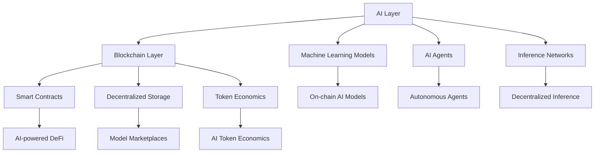

# 🤖 AI-Blockchain Integration - 2025 Convergence Revolution

## 🎯 First Principle Thinking

**Tại sao AI + Blockchain = Perfect Match?**

**AI's Problems:**
- **Data centralization** → Big Tech monopoly
- **Model opacity** → Black box algorithms  
- **Compute concentration** → Expensive access
- **Bias và fairness** → No accountability

**Blockchain's Solutions:**
- **Decentralized data markets** → Fair data ownership
- **Verifiable AI** → ZK proofs for model integrity
- **Distributed compute** → Democratic AI access
- **Tokenized incentives** → Align AI development

## 📊 AI x Crypto Market 2025

**Market Cap**: **$15B+** for AI-crypto projects

```javascript
const aiCryptoEcosystem2025 = {
  totalMarketCap: "$15B+",
  
  categories: {
    computeNetworks: {
      value: "$8B+",
      leaders: ["Render Network", "Akash Network", "Gensyn"],
      useCase: "Distributed GPU training & inference"
    },
    
    dataProtocols: {
      value: "$3B+", 
      leaders: ["Ocean Protocol", "SingularityNET", "Fetch.ai"],
      useCase: "Decentralized data markets"
    },
    
    aiAgents: {
      value: "$2B+",
      leaders: ["Autonolas", "MyShell", "Virtuals Protocol"], 
      useCase: "Autonomous AI agents with crypto wallets"
    },
    
    verifiableAI: {
      value: "$1.5B+",
      leaders: ["Worldcoin", "Modulus Labs", "EZKL"],
      useCase: "ZK proofs for AI model verification"
    },
    
    predictionMarkets: {
      value: "$500M+",
      leaders: ["Augur", "Gnosis", "Polymarket with AI"],
      useCase: "AI-powered prediction & forecasting"
    }
  }
}
```

## 🏗️ AI x Blockchain Architecture



## 🧠 AI Applications in Blockchain

### 1. AI-Powered Smart Contracts

```solidity
// AI-enhanced DeFi protocol
contract AITradingStrategy {
    struct TradingSignal {
        address token;
        bool isBuy;
        uint256 confidence;
        uint256 timestamp;
        bytes32 modelHash;
    }
    
    mapping(bytes32 => bool) public authorizedModels;
    mapping(address => TradingSignal) public latestSignals;
    
    // Oracle integration for AI predictions
    IChainlinkOracle public aiOracle;
    
    function executeAITrade(
        address token,
        uint256 amount,
        bytes32 modelPrediction,
        bytes memory proof
    ) external {
        // Verify AI model prediction
        require(verifyModelPrediction(modelPrediction, proof), "Invalid AI prediction");
        
        // Get confidence score from oracle
        uint256 confidence = aiOracle.getConfidenceScore(token, modelPrediction);
        require(confidence >= 80, "Low confidence prediction");
        
        // Execute trade based on AI signal
        if (isPositivePrediction(modelPrediction)) {
            executeBuy(token, amount);
        } else {
            executeSell(token, amount);
        }
        
        // Update signals
        latestSignals[token] = TradingSignal({
            token: token,
            isBuy: isPositivePrediction(modelPrediction),
            confidence: confidence,
            timestamp: block.timestamp,
            modelHash: keccak256(abi.encodePacked(modelPrediction))
        });
    }
    
    function verifyModelPrediction(
        bytes32 prediction,
        bytes memory proof
    ) internal view returns (bool) {
        // Zero-knowledge proof verification
        return zkVerifier.verifyProof(proof, prediction);
    }
}
```

### 2. Decentralized AI Model Marketplace

```solidity
// AI Model NFT Marketplace
contract AIModelMarketplace {
    struct AIModel {
        uint256 tokenId;
        address creator;
        string modelURI; // IPFS hash
        uint256 price;
        uint256 accuracy;
        string category;
        bool isActive;
        uint256 totalInferences;
        uint256 revenue;
    }
    
    mapping(uint256 => AIModel) public models;
    mapping(address => uint256[]) public creatorModels;
    mapping(uint256 => mapping(address => bool)) public modelAccess;
    
    event ModelListed(uint256 indexed tokenId, address creator, uint256 price);
    event ModelPurchased(uint256 indexed tokenId, address buyer);
    event InferenceExecuted(uint256 indexed tokenId, address user, uint256 fee);
    
    function listModel(
        string memory modelURI,
        uint256 price,
        uint256 accuracy,
        string memory category
    ) external returns (uint256) {
        uint256 tokenId = _tokenIdCounter++;
        
        models[tokenId] = AIModel({
            tokenId: tokenId,
            creator: msg.sender,
            modelURI: modelURI,
            price: price,
            accuracy: accuracy,
            category: category,
            isActive: true,
            totalInferences: 0,
            revenue: 0
        });
        
        creatorModels[msg.sender].push(tokenId);
        
        // Mint NFT representing model ownership
        _mint(msg.sender, tokenId);
        
        emit ModelListed(tokenId, msg.sender, price);
        return tokenId;
    }
    
    function purchaseModelAccess(uint256 tokenId) external payable {
        AIModel storage model = models[tokenId];
        require(model.isActive, "Model not active");
        require(msg.value >= model.price, "Insufficient payment");
        
        // Grant access to buyer
        modelAccess[tokenId][msg.sender] = true;
        
        // Pay creator
        uint256 platformFee = msg.value * 5 / 100; // 5% platform fee
        uint256 creatorPayment = msg.value - platformFee;
        
        payable(model.creator).transfer(creatorPayment);
        
        emit ModelPurchased(tokenId, msg.sender);
    }
    
    function executeInference(
        uint256 tokenId,
        bytes memory inputData
    ) external payable returns (bytes memory result) {
        require(modelAccess[tokenId][msg.sender], "No access to model");
        
        AIModel storage model = models[tokenId];
        uint256 inferenceFee = calculateInferenceFee(tokenId, inputData.length);
        require(msg.value >= inferenceFee, "Insufficient inference fee");
        
        // Execute inference via oracle or off-chain service
        result = executeModelInference(tokenId, inputData);
        
        // Update metrics
        model.totalInferences++;
        model.revenue += msg.value;
        
        // Pay inference fee to model creator
        payable(model.creator).transfer(msg.value);
        
        emit InferenceExecuted(tokenId, msg.sender, msg.value);
    }
}
```

### 3. AI Agents with Crypto Wallets

```solidity
// Autonomous AI Agent
contract AIAgent {
    address public owner;
    address public aiController; // AI service that controls agent
    uint256 public budget;
    uint256 public spent;
    
    mapping(address => bool) public authorizedTokens;
    mapping(bytes4 => bool) public authorizedFunctions;
    
    struct Task {
        uint256 id;
        string description;
        uint256 reward;
        bool completed;
        address assignedTo;
    }
    
    mapping(uint256 => Task) public tasks;
    uint256 public taskCounter;
    
    modifier onlyAI() {
        require(msg.sender == aiController, "Only AI controller");
        _;
    }
    
    modifier withinBudget(uint256 amount) {
        require(spent + amount <= budget, "Exceeds budget");
        _;
    }
    
    function createTask(
        string memory description,
        uint256 reward
    ) external onlyAI withinBudget(reward) returns (uint256) {
        uint256 taskId = taskCounter++;
        
        tasks[taskId] = Task({
            id: taskId,
            description: description,
            reward: reward,
            completed: false,
            assignedTo: address(0)
        });
        
        return taskId;
    }
    
    function assignTask(uint256 taskId, address worker) external onlyAI {
        Task storage task = tasks[taskId];
        require(!task.completed, "Task already completed");
        
        task.assignedTo = worker;
    }
    
    function completeTask(uint256 taskId, bytes memory proof) external {
        Task storage task = tasks[taskId];
        require(task.assignedTo == msg.sender, "Not assigned to you");
        require(!task.completed, "Already completed");
        
        // Verify task completion (could use oracles, ZK proofs, etc.)
        require(verifyTaskCompletion(taskId, proof), "Invalid proof");
        
        task.completed = true;
        spent += task.reward;
        
        // Pay worker
        payable(msg.sender).transfer(task.reward);
    }
    
    // AI agent can execute DeFi operations
    function aiExecuteTrade(
        address dexRouter,
        address tokenIn,
        address tokenOut,
        uint256 amountIn,
        uint256 minAmountOut
    ) external onlyAI withinBudget(amountIn) {
        require(authorizedTokens[tokenIn], "Token not authorized");
        
        // Execute swap
        IERC20(tokenIn).approve(dexRouter, amountIn);
        IDEXRouter(dexRouter).swapExactTokensForTokens(
            amountIn,
            minAmountOut,
            getPath(tokenIn, tokenOut),
            address(this),
            block.timestamp + 300
        );
        
        spent += amountIn;
    }
}
```

## 🔗 Decentralized AI Infrastructure

### 1. Compute Networks

```javascript
// Akash Network integration for AI compute
const aiComputeNetwork = {
  deployment: {
    provider: "Akash Network",
    resources: {
      cpu: "8 cores",
      memory: "32GB",
      gpu: "NVIDIA A100",
      storage: "500GB SSD"
    },
    cost: "$0.50/hour" // 80% cheaper than AWS
  },
  
  modelTraining: async (dataset, modelConfig) => {
    const deployment = await akash.deployContainer({
      image: "tensorflow/tensorflow:latest-gpu",
      resources: aiComputeNetwork.deployment.resources,
      env: {
        DATASET_URL: dataset.ipfsHash,
        MODEL_CONFIG: JSON.stringify(modelConfig)
      }
    });
    
    return deployment.serviceUrl;
  }
}
```

### 2. Decentralized Storage for AI Models

```javascript
// IPFS + Filecoin for AI model storage
const aiStorage = {
  storeModel: async (modelFile) => {
    // Store on IPFS for fast access
    const ipfsHash = await ipfs.add(modelFile);
    
    // Store on Filecoin for long-term storage
    const filecoinDeal = await filecoin.store({
      data: modelFile,
      duration: "2 years",
      price: "0.01 FIL/GB"
    });
    
    return {
      ipfsHash: ipfsHash,
      filecoinCid: filecoinDeal.cid,
      redundancy: 3 // copies across 3 storage providers
    };
  },
  
  retrieveModel: async (ipfsHash) => {
    try {
      // Try IPFS first (faster)
      return await ipfs.get(ipfsHash);
    } catch (error) {
      // Fallback to Filecoin
      return await filecoin.retrieve(ipfsHash);
    }
  }
}
```

### 3. Inference Networks

```solidity
// Decentralized AI Inference Network
contract InferenceNetwork {
    struct InferenceProvider {
        address provider;
        string endpoint;
        uint256 pricePerInference;
        uint256 reputation;
        uint256 totalInferences;
        bool isActive;
    }
    
    mapping(address => InferenceProvider) public providers;
    mapping(bytes32 => uint256) public inferenceResults;
    mapping(address => uint256) public providerStakes;
    
    uint256 public constant MIN_STAKE = 1000 * 10**18; // 1000 tokens
    
    function registerProvider(
        string memory endpoint,
        uint256 pricePerInference
    ) external {
        require(token.balanceOf(msg.sender) >= MIN_STAKE, "Insufficient stake");
        
        // Stake tokens
        token.transferFrom(msg.sender, address(this), MIN_STAKE);
        providerStakes[msg.sender] = MIN_STAKE;
        
        providers[msg.sender] = InferenceProvider({
            provider: msg.sender,
            endpoint: endpoint,
            pricePerInference: pricePerInference,
            reputation: 100, // Starting reputation
            totalInferences: 0,
            isActive: true
        });
    }
    
    function requestInference(
        address provider,
        bytes32 modelHash,
        bytes memory inputData
    ) external payable returns (bytes32 requestId) {
        InferenceProvider storage p = providers[provider];
        require(p.isActive, "Provider not active");
        require(msg.value >= p.pricePerInference, "Insufficient payment");
        
        requestId = keccak256(abi.encodePacked(
            msg.sender,
            provider,
            modelHash,
            inputData,
            block.timestamp
        ));
        
        // Emit event for off-chain processing
        emit InferenceRequested(requestId, provider, modelHash, inputData);
        
        return requestId;
    }
    
    function submitInferenceResult(
        bytes32 requestId,
        bytes memory result,
        bytes memory proof
    ) external {
        require(providers[msg.sender].isActive, "Not an active provider");
        
        // Verify result using ZK proof or other method
        require(verifyInferenceResult(requestId, result, proof), "Invalid result");
        
        // Store result
        inferenceResults[requestId] = keccak256(result);
        
        // Update provider stats
        providers[msg.sender].totalInferences++;
        
        emit InferenceCompleted(requestId, msg.sender, result);
    }
}
```

## 💰 AI-Powered DeFi

### 1. Intelligent Yield Farming

```solidity
// AI-optimized yield farming strategy
contract AIYieldOptimizer {
    struct Strategy {
        address protocol;
        uint256 allocation;
        uint256 expectedAPY;
        uint256 riskScore;
        uint256 confidence;
    }
    
    mapping(address => Strategy[]) public userStrategies;
    mapping(address => uint256) public totalDeposits;
    
    IAIOracle public aiOracle;
    
    function optimizeYield(address user) external returns (Strategy[] memory) {
        uint256 userBalance = totalDeposits[user];
        
        // Get AI predictions for different protocols
        bytes memory aiData = aiOracle.getOptimalAllocation(user, userBalance);
        Strategy[] memory strategies = abi.decode(aiData, (Strategy[]));
        
        // Validate strategies
        uint256 totalAllocation = 0;
        for (uint i = 0; i < strategies.length; i++) {
            require(strategies[i].confidence >= 70, "Low confidence strategy");
            require(strategies[i].riskScore <= 50, "Too risky");
            totalAllocation += strategies[i].allocation;
        }
        require(totalAllocation == 100, "Invalid allocation");
        
        // Update user strategies
        userStrategies[user] = strategies;
        
        // Execute rebalancing
        executeRebalancing(user, strategies);
        
        return strategies;
    }
    
    function executeRebalancing(
        address user,
        Strategy[] memory strategies
    ) internal {
        uint256 totalAmount = totalDeposits[user];
        
        for (uint i = 0; i < strategies.length; i++) {
            uint256 amount = totalAmount * strategies[i].allocation / 100;
            
            // Deposit to protocol
            IYieldProtocol(strategies[i].protocol).deposit(amount);
        }
    }
}
```

### 2. MEV Protection with AI

```solidity
// AI-powered MEV protection
contract MEVShield {
    struct TransactionIntent {
        address user;
        address token;
        uint256 amount;
        uint256 minOutput;
        uint256 maxSlippage;
        uint256 deadline;
    }
    
    mapping(bytes32 => bool) public processedIntents;
    IAIMEVAnalyzer public mevAnalyzer;
    
    function submitIntent(
        TransactionIntent memory intent,
        bytes memory signature
    ) external {
        bytes32 intentHash = keccak256(abi.encode(intent));
        require(!processedIntents[intentHash], "Intent already processed");
        
        // Verify signature
        require(verifyIntentSignature(intent, signature), "Invalid signature");
        
        // AI analysis for MEV risk
        uint256 mevRisk = mevAnalyzer.analyzeMEVRisk(intent);
        
        if (mevRisk > 80) {
            // High MEV risk - use private mempool
            executePrivate(intent);
        } else if (mevRisk > 50) {
            // Medium risk - batch with other transactions
            addToBatch(intent);
        } else {
            // Low risk - execute normally
            executeImmediate(intent);
        }
        
        processedIntents[intentHash] = true;
    }
    
    function executePrivate(TransactionIntent memory intent) internal {
        // Use Flashbots or similar private mempool
        IPrivateMempool(flashbotsRelay).submitBundle([createTransaction(intent)]);
    }
}
```

## 🎮 AI in Gaming & NFTs

### 1. AI-Generated NFTs

```solidity
// Dynamic AI-generated NFTs
contract AIGenerativeNFT {
    struct NFTMetadata {
        uint256 tokenId;
        string basePrompt;
        bytes32 seedHash;
        uint256 generationTimestamp;
        string aiModel;
        string imageURI;
        mapping(string => string) attributes;
    }
    
    mapping(uint256 => NFTMetadata) public nftData;
    mapping(bytes32 => bool) public usedSeeds;
    
    IAIImageGenerator public aiGenerator;
    
    function mintAINFT(
        string memory prompt,
        string memory style,
        bytes32 seed
    ) external payable returns (uint256) {
        require(!usedSeeds[seed], "Seed already used");
        require(msg.value >= 0.1 ether, "Insufficient payment");
        
        uint256 tokenId = _tokenIdCounter++;
        usedSeeds[seed] = true;
        
        // Generate image using AI
        string memory imageURI = aiGenerator.generateImage(prompt, style, seed);
        
        // Store metadata
        NFTMetadata storage metadata = nftData[tokenId];
        metadata.tokenId = tokenId;
        metadata.basePrompt = prompt;
        metadata.seedHash = seed;
        metadata.generationTimestamp = block.timestamp;
        metadata.aiModel = aiGenerator.getModelVersion();
        metadata.imageURI = imageURI;
        
        // Generate attributes using AI
        string[] memory attributeNames;
        string[] memory attributeValues;
        (attributeNames, attributeValues) = aiGenerator.generateAttributes(imageURI);
        
        for (uint i = 0; i < attributeNames.length; i++) {
            metadata.attributes[attributeNames[i]] = attributeValues[i];
        }
        
        _mint(msg.sender, tokenId);
        return tokenId;
    }
    
    // Evolution mechanism - NFT changes over time
    function evolveNFT(uint256 tokenId) external {
        require(ownerOf(tokenId) == msg.sender, "Not owner");
        
        NFTMetadata storage metadata = nftData[tokenId];
        require(
            block.timestamp >= metadata.generationTimestamp + 30 days,
            "Too early to evolve"
        );
        
        // AI generates evolution
        string memory newImageURI = aiGenerator.evolveImage(
            metadata.imageURI,
            block.timestamp - metadata.generationTimestamp
        );
        
        metadata.imageURI = newImageURI;
        metadata.generationTimestamp = block.timestamp;
        
        emit NFTEvolved(tokenId, newImageURI);
    }
}
```

### 2. AI Game NPCs

```solidity
// AI-powered NPCs with blockchain memory
contract AINPC {
    struct NPCMemory {
        uint256 npcId;
        mapping(address => string[]) interactions;
        mapping(string => uint256) personalityTraits;
        uint256 experiencePoints;
        string currentMood;
        string[] learnedBehaviors;
    }
    
    mapping(uint256 => NPCMemory) public npcMemories;
    mapping(uint256 => address) public npcOwners;
    
    IAIPersonality public aiPersonality;
    
    function interactWithNPC(
        uint256 npcId,
        string memory message
    ) external returns (string memory response) {
        NPCMemory storage memory = npcMemories[npcId];
        
        // Get AI response based on memory and personality
        response = aiPersonality.generateResponse(
            npcId,
            message,
            memory.interactions[msg.sender],
            memory.personalityTraits,
            memory.currentMood
        );
        
        // Store interaction
        memory.interactions[msg.sender].push(message);
        memory.interactions[msg.sender].push(response);
        
        // Update NPC state
        memory.experiencePoints += 1;
        memory.currentMood = aiPersonality.updateMood(npcId, message);
        
        // Learn new behaviors
        string memory newBehavior = aiPersonality.learnFromInteraction(npcId, message);
        if (bytes(newBehavior).length > 0) {
            memory.learnedBehaviors.push(newBehavior);
        }
        
        emit NPCInteraction(npcId, msg.sender, message, response);
        return response;
    }
    
    function tradeWithNPC(
        uint256 npcId,
        address token,
        uint256 amount
    ) external returns (bool accepted, uint256 price) {
        // AI determines if NPC wants to trade based on personality and market data
        (accepted, price) = aiPersonality.evaluateTrade(
            npcId,
            token,
            amount,
            npcMemories[npcId].personalityTraits
        );
        
        if (accepted) {
            IERC20(token).transferFrom(msg.sender, npcOwners[npcId], amount);
            // Give player NPC's items/rewards
        }
        
        return (accepted, price);
    }
}
```

## 🔮 Emerging AI x Crypto Projects

### 1. Current Leading Projects (2025)

```javascript
const aiCryptoProjects = {
  infrastructure: {
    "Akash Network": {
      focus: "Decentralized cloud compute",
      marketCap: "$500M+",
      tps: "GPU/CPU marketplace"
    },
    "Render Network": {
      focus: "Decentralized GPU rendering",
      marketCap: "$1B+",
      useCase: "AI model training"
    },
    "Ocean Protocol": {
      focus: "Data marketplace",
      marketCap: "$300M+",
      useCase: "AI datasets"
    }
  },
  
  inference: {
    "Bittensor": {
      focus: "Decentralized AI network",
      mechanism: "Proof of intelligence",
      innovation: "AI subnet system"
    },
    "Ritual": {
      focus: "AI infrastructure layer",
      technology: "Modular AI stack"
    }
  },
  
  applications: {
    "SingularityNET": {
      focus: "AI marketplace",
      features: "AGI development"
    },
    "Fetch.ai": {
      focus: "Autonomous agents",
      features: "Multi-agent systems"
    }
  }
}
```

### 2. AI Agent Frameworks

```python
# AI Agent development framework
class BlockchainAIAgent:
    def __init__(self, wallet_address, ai_model):
        self.wallet = Web3Wallet(wallet_address)
        self.ai_model = ai_model
        self.memory = BlockchainMemory()
        self.skills = []
        
    def add_skill(self, skill_contract):
        """Add new skill (smart contract interaction)"""
        self.skills.append(skill_contract)
        
    def autonomous_trading(self, market_data):
        """AI-driven trading decisions"""
        prediction = self.ai_model.predict(market_data)
        
        if prediction['confidence'] > 0.8:
            if prediction['action'] == 'buy':
                self.wallet.execute_trade(
                    token=prediction['token'],
                    amount=prediction['amount'],
                    action='buy'
                )
            elif prediction['action'] == 'sell':
                self.wallet.execute_trade(
                    token=prediction['token'],
                    amount=prediction['amount'],
                    action='sell'
                )
                
        # Store decision in blockchain memory
        self.memory.store_decision(prediction)
        
    def learn_from_outcomes(self):
        """Update model based on trading results"""
        outcomes = self.memory.get_outcomes()
        self.ai_model.retrain(outcomes)
```

## 🛡️ Security & Privacy

### 1. Zero-Knowledge AI

```solidity
// Private AI inference using ZK proofs
contract ZKAIInference {
    mapping(bytes32 => bool) public validProofs;
    mapping(address => bytes32) public userQueries;
    
    function submitPrivateQuery(
        bytes32 queryHash,
        bytes memory zkProof
    ) external {
        // Verify ZK proof without revealing query
        require(verifyZKProof(zkProof, queryHash), "Invalid proof");
        
        validProofs[queryHash] = true;
        userQueries[msg.sender] = queryHash;
        
        // Process query privately off-chain
        emit PrivateQuerySubmitted(msg.sender, queryHash);
    }
    
    function getPrivateResult(
        bytes32 queryHash,
        bytes memory encryptedResult,
        bytes memory proof
    ) external view returns (bytes memory) {
        require(validProofs[queryHash], "Invalid query");
        require(userQueries[msg.sender] == queryHash, "Not your query");
        
        // Verify result proof
        require(verifyResultProof(encryptedResult, proof), "Invalid result");
        
        return encryptedResult;
    }
}
```

### 2. Federated Learning on Blockchain

```solidity
// Decentralized federated learning
contract FederatedLearning {
    struct ModelUpdate {
        address contributor;
        bytes32 gradientHash;
        uint256 dataSize;
        uint256 accuracy;
        uint256 timestamp;
    }
    
    mapping(uint256 => ModelUpdate[]) public roundUpdates;
    mapping(address => uint256) public contributions;
    
    uint256 public currentRound;
    uint256 public constant MIN_PARTICIPANTS = 10;
    
    function submitGradientUpdate(
        bytes32 gradientHash,
        uint256 dataSize,
        uint256 localAccuracy,
        bytes memory proof
    ) external {
        require(verifyGradientProof(gradientHash, proof), "Invalid gradient");
        
        roundUpdates[currentRound].push(ModelUpdate({
            contributor: msg.sender,
            gradientHash: gradientHash,
            dataSize: dataSize,
            accuracy: localAccuracy,
            timestamp: block.timestamp
        }));
        
        contributions[msg.sender] += dataSize;
        
        // Check if round is complete
        if (roundUpdates[currentRound].length >= MIN_PARTICIPANTS) {
            aggregateRound();
        }
    }
    
    function aggregateRound() internal {
        ModelUpdate[] storage updates = roundUpdates[currentRound];
        
        // Calculate weighted average of gradients
        bytes32 aggregatedGradient = calculateWeightedAverage(updates);
        
        // Distribute rewards based on contribution
        distributeRewards(currentRound);
        
        currentRound++;
        emit RoundCompleted(currentRound - 1, aggregatedGradient);
    }
}
```

## 📊 Market Analysis & Trends

### AI-Crypto Market Size (2025)

```javascript
const marketData = {
  totalMarketCap: "$15B+",
  sectors: {
    infrastructure: "$8B", // 53%
    inference: "$3B",      // 20%
    applications: "$2.5B", // 17%
    data: "$1.5B"         // 10%
  },
  
  growth: {
    yearOverYear: "300%+",
    institutionalAdoption: "increasing",
    developerActivity: "exponential"
  },
  
  keyDrivers: [
    "ChatGPT mainstream adoption",
    "Compute cost optimization",
    "Privacy concerns",
    "Censorship resistance"
  ]
}
```

### Investment Opportunities

```javascript
const investmentThesis = {
  infrastructure: {
    opportunity: "Decentralized compute shortage",
    market: "Cloud computing disruption",
    timeframe: "2-5 years",
    risk: "Medium"
  },
  
  inference: {
    opportunity: "AI democratization",
    market: "API gateway for AI",
    timeframe: "1-3 years",
    risk: "High"
  },
  
  applications: {
    opportunity: "AI-native dApps",
    market: "Web3 UX improvement",
    timeframe: "1-2 years",
    risk: "Very High"
  }
}
```

## 🛠️ Development Tools & Frameworks

### 1. AI-Blockchain Development Stack

```bash
# Setup AI-blockchain development environment
npm install @huggingface/transformers
npm install @openzeppelin/contracts
npm install @chainlink/contracts
pip install web3.py torch transformers

# Essential tools
- Hugging Face: AI model hub
- OpenAI API: GPT integration
- Chainlink: AI oracle services
- The Graph: AI data indexing
```

### 2. Integration Templates

```javascript
// Template for AI-powered dApp
const aiDappTemplate = {
  frontend: {
    framework: "React + Next.js",
    aiIntegration: "OpenAI SDK",
    web3: "ethers.js + wagmi"
  },
  
  backend: {
    aiService: "Python + FastAPI",
    blockchain: "Hardhat + Solidity",
    storage: "IPFS + Pinata"
  },
  
  infrastructure: {
    compute: "Akash Network",
    inference: "Bittensor subnet",
    oracle: "Chainlink Functions"
  }
}
```

## ✅ Key Takeaways

1. **Convergence Era**: AI và Blockchain đang tạo ra paradigm mới
2. **Infrastructure Focus**: Decentralized compute là foundation layer
3. **Privacy-First**: ZK proofs enable private AI inference
4. **Autonomous Economy**: AI agents sẽ trở thành economic actors
5. **DeFi Evolution**: AI sẽ optimize yield farming và trading strategies
6. **Gaming Revolution**: AI NPCs với persistent blockchain memory

**Next**: [[10-Modular-Blockchain-Architecture]] - Kiến trúc blockchain modular
