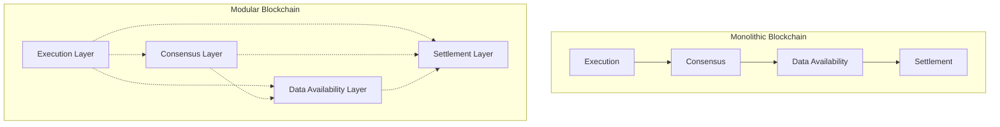
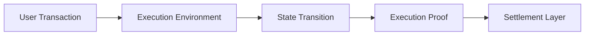
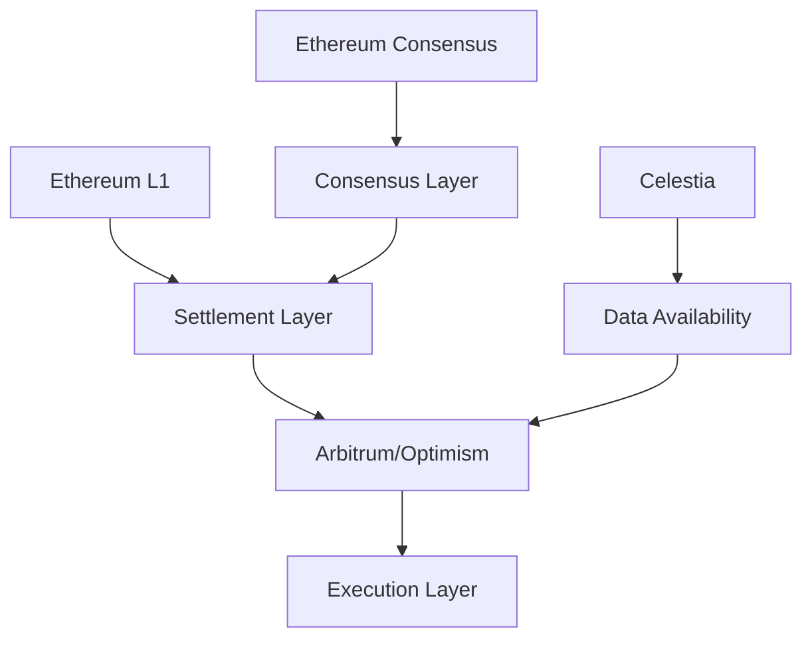
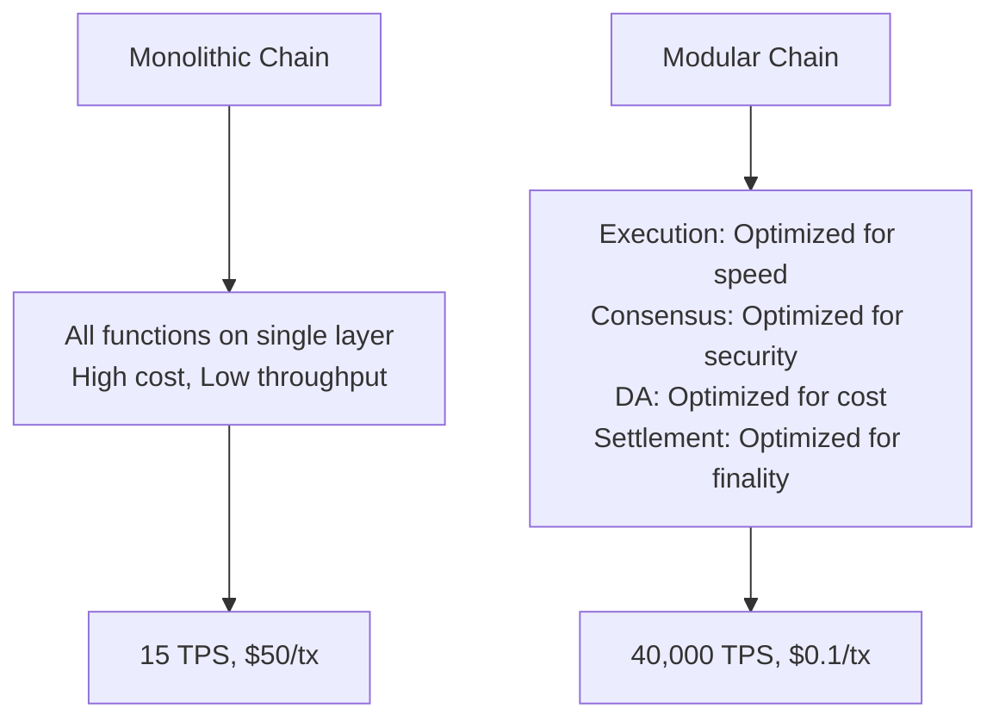
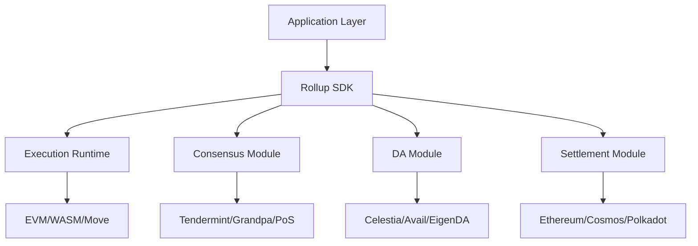

# 🧩 Modular Blockchain Architecture - Tương lai của Scalability

## 🎯 Tổng quan

Modular blockchain architecture tách riêng các function chính của blockchain (execution, consensus, data availability, settlement) thành các layer độc lập, cho phép tối ưu hóa từng component.

## 🏗️ Monolithic vs Modular Architecture



## 🔧 Core Layers

### 1. Execution Layer

**Function**: Process transactions và smart contracts



**Examples:**

#### Arbitrum (Rollup)
```javascript
// Arbitrum execution environment
const arbitrumExecution = {
  type: "Optimistic Rollup",
  vm: "AVM (Arbitrum Virtual Machine)",
  compatibility: "EVM compatible",
  
  stateTransition: async (transaction) => {
    // Execute transaction in AVM
    const result = await avm.execute(transaction);
    
    // Generate execution proof
    const proof = generateExecutionProof(result);
    
    // Submit to L1 for settlement
    return submitToL1(proof);
  }
}
```

#### StarkNet (Validity Rollup)
```python
# Cairo contract on StarkNet
@contract
def example_contract():
    @storage_var
    func balance() -> (res: felt):
    end

    @external
    func increase_balance(amount: felt):
        let (current_balance) = balance.read()
        balance.write(current_balance + amount)
        return ()
    end

    @view
    func get_balance() -> (balance: felt):
        let (res) = balance.read()
        return (balance=res)
    end
```

### 2. Consensus Layer

**Function**: Order transactions và maintain network security

```solidity
// Consensus mechanism interface
interface IConsensusLayer {
    function proposeBlock(bytes memory blockData) external;
    function validateBlock(bytes32 blockHash) external returns (bool);
    function finalizeBlock(bytes32 blockHash) external;
    
    event BlockProposed(bytes32 indexed blockHash, address proposer);
    event BlockValidated(bytes32 indexed blockHash, uint256 validatorCount);
    event BlockFinalized(bytes32 indexed blockHash, uint256 finalityTime);
}

contract TendermintConsensus is IConsensusLayer {
    struct Block {
        bytes32 blockHash;
        address proposer;
        uint256 timestamp;
        bytes data;
        mapping(address => bool) validatorVotes;
        uint256 voteCount;
        bool finalized;
    }
    
    mapping(bytes32 => Block) public blocks;
    mapping(address => bool) public validators;
    uint256 public validatorCount;
    uint256 public constant CONSENSUS_THRESHOLD = 67; // 2/3 majority
    
    function proposeBlock(bytes memory blockData) external override {
        require(validators[msg.sender], "Not a validator");
        
        bytes32 blockHash = keccak256(blockData);
        
        blocks[blockHash] = Block({
            blockHash: blockHash,
            proposer: msg.sender,
            timestamp: block.timestamp,
            data: blockData,
            voteCount: 0,
            finalized: false
        });
        
        emit BlockProposed(blockHash, msg.sender);
    }
    
    function validateBlock(bytes32 blockHash) external override returns (bool) {
        require(validators[msg.sender], "Not a validator");
        
        Block storage blockData = blocks[blockHash];
        require(!blockData.validatorVotes[msg.sender], "Already voted");
        
        blockData.validatorVotes[msg.sender] = true;
        blockData.voteCount++;
        
        emit BlockValidated(blockHash, blockData.voteCount);
        
        // Check if consensus reached
        if (blockData.voteCount * 100 >= validatorCount * CONSENSUS_THRESHOLD) {
            finalizeBlock(blockHash);
            return true;
        }
        
        return false;
    }
}
```

### 3. Data Availability Layer

**Function**: Ensure data is available for verification

#### Celestia
```javascript
// Celestia Data Availability
const celestiaDA = {
  namespace: "rollup-data",
  
  publishData: async (rollupData) => {
    // Encode data with namespace
    const namespacedData = encodeWithNamespace(
      celestiaDA.namespace,
      rollupData
    );
    
    // Submit to Celestia
    const commitment = await celestia.submitBlob({
      namespace: celestiaDA.namespace,
      data: namespacedData,
      shareVersion: 0
    });
    
    return commitment;
  },
  
  retrieveData: async (height, commitment) => {
    // Retrieve data from Celestia
    const blob = await celestia.getBlob(
      height,
      celestiaDA.namespace,
      commitment
    );
    
    // Verify data availability
    const proof = await celestia.generateDAProof(blob);
    
    return {
      data: blob.data,
      proof: proof,
      verified: await verifyDAProof(proof)
    };
  }
}
```

#### Polygon Avail
```rust
// Avail data submission
use avail_core::{AppId, DataLookup};

pub struct AvailDataAvailability {
    app_id: AppId,
    client: AvailClient,
}

impl AvailDataAvailability {
    pub async fn submit_data(&self, data: Vec<u8>) -> Result<H256, Error> {
        // Submit data to Avail
        let extrinsic = self.client
            .tx()
            .data_availability()
            .submit_data(self.app_id, data)?;
            
        let hash = extrinsic.submit_and_watch().await?;
        
        Ok(hash)
    }
    
    pub async fn verify_availability(&self, block_hash: H256) -> Result<bool, Error> {
        // Generate data availability proof
        let proof = self.client
            .rpc()
            .kate_query_proof(vec![0], Some(block_hash))
            .await?;
            
        // Verify proof
        Ok(self.verify_proof(proof))
    }
}
```

### 4. Settlement Layer

**Function**: Final state settlement và dispute resolution

```solidity
// Settlement layer contract
contract ModularSettlement {
    struct StateCommitment {
        bytes32 stateRoot;
        uint256 blockNumber;
        address executor;
        uint256 timestamp;
        bool disputed;
        uint256 challengePeriod;
    }
    
    mapping(bytes32 => StateCommitment) public commitments;
    mapping(address => bool) public authorizedExecutors;
    
    uint256 public constant CHALLENGE_PERIOD = 7 days;
    uint256 public constant DISPUTE_BOND = 100 ether;
    
    event StateCommitted(bytes32 indexed stateRoot, address executor);
    event StateDisputed(bytes32 indexed stateRoot, address challenger);
    event StateFinalized(bytes32 indexed stateRoot);
    
    function commitState(
        bytes32 stateRoot,
        uint256 blockNumber,
        bytes memory proof
    ) external {
        require(authorizedExecutors[msg.sender], "Not authorized");
        require(verifyStateProof(stateRoot, proof), "Invalid proof");
        
        bytes32 commitmentId = keccak256(abi.encodePacked(stateRoot, blockNumber));
        
        commitments[commitmentId] = StateCommitment({
            stateRoot: stateRoot,
            blockNumber: blockNumber,
            executor: msg.sender,
            timestamp: block.timestamp,
            disputed: false,
            challengePeriod: block.timestamp + CHALLENGE_PERIOD
        });
        
        emit StateCommitted(stateRoot, msg.sender);
    }
    
    function disputeState(
        bytes32 commitmentId,
        bytes memory fraudProof
    ) external payable {
        require(msg.value >= DISPUTE_BOND, "Insufficient bond");
        
        StateCommitment storage commitment = commitments[commitmentId];
        require(block.timestamp <= commitment.challengePeriod, "Challenge period expired");
        require(!commitment.disputed, "Already disputed");
        
        // Verify fraud proof
        require(verifyFraudProof(commitment.stateRoot, fraudProof), "Invalid fraud proof");
        
        commitment.disputed = true;
        
        // Slash executor and reward challenger
        slashExecutor(commitment.executor);
        payable(msg.sender).transfer(msg.value + DISPUTE_BOND);
        
        emit StateDisputed(commitment.stateRoot, msg.sender);
    }
    
    function finalizeState(bytes32 commitmentId) external {
        StateCommitment storage commitment = commitments[commitmentId];
        require(block.timestamp > commitment.challengePeriod, "Challenge period not expired");
        require(!commitment.disputed, "State was disputed");
        
        emit StateFinalized(commitment.stateRoot);
    }
}
```

## 🌐 Modular Blockchain Stacks

### 1. Ethereum-based Stack



```javascript
// Ethereum modular stack configuration
const ethereumModularStack = {
  settlement: {
    layer: "Ethereum L1",
    function: "Final settlement và dispute resolution",
    security: "Full Ethereum security"
  },
  
  execution: {
    layer: "Arbitrum/Optimism/Polygon",
    function: "Transaction processing",
    throughput: "1000-40000 TPS"
  },
  
  dataAvailability: {
    layer: "Celestia/Polygon Avail",
    function: "Data publishing và availability",
    cost: "99% cheaper than L1"
  },
  
  consensus: {
    layer: "Ethereum PoS",
    function: "Block ordering và finality",
    validators: "900,000+"
  }
}
```

### 2. Cosmos-based Stack

```go
// Cosmos modular chain
package main

import (
    "github.com/cosmos/cosmos-sdk/types"
    "github.com/tendermint/tendermint/consensus"
)

type ModularCosmosChain struct {
    ExecutionLayer    ExecutionModule
    ConsensusLayer    consensus.ConsensusReactor
    DataLayer         DataAvailabilityModule
    SettlementLayer   SettlementModule
}

type ExecutionModule struct {
    VM           VirtualMachine
    StateManager StateManager
}

func (m *ModularCosmosChain) ProcessTransaction(tx types.Tx) error {
    // 1. Execute transaction
    result, err := m.ExecutionLayer.Execute(tx)
    if err != nil {
        return err
    }
    
    // 2. Publish data
    commitment, err := m.DataLayer.PublishData(result.Data)
    if err != nil {
        return err
    }
    
    // 3. Reach consensus
    err = m.ConsensusLayer.Propose(result.StateRoot)
    if err != nil {
        return err
    }
    
    // 4. Settle final state
    return m.SettlementLayer.Settle(result.StateRoot, commitment)
}
```

### 3. Polkadot-based Stack

```rust
// Polkadot modular parachain
use sp_runtime::traits::{Block as BlockT, Header};
use frame_support::dispatch::DispatchResult;

pub struct ModularParachain<Block: BlockT> {
    execution_runtime: ExecutionRuntime,
    consensus_engine: ConsensusEngine<Block>,
    data_availability: DataAvailabilityProvider,
    settlement_relay: RelayChainConnection,
}

impl<Block: BlockT> ModularParachain<Block> {
    pub fn execute_block(&self, block: Block) -> DispatchResult {
        // 1. Execute block in custom runtime
        let execution_result = self.execution_runtime.execute_block(block.clone())?;
        
        // 2. Ensure data availability
        let data_commitment = self.data_availability
            .publish_block_data(block.extrinsics())?;
        
        // 3. Submit to relay chain for consensus
        self.settlement_relay.submit_block(
            block.header(),
            execution_result.state_root,
            data_commitment
        )?;
        
        Ok(())
    }
}

// Custom execution runtime
pub struct ExecutionRuntime {
    state_machine: StateMachine,
    wasm_runtime: WasmRuntime,
}

impl ExecutionRuntime {
    pub fn execute_block(&self, block: Block) -> ExecutionResult {
        // Custom execution logic
        let mut state = self.state_machine.get_state();
        
        for extrinsic in block.extrinsics() {
            match self.wasm_runtime.execute(extrinsic, &mut state) {
                Ok(result) => {
                    state.apply_changes(result);
                },
                Err(e) => return Err(e),
            }
        }
        
        ExecutionResult {
            state_root: state.compute_root(),
            events: state.get_events(),
        }
    }
}
```

## 🔄 Interoperability Protocols

### 1. Inter-Blockchain Communication (IBC)

```go
// IBC protocol implementation
package ibc

type IBCModule struct {
    channelKeeper ChannelKeeper
    portKeeper    PortKeeper
}

func (m IBCModule) OnRecvPacket(
    ctx sdk.Context,
    packet channeltypes.Packet,
    relayer sdk.AccAddress,
) ibcexported.Acknowledgement {
    // Decode packet data
    var data ModularPacketData
    if err := json.Unmarshal(packet.GetData(), &data); err != nil {
        return channeltypes.NewErrorAcknowledgement(err.Error())
    }
    
    // Process modular blockchain data
    switch data.Type {
    case "execution_result":
        return m.handleExecutionResult(ctx, data)
    case "data_availability_proof":
        return m.handleDAProof(ctx, data)
    case "consensus_update":
        return m.handleConsensusUpdate(ctx, data)
    default:
        return channeltypes.NewErrorAcknowledgement("unknown packet type")
    }
}

type ModularPacketData struct {
    Type    string          `json:"type"`
    Payload json.RawMessage `json:"payload"`
    Source  string          `json:"source"`
    Height  uint64          `json:"height"`
}
```

### 2. LayerZero Omnichain Protocol

```solidity
// LayerZero for modular blockchain communication
contract ModularOmnichain {
    ILayerZeroEndpoint public lzEndpoint;
    
    mapping(uint16 => bytes) public trustedRemoteLookup;
    mapping(uint16 => mapping(bytes => mapping(uint64 => bytes32))) public failedMessages;
    
    struct ModularMessage {
        uint8 messageType; // 1: execution, 2: DA, 3: consensus
        bytes payload;
        address sender;
        uint256 nonce;
    }
    
    function sendModularMessage(
        uint16 _dstChainId,
        ModularMessage memory _message
    ) external payable {
        bytes memory payload = abi.encode(_message);
        
        _lzSend(
            _dstChainId,
            payload,
            payable(msg.sender),
            address(0),
            bytes("")
        );
    }
    
    function _nonblockingLzReceive(
        uint16 _srcChainId,
        bytes memory _srcAddress,
        uint64 _nonce,
        bytes memory _payload
    ) internal override {
        ModularMessage memory message = abi.decode(_payload, (ModularMessage));
        
        if (message.messageType == 1) {
            // Handle execution layer message
            handleExecutionMessage(message.payload);
        } else if (message.messageType == 2) {
            // Handle data availability message
            handleDAMessage(message.payload);
        } else if (message.messageType == 3) {
            // Handle consensus message
            handleConsensusMessage(message.payload);
        }
    }
}
```

## 🎯 Specialized Modular Solutions

### 1. dYdX v4 (Cosmos-based)

```javascript
const dydxV4Architecture = {
  consensus: {
    protocol: "Tendermint BFT",
    validators: "60+ professional validators",
    finality: "~1 second"
  },
  
  execution: {
    engine: "Custom trading engine",
    throughput: "2000+ orders/second",
    latency: "10-50ms"
  },
  
  settlement: {
    layer: "dYdX Chain (sovereign)",
    bridging: "IBC to Cosmos ecosystem",
    withdrawal: "Native USDC bridging"
  },
  
  dataAvailability: {
    method: "Full node replication",
    backup: "IPFS for historical data"
  }
}
```

### 2. Fuel Network (Modular Execution)

```rust
// Fuel VM - Optimized execution layer
use fuel_vm::prelude::*;

pub struct FuelExecutionLayer {
    vm: Interpreter<MemoryStorage>,
    state: State,
}

impl FuelExecutionLayer {
    pub fn execute_transaction(&mut self, tx: Transaction) -> Result<Receipt> {
        // UTXO-based execution model
        let script = Script::from(tx.script());
        let script_data = tx.script_data();
        
        // Execute with parallelization support
        let result = self.vm.transact(
            tx.clone(),
            &self.state
        )?;
        
        // Generate execution receipt
        let receipt = Receipt::from_result(result);
        
        // Update state
        self.state.apply_transaction(tx, &receipt)?;
        
        Ok(receipt)
    }
    
    pub fn batch_execute(&mut self, txs: Vec<Transaction>) -> Vec<Receipt> {
        // Parallel execution for independent transactions
        txs.par_iter()
           .map(|tx| self.execute_transaction(tx.clone()))
           .collect::<Result<Vec<_>, _>>()
           .unwrap_or_default()
    }
}
```

### 3. Celestia (Specialized DA)

```go
// Celestia namespace data model
package celestia

type NamespaceData struct {
    NamespaceID []byte
    Data        []byte
    ShareStart  uint64
    ShareLen    uint64
}

type DataAvailabilityLayer struct {
    namespaces map[string]*Namespace
    shares     []Share
}

func (da *DataAvailabilityLayer) SubmitBlob(
    namespaceID []byte,
    data []byte,
) (*Commitment, error) {
    // Encode data into shares
    shares := da.encodeToShares(namespaceID, data)
    
    // Generate commitment
    commitment := da.generateCommitment(shares)
    
    // Add to block
    blockHeight := da.addToBlock(shares)
    
    return &Commitment{
        Root:        commitment,
        BlockHeight: blockHeight,
        ShareRange:  ShareRange{Start: 0, End: uint64(len(shares))},
    }, nil
}

func (da *DataAvailabilityLayer) RetrieveBlob(
    blockHeight uint64,
    namespaceID []byte,
    commitment *Commitment,
) (*NamespaceData, error) {
    // Get shares from block
    shares := da.getShares(blockHeight, commitment.ShareRange)
    
    // Verify commitment
    if !da.verifyCommitment(shares, commitment.Root) {
        return nil, ErrInvalidCommitment
    }
    
    // Decode data
    data := da.decodeFromShares(shares, namespaceID)
    
    return &NamespaceData{
        NamespaceID: namespaceID,
        Data:        data,
        ShareStart:  commitment.ShareRange.Start,
        ShareLen:    commitment.ShareRange.End - commitment.ShareRange.Start,
    }, nil
}
```

## 📊 Performance Comparisons

### Throughput Analysis

```javascript
const performanceMetrics = {
  monolithic: {
    ethereum: {
      tps: 15,
      finality: "12-15 minutes",
      cost: "$5-50 per transaction"
    },
    bitcoin: {
      tps: 7,
      finality: "60 minutes",
      cost: "$1-20 per transaction"
    }
  },
  
  modular: {
    arbitrum: {
      tps: 40000,
      finality: "7 days (optimistic)",
      cost: "$0.1-1 per transaction"
    },
    
    polygon: {
      tps: 65000,
      finality: "2-3 seconds",
      cost: "$0.01-0.1 per transaction"
    },
    
    celestia_rollup: {
      tps: "100k+ (theoretical)",
      finality: "~20 seconds",
      cost: "$0.001-0.01 per transaction"
    }
  }
}
```

### Cost Efficiency



## 🛠️ Development Framework

### 1. Modular Development Kit

```typescript
// Modular blockchain development framework
interface ModularBlockchain {
  execution: ExecutionLayer;
  consensus: ConsensusLayer;
  dataAvailability: DataAvailabilityLayer;
  settlement: SettlementLayer;
}

class ModularBuilder {
  private config: ModularConfig;
  
  constructor(config: ModularConfig) {
    this.config = config;
  }
  
  buildExecutionLayer(): ExecutionLayer {
    switch (this.config.execution.type) {
      case 'evm':
        return new EVMExecutionLayer(this.config.execution);
      case 'wasm':
        return new WasmExecutionLayer(this.config.execution);
      case 'fuel':
        return new FuelExecutionLayer(this.config.execution);
      default:
        throw new Error('Unsupported execution layer');
    }
  }
  
  buildConsensusLayer(): ConsensusLayer {
    switch (this.config.consensus.type) {
      case 'tendermint':
        return new TendermintConsensus(this.config.consensus);
      case 'grandpa':
        return new GrandpaConsensus(this.config.consensus);
      case 'pos':
        return new ProofOfStakeConsensus(this.config.consensus);
      default:
        throw new Error('Unsupported consensus mechanism');
    }
  }
  
  buildDataAvailabilityLayer(): DataAvailabilityLayer {
    switch (this.config.dataAvailability.type) {
      case 'celestia':
        return new CelestiaDA(this.config.dataAvailability);
      case 'polygon-avail':
        return new PolygonAvailDA(this.config.dataAvailability);
      case 'ethereum':
        return new EthereumDA(this.config.dataAvailability);
      default:
        throw new Error('Unsupported DA layer');
    }
  }
  
  build(): ModularBlockchain {
    return {
      execution: this.buildExecutionLayer(),
      consensus: this.buildConsensusLayer(),
      dataAvailability: this.buildDataAvailabilityLayer(),
      settlement: this.buildSettlementLayer()
    };
  }
}
```

### 2. Cross-Layer Communication

```solidity
// Cross-layer messaging protocol
contract ModularMessaging {
    enum LayerType { EXECUTION, CONSENSUS, DATA_AVAILABILITY, SETTLEMENT }
    
    struct CrossLayerMessage {
        LayerType sourceLayer;
        LayerType targetLayer;
        bytes32 messageId;
        bytes payload;
        uint256 timestamp;
        address sender;
    }
    
    mapping(bytes32 => CrossLayerMessage) public messages;
    mapping(LayerType => address) public layerEndpoints;
    
    event MessageSent(bytes32 indexed messageId, LayerType source, LayerType target);
    event MessageReceived(bytes32 indexed messageId, LayerType target);
    
    function sendCrossLayerMessage(
        LayerType targetLayer,
        bytes memory payload
    ) external returns (bytes32 messageId) {
        messageId = keccak256(abi.encodePacked(
            msg.sender,
            targetLayer,
            payload,
            block.timestamp
        ));
        
        messages[messageId] = CrossLayerMessage({
            sourceLayer: getCurrentLayer(),
            targetLayer: targetLayer,
            messageId: messageId,
            payload: payload,
            timestamp: block.timestamp,
            sender: msg.sender
        });
        
        // Route message to target layer
        ILayerEndpoint(layerEndpoints[targetLayer])
            .receiveMessage(messageId, payload);
            
        emit MessageSent(messageId, getCurrentLayer(), targetLayer);
        
        return messageId;
    }
    
    function receiveMessage(
        bytes32 messageId,
        bytes memory payload
    ) external {
        require(isValidLayerEndpoint(msg.sender), "Invalid sender");
        
        CrossLayerMessage storage message = messages[messageId];
        require(message.messageId == messageId, "Invalid message");
        
        // Process message based on target layer
        processLayerMessage(message);
        
        emit MessageReceived(messageId, getCurrentLayer());
    }
}
```

## 🔮 Future Developments

### 1. Full Modular Stack (2025-2026)

```javascript
const futureModularStack = {
  execution: {
    parallel: "Multi-threaded execution",
    languages: ["Solidity", "Rust", "Move", "Cairo"],
    optimization: "Hardware-specific optimizations"
  },
  
  consensus: {
    finality: "Single-slot finality",
    efficiency: "99% energy reduction vs PoW",
    scalability: "Millions of validators"
  },
  
  dataAvailability: {
    cost: "Orders of magnitude cheaper",
    throughput: "Petabytes per second",
    retrieval: "Sub-second data retrieval"
  },
  
  settlement: {
    crossChain: "Universal settlement layer",
    speed: "Instant finality",
    security: "Shared security model"
  }
}
```

### 2. Composable Blockchain Infrastructure



## ✅ Key Takeaways

1. **Specialization**: Mỗi layer được optimize cho function cụ thể
2. **Scalability**: Throughput tăng exponentially so với monolithic
3. **Cost Efficiency**: Giảm chi phí 99%+ so với L1
4. **Flexibility**: Developer có thể chọn best components cho use case
5. **Interoperability**: Cross-layer communication enable complex workflows
6. **Future Ready**: Foundation cho Web3 mass adoption

**Next**: [[11-Real-World-Assets-Tokenization]] - Tokenization của tài sản thực
