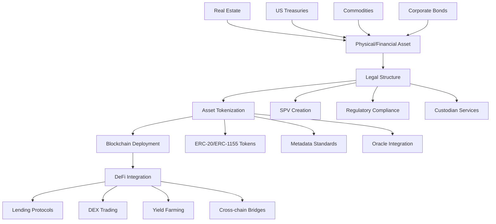

# � Real World Assets (RWA) Tokenization: Cầu nối Tài sản Truyền thống - Blockchain

## 🎯 First-Principles Thinking về RWA

### Vấn đề cốt lõi
**Tại sao cần tokenize tài sản thực?**

1. **Liquidity Problem**: Tài sản truyền thống khó chia nhỏ và giao dịch
2. **Access Barriers**: Vốn đầu tư lớn, thủ tục phức tạp
3. **Transparency Issues**: Thiếu minh bạch trong quản lý và định giá
4. **Geographic Limitations**: Giới hạn địa lý trong đầu tư

### Giải pháp Tokenization

**Digital Twin của tài sản thực**:

- 1 token = quyền sở hữu 1 phần tài sản
- Smart contracts tự động hóa quản lý
- Blockchain đảm bảo tính bất biến và minh bạch
- Global accessibility 24/7

## 📊 RWA Market 2025 - Thực tế số liệu

**Market Size**: **$230+ Billion** (tăng 69% từ 2024)

```javascript
const rwaMarketBreakdown2025 = {
  totalMarketCap: "$230B+",
  growth: "69% YoY",
  
  segments: {
    fiatStablecoins: {
      value: "$224.9B", 
      dominance: "97.8%",
      leaders: ["USDT", "USDC", "BUSD", "DAI"]
    },
    
    tokenizedTreasuries: {
      value: "$5.6B",
      growth: "800% YoY", 
      leaders: ["BlackRock BUIDL", "Franklin Templeton", "Ondo Finance"]
    },
    
    realEstate: {
      value: "$500M+",
      platforms: ["RealT", "Lofty", "Centrifuge"]
    },
    
    commodities: {
      value: "$200M+", 
      assets: ["Gold (PAXG)", "Silver", "Oil futures"]
    }
  }
}
```

## 🏗️ RWA Architecture - Technical Deep Dive



## 🏛️ Institutional Adoption 2025

### Major Players Entering RWA

**BlackRock BUIDL Fund** - $520M+ AUM
```solidity
// Simplified BlackRock BUIDL token structure
contract BUIDLToken is ERC20, AccessControl {
    bytes32 public constant TRANSFER_AGENT_ROLE = keccak256("TRANSFER_AGENT_ROLE");
    
    struct InvestorInfo {
        bool isAccredited;
        uint256 investmentLimit;
        uint256 currentInvestment;
        bytes32 kycHash;
    }
    
    mapping(address => InvestorInfo) public investors;
    
    modifier onlyAccredited(address investor) {
        require(investors[investor].isAccredited, "Not accredited investor");
        require(
            investors[investor].currentInvestment + amount <= 
            investors[investor].investmentLimit, 
            "Investment limit exceeded"
        );
        _;
    }
    
    function transfer(address to, uint256 amount) 
        public 
        override 
        onlyAccredited(to) 
        returns (bool) 
    {
        return super.transfer(to, amount);
    }
}
```

**Franklin Templeton FOBXX** - On-chain money market fund
```javascript
const franklinOnChain = {
  fund: "Franklin OnChain U.S. Government Money Fund",
  ticker: "FOBXX", 
  blockchain: "Stellar",
  aum: "$380M+",
  yield: "5.1% APY",
  features: [
    "Daily NAV updates on-chain",
    "Instant settlement",
    "24/7 trading capability"
  ]
}
```

## 🏠 Types of RWA

### 1. Real Estate Tokenization

```solidity
// Real Estate tokenization contract
contract RealEstateToken {
    struct Property {
        uint256 propertyId;
        string propertyAddress;
        uint256 totalValue;
        uint256 totalSupply;
        address propertyManager;
        string legalDocumentHash;
        bool isActive;
        uint256 rentalYield;
        uint256 lastValuation;
    }
    
    mapping(uint256 => Property) public properties;
    mapping(uint256 => mapping(address => uint256)) public propertyShares;
    mapping(uint256 => uint256) public totalRentalCollected;
    
    event PropertyTokenized(uint256 indexed propertyId, uint256 totalValue, uint256 totalSupply);
    event RentalDistributed(uint256 indexed propertyId, uint256 totalAmount);
    event PropertyValuationUpdated(uint256 indexed propertyId, uint256 newValue);
    
    function tokenizeProperty(
        string memory propertyAddress,
        uint256 propertyValue,
        uint256 tokenSupply,
        string memory legalDocHash
    ) external returns (uint256 propertyId) {
        require(propertyValue > 0, "Property value must be positive");
        require(tokenSupply > 0, "Token supply must be positive");
        
        propertyId = _propertyIdCounter++;
        
        properties[propertyId] = Property({
            propertyId: propertyId,
            propertyAddress: propertyAddress,
            totalValue: propertyValue,
            totalSupply: tokenSupply,
            propertyManager: msg.sender,
            legalDocumentHash: legalDocHash,
            isActive: true,
            rentalYield: 0,
            lastValuation: block.timestamp
        });
        
        // Mint tokens to property owner
        _mint(msg.sender, propertyId, tokenSupply, "");
        
        emit PropertyTokenized(propertyId, propertyValue, tokenSupply);
        return propertyId;
    }
    
    function distributeRental(
        uint256 propertyId,
        uint256 rentalAmount
    ) external onlyPropertyManager(propertyId) {
        Property storage property = properties[propertyId];
        require(property.isActive, "Property not active");
        
        totalRentalCollected[propertyId] += rentalAmount;
        property.rentalYield += rentalAmount;
        
        // Distribute rental proportionally to token holders
        // Implementation depends on token holder enumeration
        
        emit RentalDistributed(propertyId, rentalAmount);
    }
    
    function updatePropertyValuation(
        uint256 propertyId,
        uint256 newValue,
        bytes memory valuationProof
    ) external {
        require(verifyValuationProof(newValue, valuationProof), "Invalid valuation proof");
        
        Property storage property = properties[propertyId];
        property.totalValue = newValue;
        property.lastValuation = block.timestamp;
        
        emit PropertyValuationUpdated(propertyId, newValue);
    }
    
    modifier onlyPropertyManager(uint256 propertyId) {
        require(properties[propertyId].propertyManager == msg.sender, "Not property manager");
        _;
    }
}
```

### 2. Commodity Tokenization

```solidity
// Gold tokenization example
contract GoldToken is ERC20 {
    struct GoldReserve {
        uint256 reserveId;
        uint256 goldAmount; // in grams
        string vaultLocation;
        string certificateHash;
        bool isAudited;
        uint256 lastAuditDate;
    }
    
    mapping(uint256 => GoldReserve) public goldReserves;
    mapping(address => bool) public authorizedVaults;
    
    uint256 public totalGoldBacked; // total grams of gold backing tokens
    uint256 public constant GOLD_PER_TOKEN = 1; // 1 token = 1 gram of gold
    
    IChainlinkOracle public goldPriceOracle;
    
    event GoldDeposited(uint256 indexed reserveId, uint256 amount, string vaultLocation);
    event GoldWithdrawn(uint256 indexed reserveId, uint256 amount, address recipient);
    event AuditCompleted(uint256 indexed reserveId, bool passed);
    
    function depositGold(
        uint256 goldAmount,
        string memory vaultLocation,
        string memory certificateHash
    ) external onlyAuthorizedVault returns (uint256 reserveId) {
        reserveId = _reserveIdCounter++;
        
        goldReserves[reserveId] = GoldReserve({
            reserveId: reserveId,
            goldAmount: goldAmount,
            vaultLocation: vaultLocation,
            certificateHash: certificateHash,
            isAudited: false,
            lastAuditDate: 0
        });
        
        totalGoldBacked += goldAmount;
        
        // Mint tokens equivalent to gold deposited
        _mint(msg.sender, goldAmount * 10**decimals());
        
        emit GoldDeposited(reserveId, goldAmount, vaultLocation);
        return reserveId;
    }
    
    function withdrawGold(
        uint256 reserveId,
        uint256 amount,
        address recipient
    ) external {
        GoldReserve storage reserve = goldReserves[reserveId];
        require(reserve.goldAmount >= amount, "Insufficient gold in reserve");
        require(reserve.isAudited, "Reserve not audited");
        
        // Burn tokens
        uint256 tokenAmount = amount * 10**decimals();
        require(balanceOf(msg.sender) >= tokenAmount, "Insufficient tokens");
        _burn(msg.sender, tokenAmount);
        
        // Update reserve
        reserve.goldAmount -= amount;
        totalGoldBacked -= amount;
        
        // Trigger physical gold withdrawal process
        // This would involve off-chain coordination with vault
        
        emit GoldWithdrawn(reserveId, amount, recipient);
    }
    
    function getCurrentGoldPrice() external view returns (uint256) {
        return goldPriceOracle.getLatestPrice();
    }
    
    modifier onlyAuthorizedVault() {
        require(authorizedVaults[msg.sender], "Not authorized vault");
        _;
    }
}
```

### 3. Corporate Bonds Tokenization

```solidity
// Corporate bond tokenization
contract CorporateBondToken {
    struct Bond {
        uint256 bondId;
        string issuerName;
        uint256 faceValue;
        uint256 couponRate; // in basis points (e.g., 500 = 5%)
        uint256 maturityDate;
        uint256 issuanceDate;
        uint256 totalSupply;
        bool isActive;
        uint256 nextCouponDate;
        mapping(address => uint256) holdings;
    }
    
    mapping(uint256 => Bond) public bonds;
    mapping(uint256 => uint256) public accruedInterest;
    
    ICreditRatingOracle public creditRatingOracle;
    
    event BondIssued(uint256 indexed bondId, string issuer, uint256 faceValue);
    event CouponPaid(uint256 indexed bondId, uint256 totalAmount);
    event BondMatured(uint256 indexed bondId, uint256 principalRepaid);
    
    function issueBond(
        string memory issuerName,
        uint256 faceValue,
        uint256 couponRate,
        uint256 maturityPeriod, // in seconds
        uint256 totalSupply
    ) external returns (uint256 bondId) {
        require(faceValue > 0, "Face value must be positive");
        require(couponRate > 0, "Coupon rate must be positive");
        require(totalSupply > 0, "Total supply must be positive");
        
        bondId = _bondIdCounter++;
        
        Bond storage newBond = bonds[bondId];
        newBond.bondId = bondId;
        newBond.issuerName = issuerName;
        newBond.faceValue = faceValue;
        newBond.couponRate = couponRate;
        newBond.issuanceDate = block.timestamp;
        newBond.maturityDate = block.timestamp + maturityPeriod;
        newBond.totalSupply = totalSupply;
        newBond.isActive = true;
        newBond.nextCouponDate = block.timestamp + 90 days; // Quarterly coupons
        
        // Mint bond tokens
        _mint(msg.sender, bondId, totalSupply, "");
        
        emit BondIssued(bondId, issuerName, faceValue);
        return bondId;
    }
    
    function payCoupon(uint256 bondId) external payable {
        Bond storage bond = bonds[bondId];
        require(bond.isActive, "Bond not active");
        require(block.timestamp >= bond.nextCouponDate, "Coupon not due yet");
        require(block.timestamp < bond.maturityDate, "Bond has matured");
        
        // Calculate coupon payment
        uint256 couponPayment = (bond.faceValue * bond.couponRate) / 10000 / 4; // Quarterly
        uint256 totalCouponPayment = couponPayment * bond.totalSupply;
        
        require(msg.value >= totalCouponPayment, "Insufficient coupon payment");
        
        // Update next coupon date
        bond.nextCouponDate += 90 days;
        
        // Distribute to token holders (simplified)
        accruedInterest[bondId] += totalCouponPayment;
        
        emit CouponPaid(bondId, totalCouponPayment);
    }
    
    function matureBond(uint256 bondId) external payable {
        Bond storage bond = bonds[bondId];
        require(bond.isActive, "Bond not active");
        require(block.timestamp >= bond.maturityDate, "Bond not matured yet");
        
        uint256 principalRepayment = bond.faceValue * bond.totalSupply;
        require(msg.value >= principalRepayment, "Insufficient principal repayment");
        
        bond.isActive = false;
        
        // Mark for redemption by token holders
        
        emit BondMatured(bondId, principalRepayment);
    }
    
    function getBondRating(uint256 bondId) external view returns (string memory) {
        Bond storage bond = bonds[bondId];
        return creditRatingOracle.getCreditRating(bond.issuerName);
    }
}
```

## 💰 DeFi Integration

### 1. RWA Lending Protocol

```solidity
// Lending protocol accepting RWA as collateral
contract RWALendingProtocol {
    struct LoanPosition {
        uint256 positionId;
        address borrower;
        address collateralToken;
        uint256 collateralAmount;
        uint256 loanAmount;
        uint256 interestRate;
        uint256 startTime;
        uint256 dueDate;
        bool isActive;
    }
    
    mapping(uint256 => LoanPosition) public loanPositions;
    mapping(address => bool) public acceptedRWATokens;
    mapping(address => uint256) public collateralRatios; // in basis points
    
    IRWAOracle public rwaOracle;
    
    event LoanCreated(uint256 indexed positionId, address borrower, uint256 loanAmount);
    event LoanRepaid(uint256 indexed positionId, uint256 repaidAmount);
    event CollateralLiquidated(uint256 indexed positionId, uint256 liquidatedAmount);
    
    function createLoan(
        address rwaToken,
        uint256 collateralAmount,
        uint256 requestedLoan,
        uint256 loanDuration
    ) external returns (uint256 positionId) {
        require(acceptedRWATokens[rwaToken], "RWA token not accepted");
        require(collateralAmount > 0, "Collateral amount must be positive");
        
        // Get current value of RWA
        uint256 collateralValue = rwaOracle.getAssetValue(rwaToken, collateralAmount);
        
        // Check loan-to-value ratio
        uint256 maxLoan = (collateralValue * collateralRatios[rwaToken]) / 10000;
        require(requestedLoan <= maxLoan, "Loan amount too high");
        
        // Transfer collateral
        IERC20(rwaToken).transferFrom(msg.sender, address(this), collateralAmount);
        
        positionId = _positionIdCounter++;
        
        loanPositions[positionId] = LoanPosition({
            positionId: positionId,
            borrower: msg.sender,
            collateralToken: rwaToken,
            collateralAmount: collateralAmount,
            loanAmount: requestedLoan,
            interestRate: calculateInterestRate(rwaToken, requestedLoan),
            startTime: block.timestamp,
            dueDate: block.timestamp + loanDuration,
            isActive: true
        });
        
        // Transfer loan amount to borrower
        payable(msg.sender).transfer(requestedLoan);
        
        emit LoanCreated(positionId, msg.sender, requestedLoan);
        return positionId;
    }
    
    function repayLoan(uint256 positionId) external payable {
        LoanPosition storage position = loanPositions[positionId];
        require(position.isActive, "Loan not active");
        require(position.borrower == msg.sender, "Not loan borrower");
        
        uint256 totalRepayment = calculateTotalRepayment(positionId);
        require(msg.value >= totalRepayment, "Insufficient repayment");
        
        // Return collateral
        IERC20(position.collateralToken).transfer(
            position.borrower,
            position.collateralAmount
        );
        
        position.isActive = false;
        
        emit LoanRepaid(positionId, msg.value);
    }
    
    function liquidatePosition(uint256 positionId) external {
        LoanPosition storage position = loanPositions[positionId];
        require(position.isActive, "Loan not active");
        
        // Check if liquidation conditions are met
        require(
            block.timestamp > position.dueDate ||
            isUndercollateralized(positionId),
            "Liquidation not allowed"
        );
        
        // Liquidate collateral
        uint256 collateralValue = rwaOracle.getAssetValue(
            position.collateralToken,
            position.collateralAmount
        );
        
        // Auction or direct sale logic here
        // For simplicity, transfer to liquidator
        IERC20(position.collateralToken).transfer(msg.sender, position.collateralAmount);
        
        position.isActive = false;
        
        emit CollateralLiquidated(positionId, collateralValue);
    }
    
    function isUndercollateralized(uint256 positionId) public view returns (bool) {
        LoanPosition storage position = loanPositions[positionId];
        
        uint256 currentCollateralValue = rwaOracle.getAssetValue(
            position.collateralToken,
            position.collateralAmount
        );
        
        uint256 requiredCollateral = (position.loanAmount * 10000) / collateralRatios[position.collateralToken];
        
        return currentCollateralValue < requiredCollateral;
    }
}
```

### 2. RWA Yield Farming

```solidity
// Yield farming with RWA tokens
contract RWAYieldFarm {
    struct PoolInfo {
        IERC20 rwaToken;
        uint256 allocPoint;
        uint256 lastRewardTime;
        uint256 accRewardPerShare;
        uint256 totalStaked;
        string assetType; // "real-estate", "commodities", "bonds"
    }
    
    struct UserInfo {
        uint256 amount;
        uint256 rewardDebt;
        uint256 lastStakeTime;
    }
    
    PoolInfo[] public poolInfo;
    mapping(uint256 => mapping(address => UserInfo)) public userInfo;
    
    IERC20 public rewardToken;
    uint256 public rewardPerSecond;
    uint256 public totalAllocPoint;
    
    IRWAValidator public rwaValidator;
    
    event Staked(address indexed user, uint256 indexed pid, uint256 amount);
    event Withdrawn(address indexed user, uint256 indexed pid, uint256 amount);
    event RewardsClaimed(address indexed user, uint256 amount);
    
    function addPool(
        IERC20 _rwaToken,
        uint256 _allocPoint,
        string memory _assetType
    ) external onlyOwner {
        require(rwaValidator.isValidRWA(address(_rwaToken)), "Invalid RWA token");
        
        uint256 lastRewardTime = block.timestamp;
        totalAllocPoint += _allocPoint;
        
        poolInfo.push(PoolInfo({
            rwaToken: _rwaToken,
            allocPoint: _allocPoint,
            lastRewardTime: lastRewardTime,
            accRewardPerShare: 0,
            totalStaked: 0,
            assetType: _assetType
        }));
    }
    
    function stake(uint256 _pid, uint256 _amount) external {
        PoolInfo storage pool = poolInfo[_pid];
        UserInfo storage user = userInfo[_pid][msg.sender];
        
        updatePool(_pid);
        
        if (user.amount > 0) {
            uint256 pending = (user.amount * pool.accRewardPerShare / 1e12) - user.rewardDebt;
            if (pending > 0) {
                rewardToken.transfer(msg.sender, pending);
                emit RewardsClaimed(msg.sender, pending);
            }
        }
        
        if (_amount > 0) {
            pool.rwaToken.transferFrom(msg.sender, address(this), _amount);
            user.amount += _amount;
            pool.totalStaked += _amount;
            user.lastStakeTime = block.timestamp;
        }
        
        user.rewardDebt = user.amount * pool.accRewardPerShare / 1e12;
        
        emit Staked(msg.sender, _pid, _amount);
    }
    
    function withdraw(uint256 _pid, uint256 _amount) external {
        PoolInfo storage pool = poolInfo[_pid];
        UserInfo storage user = userInfo[_pid][msg.sender];
        
        require(user.amount >= _amount, "Insufficient staked amount");
        
        updatePool(_pid);
        
        uint256 pending = (user.amount * pool.accRewardPerShare / 1e12) - user.rewardDebt;
        if (pending > 0) {
            rewardToken.transfer(msg.sender, pending);
            emit RewardsClaimed(msg.sender, pending);
        }
        
        if (_amount > 0) {
            user.amount -= _amount;
            pool.totalStaked -= _amount;
            pool.rwaToken.transfer(msg.sender, _amount);
        }
        
        user.rewardDebt = user.amount * pool.accRewardPerShare / 1e12;
        
        emit Withdrawn(msg.sender, _pid, _amount);
    }
    
    function updatePool(uint256 _pid) public {
        PoolInfo storage pool = poolInfo[_pid];
        
        if (block.timestamp <= pool.lastRewardTime) {
            return;
        }
        
        if (pool.totalStaked == 0) {
            pool.lastRewardTime = block.timestamp;
            return;
        }
        
        uint256 timeElapsed = block.timestamp - pool.lastRewardTime;
        uint256 reward = timeElapsed * rewardPerSecond * pool.allocPoint / totalAllocPoint;
        
        pool.accRewardPerShare += reward * 1e12 / pool.totalStaked;
        pool.lastRewardTime = block.timestamp;
    }
}
```

## 🏛️ Legal & Compliance Framework

### 1. Compliance Smart Contract

```solidity
// Compliance framework for RWA
contract RWACompliance {
    enum ComplianceStatus { PENDING, APPROVED, REJECTED, SUSPENDED }
    
    struct ComplianceRecord {
        address tokenAddress;
        string jurisdiction;
        string regulatoryFramework;
        ComplianceStatus status;
        uint256 lastAuditDate;
        string auditReport;
        mapping(address => bool) authorizedInvestors;
    }
    
    mapping(address => ComplianceRecord) public complianceRecords;
    mapping(address => bool) public authorizedAuditors;
    mapping(string => bool) public supportedJurisdictions;
    
    event ComplianceStatusUpdated(address indexed token, ComplianceStatus status);
    event InvestorAuthorized(address indexed token, address investor);
    event AuditCompleted(address indexed token, string auditReport);
    
    function registerRWAToken(
        address tokenAddress,
        string memory jurisdiction,
        string memory regulatoryFramework
    ) external {
        require(supportedJurisdictions[jurisdiction], "Jurisdiction not supported");
        
        ComplianceRecord storage record = complianceRecords[tokenAddress];
        record.tokenAddress = tokenAddress;
        record.jurisdiction = jurisdiction;
        record.regulatoryFramework = regulatoryFramework;
        record.status = ComplianceStatus.PENDING;
        record.lastAuditDate = 0;
    }
    
    function updateComplianceStatus(
        address tokenAddress,
        ComplianceStatus newStatus,
        string memory reason
    ) external onlyAuthorizedAuditor {
        ComplianceRecord storage record = complianceRecords[tokenAddress];
        record.status = newStatus;
        
        emit ComplianceStatusUpdated(tokenAddress, newStatus);
    }
    
    function authorizeInvestor(
        address tokenAddress,
        address investor,
        bytes memory kycProof
    ) external {
        require(verifyKYCProof(investor, kycProof), "Invalid KYC proof");
        
        ComplianceRecord storage record = complianceRecords[tokenAddress];
        record.authorizedInvestors[investor] = true;
        
        emit InvestorAuthorized(tokenAddress, investor);
    }
    
    function isComplianceValid(address tokenAddress) external view returns (bool) {
        ComplianceRecord storage record = complianceRecords[tokenAddress];
        return record.status == ComplianceStatus.APPROVED;
    }
    
    function isInvestorAuthorized(
        address tokenAddress,
        address investor
    ) external view returns (bool) {
        return complianceRecords[tokenAddress].authorizedInvestors[investor];
    }
    
    modifier onlyAuthorizedAuditor() {
        require(authorizedAuditors[msg.sender], "Not authorized auditor");
        _;
    }
}
```

### 2. KYC/AML Integration

```solidity
// KYC/AML verification for RWA investors
contract RWAKYCVerification {
    struct KYCRecord {
        address investor;
        string personalDataHash;
        uint256 verificationDate;
        uint256 expiryDate;
        bool isVerified;
        string verificationLevel; // "basic", "enhanced", "institutional"
        string jurisdiction;
    }
    
    mapping(address => KYCRecord) public kycRecords;
    mapping(address => bool) public authorizedKYCProviders;
    mapping(address => mapping(string => bool)) public jurisdictionAccess;
    
    IZKVerifier public zkVerifier; // For privacy-preserving KYC
    
    event KYCVerified(address indexed investor, string verificationLevel);
    event KYCExpired(address indexed investor);
    
    function submitKYCVerification(
        address investor,
        string memory personalDataHash,
        uint256 validityPeriod,
        string memory verificationLevel,
        string memory jurisdiction,
        bytes memory verificationProof
    ) external onlyAuthorizedKYCProvider {
        require(
            zkVerifier.verifyKYCProof(
                investor,
                personalDataHash,
                verificationProof
            ),
            "Invalid KYC proof"
        );
        
        kycRecords[investor] = KYCRecord({
            investor: investor,
            personalDataHash: personalDataHash,
            verificationDate: block.timestamp,
            expiryDate: block.timestamp + validityPeriod,
            isVerified: true,
            verificationLevel: verificationLevel,
            jurisdiction: jurisdiction
        });
        
        jurisdictionAccess[investor][jurisdiction] = true;
        
        emit KYCVerified(investor, verificationLevel);
    }
    
    function isKYCValid(address investor) external view returns (bool) {
        KYCRecord storage record = kycRecords[investor];
        return record.isVerified && block.timestamp <= record.expiryDate;
    }
    
    function hasJurisdictionAccess(
        address investor,
        string memory jurisdiction
    ) external view returns (bool) {
        return jurisdictionAccess[investor][jurisdiction] && isKYCValid(investor);
    }
    
    function checkKYCExpiry() external {
        // This would typically be called by a keeper/automation service
        KYCRecord storage record = kycRecords[msg.sender];
        if (record.isVerified && block.timestamp > record.expiryDate) {
            record.isVerified = false;
            emit KYCExpired(msg.sender);
        }
    }
    
    modifier onlyAuthorizedKYCProvider() {
        require(authorizedKYCProviders[msg.sender], "Not authorized KYC provider");
        _;
    }
}
```

## 📊 RWA Market Analysis (2025)

### Market Size & Growth

```javascript
const rwaMarketData = {
  totalMarketSize: "$2.8T", // Total addressable market
  tokenizedAssets: "$50B+", // Currently tokenized
  growthRate: "400% YoY",
  
  breakdown: {
    realEstate: {
      market: "$280T globally",
      tokenized: "$2B",
      penetration: "0.0007%",
      potential: "Massive"
    },
    
    commodities: {
      market: "$20T",
      tokenized: "$500M",
      penetration: "0.0025%",
      leaders: ["Gold", "Silver", "Oil"]
    },
    
    bonds: {
      market: "$130T",
      tokenized: "$1B",
      penetration: "0.0008%",
      growth: "Institutional adoption"
    },
    
    privateEquity: {
      market: "$7T",
      tokenized: "$100M",
      penetration: "0.0014%",
      barrier: "Regulatory complexity"
    }
  }
}
```

### Leading RWA Platforms

```javascript
const rwaProtocols = {
  centrifuge: {
    focus: "Real-world credit",
    tvl: "$300M+",
    chains: ["Ethereum", "Polkadot"],
    assets: ["Invoices", "Mortgages", "Revenue streams"]
  },
  
  goldfinch: {
    focus: "Emerging market lending",
    tvl: "$100M+",
    model: "Uncollateralized loans",
    backers: "Institutional credit assessment"
  },
  
  maple: {
    focus: "Institutional lending",
    tvl: "$200M+",
    model: "Pool-based lending",
    borrowers: "Crypto institutions"
  },
  
  realT: {
    focus: "Real estate tokenization",
    properties: "400+ properties",
    location: "US real estate",
    model: "Fractional ownership"
  }
}
```

## 🔮 Future Trends

### 1. Cross-Chain RWA

```solidity
// Cross-chain RWA bridge
contract CrossChainRWABridge {
    struct CrossChainAsset {
        uint256 assetId;
        address originalToken;
        uint16 sourceChain;
        string assetType;
        uint256 totalSupply;
        mapping(uint16 => address) wrappedTokens;
    }
    
    mapping(uint256 => CrossChainAsset) public crossChainAssets;
    mapping(uint16 => bool) public supportedChains;
    
    ILayerZeroEndpoint public lzEndpoint;
    
    function bridgeRWAToChain(
        uint256 assetId,
        uint16 destinationChain,
        uint256 amount,
        address recipient
    ) external payable {
        require(supportedChains[destinationChain], "Chain not supported");
        
        CrossChainAsset storage asset = crossChainAssets[assetId];
        
        // Burn tokens on source chain
        IERC20(asset.originalToken).transferFrom(msg.sender, address(this), amount);
        
        // Send cross-chain message
        bytes memory payload = abi.encode(assetId, amount, recipient);
        _lzSend(destinationChain, payload, payable(msg.sender), address(0), bytes(""));
    }
    
    function _nonblockingLzReceive(
        uint16 _srcChainId,
        bytes memory _srcAddress,
        uint64 _nonce,
        bytes memory _payload
    ) internal override {
        (uint256 assetId, uint256 amount, address recipient) = abi.decode(
            _payload,
            (uint256, uint256, address)
        );
        
        CrossChainAsset storage asset = crossChainAssets[assetId];
        
        // Mint wrapped tokens on destination chain
        IERC20(asset.wrappedTokens[_srcChainId]).mint(recipient, amount);
    }
}
```

### 2. AI-Enhanced RWA Valuation

```solidity
// AI-powered RWA valuation oracle
contract AIRWAValuationOracle {
    struct ValuationModel {
        string modelName;
        string modelVersion;
        uint256 accuracy; // in basis points
        string assetTypes; // JSON array of supported asset types
        bool isActive;
    }
    
    mapping(bytes32 => ValuationModel) public valuationModels;
    mapping(address => uint256) public lastValuations;
    mapping(address => uint256) public valuationTimestamps;
    
    IAIOracle public aiOracle;
    
    event ValuationUpdated(address indexed asset, uint256 newValue, bytes32 modelUsed);
    
    function updateValuation(
        address rwaToken,
        bytes memory marketData,
        bytes32 modelId
    ) external returns (uint256 valuation) {
        ValuationModel storage model = valuationModels[modelId];
        require(model.isActive, "Model not active");
        
        // Get AI valuation
        valuation = aiOracle.getAssetValuation(
            rwaToken,
            marketData,
            model.modelName
        );
        
        // Update stored valuation
        lastValuations[rwaToken] = valuation;
        valuationTimestamps[rwaToken] = block.timestamp;
        
        emit ValuationUpdated(rwaToken, valuation, modelId);
        return valuation;
    }
    
    function getValuation(address rwaToken) external view returns (uint256, uint256) {
        return (lastValuations[rwaToken], valuationTimestamps[rwaToken]);
    }
}
```

## 🛠️ Development Tools

### RWA Development Stack

```bash
# Essential tools for RWA development
npm install @openzeppelin/contracts
npm install @chainlink/contracts
npm install hardhat-deploy
npm install @nomicfoundation/hardhat-verify

# RWA-specific libraries
npm install @centrifuge/tinlake-js
npm install @realtoken/web3-contracts
```

### Legal Framework Integration

```javascript
// Integration with legal document storage
const legalFramework = {
  documentStorage: {
    ipfs: "Decentralized storage",
    arweave: "Permanent storage",
    encryption: "AES-256 encryption"
  },
  
  compliance: {
    kyc: "Jumio, Onfido integration",
    aml: "Chainalysis, Elliptic",
    reporting: "Automated compliance reports"
  },
  
  legal: {
    smartLegal: "Smart legal contracts",
    oracles: "Legal status oracles",
    arbitration: "On-chain dispute resolution"
  }
}
```

## ✅ Key Takeaways

1. **Massive Opportunity**: $280T+ trong real-world assets có thể được tokenized
2. **Early Stage**: Chỉ <0.01% assets đã được tokenized
3. **Regulatory Key**: Compliance là yếu tố quyết định success
4. **DeFi Integration**: RWA mở ra collateral mới cho lending/borrowing
5. **Technology Evolution**: AI valuation, cross-chain bridges improving
6. **Institutional Adoption**: Traditional finance đang embrace tokenization

**Next**: [[12-Cross-Chain-Interoperability]] - Tương lai multi-chain
