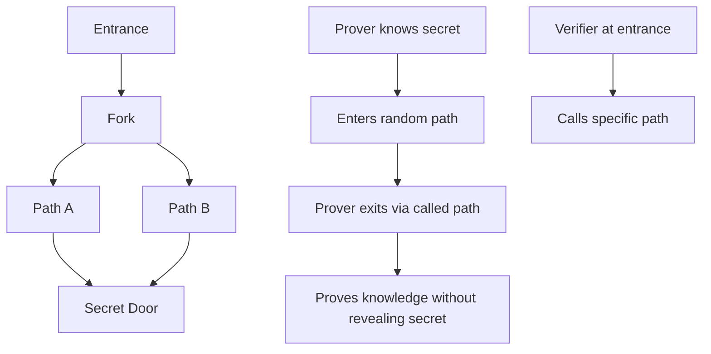
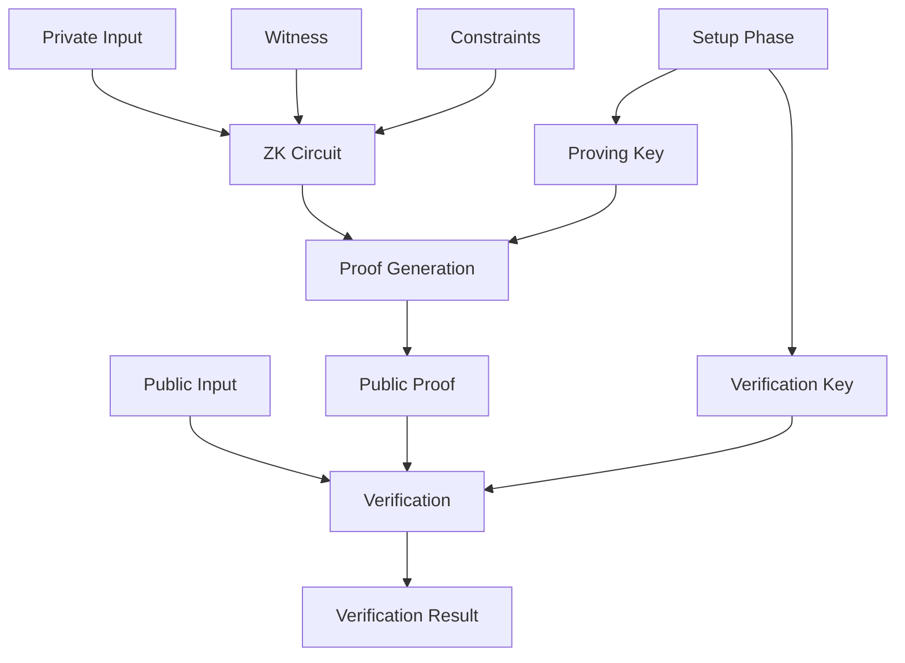

# � Zero-Knowledge Proofs: Bằng chứng không cần tiết lộ bí mật

## 🎯 First-Principles Thinking về ZKP

### Vấn đề cơ bản
**Làm sao chứng minh bạn biết điều gì đó mà không cần tiết lộ nó?**

Ví dụ đời thường:

- Chứng minh bạn đủ tuổi uống rượu mà không cần tiết lộ ngày sinh chính xác
- Chứng minh bạn có đủ tiền trong tài khoản mà không cần tiết lộ số dư
- Chứng minh bạn biết password mà không cần tiết lộ password

### Ba tính chất cốt lõi của ZKP

1. **Completeness** (Đầy đủ): Nếu statement đúng, verifier sẽ tin
2. **Soundness** (Chắc chắn): Nếu statement sai, verifier sẽ không tin  
3. **Zero-Knowledge** (Không tiết lộ): Verifier không học được thông tin gì khác

## 🧠 Hiểu sâu Zero-Knowledge

### Ví dụ đơn giản: Cave of Ali Baba



**Tại sao hoạt động?**
- Nếu Prover không biết secret → 50% chance thất bại mỗi round
- Sau n rounds → Probability of cheating = (1/2)^n
- 20 rounds → 1 in 1 million chance of successful cheating

## 🏗️ ZK Architecture trong Blockchain



## 🔢 Toán học đằng sau ZK

### Polynomial Commitment Schemes

```javascript
// Simplified example of polynomial commitment
class PolynomialCommitment {
    constructor(setup) {
        this.setup = setup; // Trusted setup parameters
    }
    
    // Commit to polynomial f(x)
    commit(polynomial) {
        // f(x) = a₀ + a₁x + a₂x² + ... + aₙxⁿ
        let commitment = this.setup.g1.multiply(polynomial.coefficients[0]);
        
        for (let i = 1; i < polynomial.coefficients.length; i++) {
            const term = this.setup.powers[i].multiply(polynomial.coefficients[i]);
            commitment = commitment.add(term);
        }
        
        return commitment;
    }
    
    // Create proof that f(z) = y
    createProof(polynomial, point, value) {
        // Create quotient polynomial q(x) = (f(x) - y) / (x - z)
        const quotient = polynomial.subtract(value).divide(point);
        return this.commit(quotient);
    }
    
    // Verify proof
    verify(commitment, proof, point, value) {
        // Pairing check: e(commitment - g^y, g) = e(proof, g^(τ-z))
        const lhs = this.pairing(commitment.subtract(this.setup.g1.multiply(value)), this.setup.g2);
        const rhs = this.pairing(proof, this.setup.g2Powers.subtract(point));
        return lhs.equals(rhs);
    }
}
```

### Fiat-Shamir Transform

```javascript
// Convert interactive protocol to non-interactive
class FiatShamir {
    static makeNonInteractive(prover, statement, witness) {
        const commitment = prover.step1(witness);
        
        // Generate challenge using hash function (random oracle)
        const challenge = this.hash(statement + commitment.toString());
        
        const response = prover.step3(witness, challenge);
        
        return {
            commitment,
            challenge,
            response
        };
    }
    
    static verify(verifier, statement, proof) {
        // Recreate challenge
        const expectedChallenge = this.hash(statement + proof.commitment.toString());
        
        if (expectedChallenge !== proof.challenge) {
            return false;
        }
        
        return verifier.verify(statement, proof.commitment, proof.challenge, proof.response);
    }
    
    static hash(input) {
        // Use cryptographic hash function (Poseidon for ZK circuits)
        return poseidonHash(input);
    }
}
```

## 🚀 ZK Rollups: Scaling với Privacy

### Architecture Deep Dive

```solidity
// Simplified ZK Rollup contract
contract ZKRollup {
    struct Block {
        bytes32 stateRoot;
        bytes32 transactionRoot;
        uint256 blockNumber;
        bytes32 zkProof;
    }
    
    mapping(uint256 => Block) public blocks;
    uint256 public currentBlockNumber;
    bytes32 public currentStateRoot;
    
    // Verifier contract for ZK proofs
    IVerifier public immutable verifier;
    
    event BlockSubmitted(
        uint256 indexed blockNumber,
        bytes32 stateRoot,
        bytes32 transactionRoot
    );
    
    function submitBlock(
        bytes32 newStateRoot,
        bytes32 transactionRoot,
        bytes calldata proof,
        uint256[] calldata publicInputs
    ) external {
        // Verify ZK proof
        require(
            verifier.verifyProof(proof, publicInputs),
            "Invalid ZK proof"
        );
        
        // Check state transition validity
        require(
            publicInputs[0] == uint256(currentStateRoot),
            "Invalid previous state"
        );
        require(
            publicInputs[1] == uint256(newStateRoot),
            "Invalid new state"
        );
        
        // Update state
        currentBlockNumber++;
        currentStateRoot = newStateRoot;
        
        blocks[currentBlockNumber] = Block({
            stateRoot: newStateRoot,
            transactionRoot: transactionRoot,
            blockNumber: currentBlockNumber,
            zkProof: keccak256(proof)
        });
        
        emit BlockSubmitted(currentBlockNumber, newStateRoot, transactionRoot);
    }
    
    function processWithdrawal(
        uint256 amount,
        address recipient,
        bytes32[] calldata merkleProof
    ) external {
        // Verify withdrawal is in current state
        require(
            verifyMerkleProof(merkleProof, currentStateRoot, amount, recipient),
            "Invalid withdrawal proof"
        );
        
        // Execute withdrawal
        payable(recipient).transfer(amount);
    }
}
```

### Transaction Processing

```rust
// Rust implementation for ZK circuit
use ark_ff::Field;
use ark_relations::r1cs::{ConstraintSynthesizer, ConstraintSystemRef, SynthesisError};

struct TransactionCircuit<F: Field> {
    // Private inputs (witness)
    private_key: Option<F>,
    nonce: Option<F>,
    amount: Option<F>,
    
    // Public inputs
    public_key: Option<F>,
    recipient: Option<F>,
    new_balance: Option<F>,
}

impl<F: Field> ConstraintSynthesizer<F> for TransactionCircuit<F> {
    fn generate_constraints(
        self,
        cs: ConstraintSystemRef<F>,
    ) -> Result<(), SynthesisError> {
        // Allocate variables
        let private_key = cs.new_witness_variable(|| {
            self.private_key.ok_or(SynthesisError::AssignmentMissing)
        })?;
        
        let public_key = cs.new_input_variable(|| {
            self.public_key.ok_or(SynthesisError::AssignmentMissing)
        })?;
        
        // Constraint 1: Public key derivation
        // public_key = hash(private_key)
        let computed_public_key = self.hash_constraint(cs.clone(), private_key)?;
        cs.enforce_constraint(
            lc!() + public_key,
            lc!() + CS::one(),
            lc!() + computed_public_key,
        )?;
        
        // Constraint 2: Signature verification
        let signature = self.sign_transaction(cs.clone(), private_key)?;
        self.verify_signature_constraint(cs.clone(), signature, public_key)?;
        
        // Constraint 3: Balance constraint
        let old_balance = cs.new_witness_variable(|| {
            self.old_balance.ok_or(SynthesisError::AssignmentMissing)
        })?;
        
        let new_balance = cs.new_input_variable(|| {
            self.new_balance.ok_or(SynthesisError::AssignmentMissing)
        })?;
        
        let amount = cs.new_witness_variable(|| {
            self.amount.ok_or(SynthesisError::AssignmentMissing)
        })?;
        
        // new_balance = old_balance - amount
        cs.enforce_constraint(
            lc!() + old_balance - amount,
            lc!() + CS::one(),
            lc!() + new_balance,
        )?;
        
        Ok(())
    }
}
```

## 🛠️ ZK Development Tools 2025

### 1. Circom & snarkjs

```javascript
// Circom circuit for simple multiplication
pragma circom 2.0.0;

template Multiplier() {
    signal private input a;
    signal private input b;
    signal output c;
    
    c <== a * b;
}

component main = Multiplier();
```

```javascript
// JavaScript proof generation
const circomlib = require("circomlib");
const snarkjs = require("snarkjs");

async function generateProof(a, b) {
    const input = { a: a, b: b };
    
    // Generate witness
    const { witness } = await snarkjs.wtns.calculate(input, "multiplier.wasm");
    
    // Generate proof
    const { proof, publicSignals } = await snarkjs.groth16.prove(
        "multiplier_final.zkey",
        witness
    );
    
    return { proof, publicSignals };
}

async function verifyProof(proof, publicSignals) {
    const vKey = JSON.parse(fs.readFileSync("verification_key.json"));
    
    const res = await snarkjs.groth16.verify(vKey, publicSignals, proof);
    return res;
}
```

### 2. Cairo & StarkNet

```cairo
// Cairo function for Fibonacci
func fibonacci(n: felt) -> felt {
    if (n == 0) {
        return 0;
    }
    if (n == 1) {
        return 1;
    }
    return fibonacci(n - 1) + fibonacci(n - 2);
}

// StarkNet contract
@contract_interface
namespace IFibonacci {
    func calculate_fibonacci(n: felt) -> (result: felt) {
    }
}

@storage_var
func fibonacci_cache(n: felt) -> (result: felt) {
}

@external
func calculate_fibonacci{
    syscall_ptr: felt*,
    pedersen_ptr: HashBuiltin*,
    range_check_ptr,
}(n: felt) -> (result: felt) {
    // Check cache first
    let (cached_result) = fibonacci_cache.read(n);
    if (cached_result != 0) {
        return (result=cached_result);
    }
    
    // Calculate and cache
    let result = fibonacci(n);
    fibonacci_cache.write(n, result);
    
    return (result=result);
}
```

### 3. Noir & Aztec

```rust
// Noir function for private voting
fn private_vote(
    voter_secret: Field,
    candidate: Field,
    nullifier: Field
) -> pub Field {
    // Prove voter eligibility without revealing identity
    let voter_commitment = poseidon::bn254::hash_2([voter_secret, 0]);
    
    // Ensure nullifier prevents double voting
    let expected_nullifier = poseidon::bn254::hash_2([voter_secret, candidate]);
    assert(nullifier == expected_nullifier);
    
    // Return vote commitment
    poseidon::bn254::hash_2([candidate, voter_commitment])
}
```

## 📊 ZK Performance Metrics 2025

### Proof Systems Comparison

| Proof System | Setup | Proof Size | Verify Time | Prove Time | Use Case |
|--------------|-------|------------|-------------|------------|----------|
| Groth16 | Trusted | 128 bytes | ~1ms | ~1-5s | Production ZK-rollups |
| PLONK | Universal | 448 bytes | ~2ms | ~2-10s | Flexible circuits |
| STARKs | Transparent | ~100KB | ~5-20ms | ~10-60s | Large computations |
| Bulletproofs | None | ~1-10KB | ~50-500ms | ~10-100s | Range proofs |
| Nova | None | ~1KB | ~1-5ms | ~1-10s | Recursive proofs |

### Real-world Performance

```javascript
// Benchmark results from major ZK projects
const zkBenchmarks = {
    zkSync: {
        tps: "2000+",
        costPerTransfer: "$0.05-0.15",
        finalityTime: "Instant",
        proofGeneration: "~10 minutes"
    },
    
    StarkNet: {
        tps: "9000+", 
        costPerTransfer: "$0.01-0.05",
        finalityTime: "Instant",
        proofGeneration: "~30 minutes"
    },
    
    Polygon_zkEVM: {
        tps: "2000+",
        costPerTransfer: "$0.02-0.08", 
        finalityTime: "Instant",
        proofGeneration: "~15 minutes"
    },
    
    Scroll: {
        tps: "1500+",
        costPerTransfer: "$0.03-0.10",
        finalityTime: "Instant", 
        proofGeneration: "~20 minutes"
    }
};
```

## 🔮 ZK Future Roadmap

### 2025 Milestones

1. **Hardware Acceleration**
   - GPU proof generation (10x faster)
   - FPGA/ASIC specialized chips
   - Distributed proving networks

2. **Developer Experience**
   - High-level languages (Leo, Zinc)
   - Visual circuit builders
   - Debugging tools

3. **New Applications**
   - Private DeFi protocols
   - Anonymous voting systems
   - Confidential smart contracts
   - Identity verification without KYC

### Code Example: Future ZK App

```typescript
// High-level ZK app using hypothetical framework
import { ZKApp, Field, PrivateKey, PublicKey } from 'zk-framework';

class PrivateDEX extends ZKApp {
    @state(Field) totalLiquidity = State<Field>();
    @state(Field) feeAccumulator = State<Field>();
    
    @method
    async privateTrade(
        @privateInput trader: PrivateKey,
        @privateInput amount: Field,
        @privateInput minOutput: Field,
        @publicInput tokenA: PublicKey,
        @publicInput tokenB: PublicKey
    ) {
        // Prove trader has sufficient balance without revealing amount
        const balanceProof = await this.proveBalance(trader, amount);
        balanceProof.assert();
        
        // Calculate trade output using private AMM formula
        const output = await this.calculateSwap(amount, tokenA, tokenB);
        output.assertGreaterThan(minOutput);
        
        // Update state without revealing trade details
        const newLiquidity = this.totalLiquidity.get().add(amount);
        this.totalLiquidity.set(newLiquidity);
        
        // Emit private event
        this.emitPrivateEvent('Trade', { trader: trader.toPublicKey(), output });
    }
    
    @method
    async proveBalance(trader: PrivateKey, amount: Field): Promise<Proof> {
        // Generate ZK proof of sufficient balance
        return await generateProof({
            privateInputs: { trader, balance: await this.getBalance(trader) },
            publicInputs: { amount },
            circuit: 'balance_check'
        });
    }
}
```

## 🧪 Hands-on Lab: Build Your First ZK Circuit

### Lab 1: Age Verification Circuit

```javascript
// Prove you're over 18 without revealing exact age
pragma circom 2.0.0;

template AgeVerification() {
    signal private input age;
    signal private input secret;
    signal output commitment;
    signal output isAdult;
    
    // Constraint 1: Age must be >= 18
    component gte = GreaterEqualThan(8);
    gte.in[0] <== age;
    gte.in[1] <== 18;
    isAdult <== gte.out;
    
    // Constraint 2: Generate commitment
    component hasher = Poseidon(2);
    hasher.inputs[0] <== age;
    hasher.inputs[1] <== secret;
    commitment <== hasher.out;
}

component main = AgeVerification();
```

### Lab 2: Private Voting System

```rust
// Noir implementation
fn vote_circuit(
    voter_id: Field,
    candidate: Field,
    voter_secret: Field,
    merkle_path: [Field; 32],
    merkle_root: pub Field
) -> pub Field {
    // 1. Prove voter is registered (in merkle tree)
    let computed_root = compute_merkle_root(voter_id, merkle_path);
    assert(computed_root == merkle_root);
    
    // 2. Generate nullifier to prevent double voting
    let nullifier = poseidon::bn254::hash_3([voter_id, voter_secret, 1]);
    
    // 3. Create vote commitment
    let vote_commitment = poseidon::bn254::hash_2([candidate, nullifier]);
    
    vote_commitment
}
```

## 🎯 Memory Techniques cho ZK

### 1. Mental Model: Magic Box Analogy

```
Input (Secret) → [Magic Box] → Output (Proof)
     ↓              ↓              ↓
  "I know X"    "Transform"    "X is true"
```

### 2. Key Concepts Chain

```
Witness → Circuit → Constraints → Proof → Verification
   ↓        ↓          ↓          ↓         ↓
 Secret   Logic    Rules      Evidence  Confirm
```

### 3. ZK Rollup Flow

```
L2 Transactions → Batch → ZK Proof → L1 Verification → State Update
       ↓            ↓        ↓           ↓              ↓
    Private      Bundle   Evidence    Validate       Commit
```

## 📚 Essential Resources

### Papers to Read
1. **"The Knowledge Complexity of Interactive Proof Systems"** - Goldwasser, Micali, Rackoff
2. **"zk-SNARKs: A Gentle Introduction"** - Zcash team
3. **"PLONK: Permutations over Lagrange-bases for Oecumenical Noninteractive Arguments"**

### Tools & Libraries
- **Circom/snarkjs**: Most popular ZK toolkit
- **Cairo**: For StarkNet development  
- **Noir**: Privacy-focused language
- **ZoKrates**: High-level ZK language
- **Arkworks**: Rust crypto library

### Practice Platforms
- **0xPARC**: ZK learning community
- **ZK Hack**: Regular hackathons
- **ZK University**: Structured courses
- **Encode Club**: Bootcamps

---

*"Zero-knowledge proofs are not about hiding information, but about revealing truth without compromise."* 🔐
