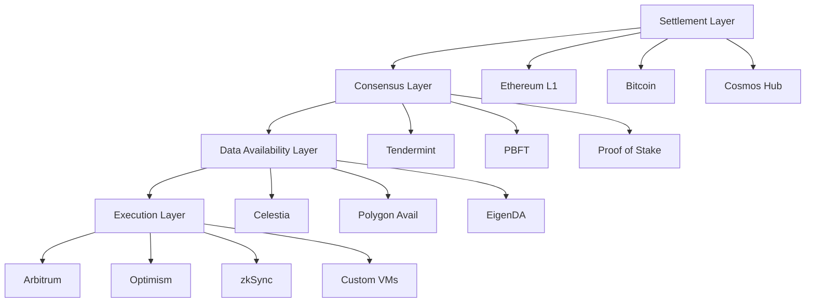

# 🧩 Modular Blockchain Architecture - Tương lai của Blockchain Scalability

## 🎯 First Principle Thinking

**Vấn đề monolithic blockchain**:
- **Consensus** + **Execution** + **Data Availability** + **Settlement** = Bottleneck
- Tất cả nodes phải làm tất cả việc → Scalability bị giới hạn
- **Blockchain Trilemma**: Decentralization, Security, Scalability (chỉ chọn được 2)

**Nguyên lý Modular**:
- **Separation of concerns**: Mỗi layer chuyên về 1 việc
- **Specialization**: Tối ưu hóa cho từng chức năng cụ thể  
- **Composability**: Kết hợp các layer khác nhau

## 🏗️ Modular Stack Architecture



## 🌟 Celestia - Data Availability Pioneer

### Core Innovation: Data Availability Sampling

```javascript
// Simplified DA sampling concept
class DataAvailabilitySampler {
    constructor(blockSize, sampleSize) {
        this.blockSize = blockSize;
        this.sampleSize = sampleSize;
        this.confidenceLevel = 0.99;
    }
    
    // Light client samples random chunks to verify availability
    async sampleBlock(blockHeader) {
        const samples = [];
        
        for (let i = 0; i < this.sampleSize; i++) {
            const randomIndex = this.getRandomIndex();
            const chunk = await this.requestChunk(blockHeader, randomIndex);
            
            if (!chunk) {
                throw new Error(`Chunk ${randomIndex} not available`);
            }
            
            samples.push(chunk);
        }
        
        // If all samples available, assume full block is available
        return this.verifyIntegrity(samples);
    }
    
    getRandomIndex() {
        return Math.floor(Math.random() * this.blockSize);
    }
    
    async requestChunk(blockHeader, index) {
        // Request chunk from multiple DA nodes
        const requests = this.daNodes.map(node => 
            node.getChunk(blockHeader.hash, index)
        );
        
        return Promise.race(requests);
    }
    
    verifyIntegrity(samples) {
        // Use Reed-Solomon encoding to verify
        return samples.every(chunk => 
            this.verifyReedSolomon(chunk)
        );
    }
}
```

### Celestia Network Architecture

```rust
// Celestia node types
pub enum NodeType {
    // Stores all data, participates in consensus
    FullNode {
        consensus: ConsensusModule,
        da_layer: DataAvailabilityLayer,
        p2p: NetworkModule,
    },
    
    // Only downloads block headers + random samples
    LightNode {
        da_sampler: DataAvailabilitySampler,
        header_sync: HeaderSyncModule,
        p2p: NetworkModule,
    },
    
    // Provides DA service to rollups
    BridgeNode {
        rollup_interface: RollupInterface,
        da_layer: DataAvailabilityLayer,
        settlement_layer: SettlementInterface,
    }
}

impl CelestiaNode {
    pub async fn validate_block(&self, block: &Block) -> Result<bool, Error> {
        match self {
            NodeType::FullNode { da_layer, .. } => {
                // Full nodes download and verify all data
                da_layer.download_full_block(block).await?;
                Ok(true)
            },
            
            NodeType::LightNode { da_sampler, .. } => {
                // Light nodes sample random chunks
                da_sampler.sample_block(&block.header).await
            },
            
            NodeType::BridgeNode { rollup_interface, .. } => {
                // Bridge nodes serve specific rollup data
                rollup_interface.verify_rollup_data(block).await
            }
        }
    }
}
```

## 🔗 Polygon Avail - Enterprise DA Solution

### Avail's Unique Features

```typescript
// Avail application-specific data
interface AvailAppData {
    appId: number;
    data: Uint8Array;
    proof: KZGProof;
}

class AvailClient {
    constructor(
        private nodeUrl: string,
        private appId: number
    ) {}
    
    async submitData(data: Uint8Array): Promise<string> {
        const transaction = {
            appId: this.appId,
            data: data,
            nonce: await this.getNonce(),
        };
        
        return await this.api.tx.dataAvailability
            .submitData(transaction.appId, transaction.data)
            .signAndSend(this.keyring);
    }
    
    async getDataProof(blockHash: string, index: number): Promise<KZGProof> {
        return await this.api.rpc.kate.queryProof([index], blockHash);
    }
    
    // Light client verification
    async verifyDataAvailability(
        blockHeader: Header, 
        appId: number
    ): Promise<boolean> {
        const commitment = blockHeader.extension.commitment;
        const samples = await this.sampleRandomCells(commitment, 16);
        
        return samples.every(sample => 
            this.verifyKZGProof(sample.proof, commitment, sample.data)
        );
    }
}
```

## 🌊 EigenDA - Ethereum-native DA

### EigenLayer Integration

```solidity
// EigenDA AVS (Actively Validated Service)
contract EigenDAContract is IAVSDirectory {
    struct OperatorStake {
        uint256 stake;
        uint256 quorumBitmap;
        bool isActive;
    }
    
    mapping(address => OperatorStake) public operators;
    mapping(bytes32 => DataCommitment) public commitments;
    
    struct DataCommitment {
        bytes32 kzgCommitment;
        uint256 blockNumber;
        uint256 confirmationThreshold;
        uint256 confirmations;
        bool finalized;
    }
    
    function commitData(
        bytes32 kzgCommitment,
        uint256 requiredQuorum
    ) external payable {
        bytes32 commitmentId = keccak256(
            abi.encodePacked(kzgCommitment, block.number)
        );
        
        commitments[commitmentId] = DataCommitment({
            kzgCommitment: kzgCommitment,
            blockNumber: block.number,
            confirmationThreshold: requiredQuorum,
            confirmations: 0,
            finalized: false
        });
        
        emit DataCommitted(commitmentId, kzgCommitment);
    }
    
    function confirmDataAvailability(
        bytes32 commitmentId,
        bytes calldata signature
    ) external {
        require(operators[msg.sender].isActive, "Operator not active");
        
        // Verify operator signature
        require(
            verifyOperatorSignature(commitmentId, signature, msg.sender),
            "Invalid signature"
        );
        
        DataCommitment storage commitment = commitments[commitmentId];
        commitment.confirmations += operators[msg.sender].stake;
        
        if (commitment.confirmations >= commitment.confirmationThreshold) {
            commitment.finalized = true;
            emit DataFinalized(commitmentId);
        }
    }
}
```

## 🎯 Rollup Integration Examples

### Arbitrum Orbit with Custom DA

```javascript
// Custom Arbitrum Orbit chain with Celestia DA
const orbitConfig = {
  chainId: 424242,
  name: "MyCustomOrbit",
  
  // Use Celestia for data availability
  dataAvailability: {
    provider: "celestia",
    config: {
      namespace: "0x4d79437573746f6d436861696e", // "MyCustomChain"
      gasPrice: "0.001", // TIA tokens
      batchSize: 1000
    }
  },
  
  // Settlement on Ethereum
  settlement: {
    layer: "ethereum",
    contract: "0x...", // Orbit rollup contract
  },
  
  // Custom execution environment
  execution: {
    vm: "evm", 
    gasLimit: 30000000,
    blockTime: 2 // seconds
  }
};

class CustomOrbitNode {
  constructor(config) {
    this.config = config;
    this.celestiaClient = new CelestiaDA(config.dataAvailability);
    this.executionLayer = new EVMExecutor(config.execution);
  }
  
  async processBlock(transactions) {
    // 1. Execute transactions
    const executionResult = await this.executionLayer.execute(transactions);
    
    // 2. Submit batch to Celestia
    const batchData = this.encodeBatch(transactions, executionResult);
    const daCommitment = await this.celestiaClient.submitBatch(batchData);
    
    // 3. Update L1 contract with commitment
    await this.updateL1Contract({
      stateRoot: executionResult.stateRoot,
      dataCommitment: daCommitment,
      blockNumber: this.currentBlock + 1
    });
    
    return {
      blockHash: executionResult.blockHash,
      stateRoot: executionResult.stateRoot,
      daCommitment: daCommitment
    };
  }
}
```

### zkSync with Polygon Avail

```rust
// zkSync integration with Avail
pub struct ZkSyncAvailIntegration {
    avail_client: AvailClient,
    zk_prover: ZkProver,
    batch_size: usize,
}

impl ZkSyncAvailIntegration {
    pub async fn submit_batch(&self, transactions: Vec<Transaction>) -> Result<BatchId, Error> {
        // 1. Generate ZK proof for batch
        let proof = self.zk_prover.prove_batch(&transactions).await?;
        
        // 2. Encode batch data
        let batch_data = BinCode::serialize(&BatchData {
            transactions,
            proof: proof.clone(),
            state_diff: proof.state_diff,
        })?;
        
        // 3. Submit to Avail
        let submission_id = self.avail_client
            .submit_data(batch_data)
            .await?;
        
        // 4. Wait for inclusion in Avail block
        let avail_block = self.avail_client
            .wait_for_inclusion(submission_id)
            .await?;
        
        // 5. Submit proof + Avail commitment to L1
        let l1_tx = self.submit_to_l1(proof, avail_block.commitment).await?;
        
        Ok(BatchId {
            avail_submission: submission_id,
            l1_transaction: l1_tx.hash(),
            batch_root: proof.batch_root,
        })
    }
}
```

## 📊 Performance Comparison 2025

### Throughput Metrics

```javascript
const modularPerformance = {
  monolithic: {
    ethereum: { tps: 15, dataSize: "Full nodes: 1TB+" },
    bitcoin: { tps: 7, dataSize: "Full nodes: 500GB+" },
    solana: { tps: 3000, dataSize: "Full nodes: 10TB+" }
  },
  
  modularWithCelestia: {
    arbitrumOrbit: { 
      tps: "10,000+", 
      dataSize: "Light clients: 1MB",
      cost: "$0.001/tx" 
    },
    optimismStack: { 
      tps: "15,000+", 
      dataSize: "Light clients: 2MB",
      cost: "$0.0005/tx"
    },
    polygonCDK: { 
      tps: "20,000+", 
      dataSize: "Light clients: 1.5MB",
      cost: "$0.0002/tx"
    }
  },
  
  theoreticalLimits: {
    maxTPS: "100,000+",
    nodeRequirements: "Consumer hardware",
    globalAccessibility: "Smartphone light clients"
  }
};
```

### Cost Analysis

```python
def calculate_da_costs():
    return {
        "ethereum_blob_space": {
            "cost_per_mb": "$50-200",
            "availability": "Limited (6 blobs/block)",
            "finality": "12-19 seconds"
        },
        
        "celestia": {
            "cost_per_mb": "$0.01-0.10", 
            "availability": "Unlimited",
            "finality": "~15 seconds",
            "light_client": "1% data sampling"
        },
        
        "polygon_avail": {
            "cost_per_mb": "$0.005-0.05",
            "availability": "High throughput",
            "finality": "~10 seconds", 
            "enterprise_features": "KZG commitments"
        },
        
        "eigenda": {
            "cost_per_mb": "$0.001-0.01",
            "availability": "Ethereum security",
            "finality": "12-19 seconds",
            "restaking_yield": "Additional APY for operators"
        }
    }
```

## 🚀 Development Getting Started

### Building on Celestia

```bash
# Install Celestia light node
curl -sSL https://get.celestia.org | sh

# Start light node on Mocha testnet
celestia light start --core.ip consensus.lunaroasis.net
```

```javascript
// Submit data to Celestia
import { CelestiaAPI } from '@celestiaorg/celestia-node-js';

const client = new CelestiaAPI();

async function submitRollupBatch(batchData) {
  const namespace = new Uint8Array([
    0, 0, 0, 0, 0, 0, 0, 0, 0, 0, 0, 0, 0, 0, 0, 0,
    0, 0, 0, 77, 121, 82, 111, 108, 108, 117, 112 // "MyRollup"
  ]);
  
  const blob = {
    namespace: namespace,
    data: new TextEncoder().encode(JSON.stringify(batchData)),
    shareVersion: 0
  };
  
  const result = await client.blob.submit([blob]);
  console.log(`Submitted to block height: ${result.height}`);
  
  return result;
}
```

### Building with Polygon CDK

```solidity
// Custom rollup using Polygon CDK
contract MyCustomRollup is PolygonRollupManager {
    struct BatchData {
        bytes32 stateRoot;
        bytes32 localExitRoot;
        bytes transactions;
        bytes availProof; // Avail DA proof
    }
    
    function verifyBatch(
        uint64 pendingStateNum,
        uint64 initNumBatch,
        uint64 finalNewBatch,
        bytes32 newLocalExitRoot,
        bytes32 newStateRoot,
        bytes32[24] calldata proof,
        bytes calldata availProof
    ) external override {
        // Verify Avail data availability
        require(
            availVerifier.verifyInclusion(availProof),
            "DA verification failed"
        );
        
        // Standard batch verification
        super.verifyBatch(
            pendingStateNum,
            initNumBatch, 
            finalNewBatch,
            newLocalExitRoot,
            newStateRoot,
            proof
        );
    }
}
```

## 🎯 Mental Models cho Modular Architecture

### 1. Restaurant Analogy

```
Monolithic = McDonald's (one kitchen does everything)
- Slow during rush hour
- Limited menu flexibility
- High coordination overhead

Modular = High-end restaurant (specialized stations)
- Appetizer station (DA layer)
- Main course station (Execution layer)  
- Quality control (Consensus layer)
- Customer service (Settlement layer)
```

### 2. Internet Stack Comparison

```
OSI Model          →    Blockchain Modular Stack
Application        →    dApps & User Interfaces
Presentation       →    Wallet & Frontend SDKs
Session           →    Cross-chain Messaging
Transport         →    Execution Layer (rollups)
Network           →    Data Availability Layer
Data Link         →    Consensus Layer  
Physical          →    Settlement Layer (L1)
```

### 3. Scaling Visualization

```
Monolithic: [■■■■■■■■] → Bottleneck at weakest link
Modular:    [■■■■■■■■] → Each layer optimized
            [■■■■■■■■]
            [■■■■■■■■]
            [■■■■■■■■]
```

## 🔮 Future Roadmap 2025-2026

### Upcoming Innovations

1. **Shared Security Models**
   - EigenLayer AVS expansion
   - Cosmos Interchain Security v2
   - Polygon 2.0 unified liquidity

2. **Cross-chain Communication**
   - IBC for modular stacks
   - Wormhole integration with DA layers
   - LayerZero omnichain protocols

3. **Specialized Execution Environments**
   - Privacy-focused VMs (Aztec, Aleo)
   - AI-optimized execution layers
   - GameFi-specific rollups

4. **Advanced DA Techniques**
   - Multi-dimensional sharding
   - Quantum-resistant commitments
   - Decentralized storage integration

---

*"The future of blockchain is not about building bigger monoliths, but about composing specialized, optimized modules."* 🧩
