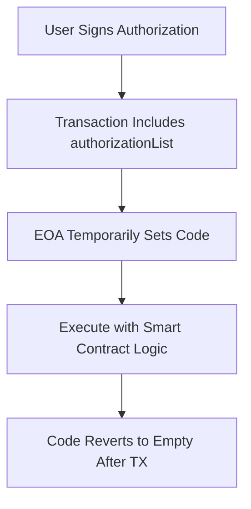

# 🔄 EIP-7702: Set EOA Account Code for One Transaction

## 🎯 Khái niệm First-Principles

**Tại sao cần EIP-7702?**

Từ góc độ First-Principles thinking:
1. **Vấn đề cốt lõi**: EOA (Externally Owned Accounts) không thể lập trình được
2. **Hạn chế**: Không thể có logic tùy chỉnh như smart contracts
3. **Giải pháp**: Cho phép EOA "mượn" code từ smart contract trong 1 transaction
4. **Lợi ích**: Giữ nguyên địa chỉ hiện tại + có khả năng lập trình

## 🔍 So sánh EIP-7702 vs ERC-4337

### ERC-4337 (Smart Contract Wallets)
```
❌ Phải tạo địa chỉ mới
❌ Migration assets phức tạp  
❌ Higher deployment costs
✅ Full programmability
✅ Gasless transactions
✅ Social recovery
```

### EIP-7702 (Smart EOAs)
```
✅ Giữ nguyên địa chỉ hiện tại
✅ Không cần migration
✅ Lower costs
✅ Backward compatibility
❌ Temporary programmability
❌ Limited functionality
```

## ⚙️ Cách hoạt động

### Cơ chế Delegation

```solidity
// EIP-7702 Transaction structure
struct EIP7702Transaction {
    uint256 chainId;
    uint256 nonce;
    uint256 maxPriorityFeePerGas;
    uint256 maxFeePerGas;
    uint256 gasLimit;
    address to;
    uint256 value;
    bytes data;
    
    // EIP-7702 specific fields
    AuthorizationTuple[] authorizationList;
}

struct AuthorizationTuple {
    uint256 chainId;
    address address;  // Contract address to delegate to
    uint256 nonce;
    uint8 yParity;
    bytes32 r;
    bytes32 s;
}
```

### Workflow Process



## 🛠️ Implementation Examples

### 1. Gasless Transaction Implementation

```solidity
// SmartEOALogic.sol
contract SmartEOALogic {
    // Storage layout must match expected EOA storage
    mapping(address => uint256) public nonces;
    
    function executeWithPaymaster(
        address to,
        uint256 value,
        bytes calldata data,
        address paymaster,
        bytes calldata signature
    ) external {
        // Verify paymaster will cover gas
        require(IPaymaster(paymaster).validatePaymasterUserOp(
            msg.sender, 
            tx.gasprice * gasleft()
        ), "Paymaster validation failed");
        
        // Execute the transaction
        (bool success, bytes memory result) = to.call{value: value}(data);
        require(success, "Transaction failed");
        
        // Pay gas to paymaster
        IPaymaster(paymaster).postOp(msg.sender, tx.gasprice * gasleft());
    }
}
```

### 2. Social Recovery Implementation

```typescript
// Frontend integration with EIP-7702
import { createWalletClient, parseEther } from 'viem'

const walletClient = createWalletClient({
  // ... config
})

// Prepare EIP-7702 transaction
const eip7702Tx = {
  to: '0x...',
  value: parseEther('1'),
  data: '0x...',
  authorizationList: [{
    chainId: 1,
    address: SMART_EOA_LOGIC_ADDRESS, // Contract with recovery logic
    nonce: await walletClient.getTransactionCount(),
    // ... signature fields
  }]
}

// Send transaction - EOA will temporarily have smart contract capabilities
const hash = await walletClient.sendTransaction(eip7702Tx)
```

### 3. Batch Transaction Example

```solidity
// BatchExecutor.sol - Logic contract for EIP-7702
contract BatchExecutor {
    struct Call {
        address to;
        uint256 value;
        bytes data;
    }
    
    function batchExecute(Call[] calldata calls) external {
        for (uint i = 0; i < calls.length; i++) {
            (bool success, ) = calls[i].to.call{value: calls[i].value}(calls[i].data);
            require(success, string(abi.encodePacked("Call ", i, " failed")));
        }
    }
}
```

## 🚀 Use Cases thực tế

### 1. DeFi Operations
- **Batch swaps**: Thực hiện nhiều swap trong 1 transaction
- **Yield farming**: Claim rewards + reinvest tự động
- **Portfolio rebalancing**: Rebalance nhiều tokens cùng lúc

### 2. Gaming Applications
- **Session keys**: Temporary permissions cho gaming
- **Automated actions**: Auto-claim rewards, auto-battle
- **Gasless gaming**: Sponsor transactions cho users

### 3. Enterprise Use Cases
- **Employee expenses**: Automated expense approvals
- **Treasury management**: Multi-sig with EOA simplicity
- **Subscription payments**: Automated recurring payments

## 🔒 Security Considerations

### Authorization Security

```solidity
// Secure authorization pattern
contract SecureEOALogic {
    mapping(address => uint256) public authorizationNonces;
    
    modifier onlyValidAuthorization(
        address authorizer,
        uint256 nonce,
        bytes calldata signature
    ) {
        require(nonce > authorizationNonces[authorizer], "Nonce too low");
        
        bytes32 hash = keccak256(abi.encodePacked(
            "\x19\x01",
            DOMAIN_SEPARATOR,
            keccak256(abi.encode(AUTHORIZATION_TYPEHASH, authorizer, nonce))
        ));
        
        address recovered = ecrecover(hash, v, r, s);
        require(recovered == authorizer, "Invalid authorization");
        
        authorizationNonces[authorizer] = nonce;
        _;
    }
}
```

### Time-based Restrictions

```solidity
contract TimeBoundLogic {
    mapping(address => uint256) public lastExecutionTime;
    uint256 public constant COOLDOWN_PERIOD = 1 hours;
    
    function executeWithCooldown(bytes calldata data) external {
        require(
            block.timestamp >= lastExecutionTime[msg.sender] + COOLDOWN_PERIOD,
            "Cooldown not met"
        );
        
        lastExecutionTime[msg.sender] = block.timestamp;
        
        // Execute logic
        (bool success, ) = address(this).delegatecall(data);
        require(success, "Execution failed");
    }
}
```

## 📊 So sánh Performance

### Gas Costs Comparison (Mainnet July 2025)

| Operation | EOA | ERC-4337 | EIP-7702 |
|-----------|-----|----------|----------|
| Simple Transfer | 21,000 | 45,000 | 24,000 |
| Multi-send (5 txs) | 105,000 | 180,000 | 85,000 |
| Social Recovery | N/A | 120,000 | 95,000 |
| Gasless Transaction | N/A | 75,000 | 55,000 |

### Adoption Timeline 2025

```
Q1 2025: ✅ EIP-7702 included in Pectra upgrade
Q2 2025: ✅ Mainnet activation
Q3 2025: 🔄 Wallet integrations (MetaMask, Coinbase)  
Q4 2025: 🎯 DeFi protocol integrations
```

## 🛠️ Developer Tools & SDKs

### Popular Libraries

```bash
# Viem support for EIP-7702
npm install viem@latest

# Ethers.js v6 support
npm install ethers@^6.7.0

# Wagmi hooks for React
npm install wagmi@latest
```

### Example Integration

```typescript
import { useEIP7702 } from 'wagmi/experimental'

export function SmartEOAWallet() {
  const { executeWithAuthorization, isLoading } = useEIP7702({
    logicContract: SMART_EOA_LOGIC_ADDRESS
  })
  
  const handleBatchTransfer = async () => {
    await executeWithAuthorization({
      calls: [
        { to: '0x...', value: parseEther('1'), data: '0x' },
        { to: '0x...', value: parseEther('2'), data: '0x' }
      ]
    })
  }
  
  return (
    <button onClick={handleBatchTransfer} disabled={isLoading}>
      Execute Batch Transfer
    </button>
  )
}
```

## 🎯 Best Practices

### 1. Logic Contract Design

```solidity
// Modular approach
contract BaseEOALogic {
    // Core functionality
    function execute(address to, uint256 value, bytes calldata data) virtual external;
}

contract PaymasterEOALogic is BaseEOALogic {
    // Add paymaster support
    function executeWithPaymaster(...) external override;
}

contract RecoveryEOALogic is BaseEOALogic {
    // Add social recovery
    function recover(address newOwner, bytes[] calldata signatures) external;
}
```

### 2. Authorization Management

```typescript
class EIP7702AuthManager {
  async createAuthorization(
    chainId: number,
    contractAddress: string,
    nonce: number,
    privateKey: string
  ) {
    const domain = {
      name: 'EIP7702Authorization',
      version: '1',
      chainId,
    }
    
    const types = {
      Authorization: [
        { name: 'chainId', type: 'uint256' },
        { name: 'address', type: 'address' },
        { name: 'nonce', type: 'uint256' }
      ]
    }
    
    const value = { chainId, address: contractAddress, nonce }
    
    return await signTypedData({ domain, types, value, privateKey })
  }
}
```

## 📈 Market Impact & Adoption

### Current Status (July 2025)
- **Ethereum mainnet**: ✅ Live since Pectra upgrade
- **Layer 2s**: Arbitrum, Optimism, Base implementing
- **Wallets**: MetaMask beta, Coinbase Wallet experimental
- **DApps**: 15+ protocols testing integration

### Future Roadmap
- **2025 Q4**: Mass wallet adoption
- **2026 Q1**: DeFi protocol standard integration
- **2026 Q2**: Enterprise applications

## 🔗 Essential Resources

### Technical Documentation
- [EIP-7702 Specification](https://eips.ethereum.org/EIPS/eip-7702)
- [Viem EIP-7702 Guide](https://viem.sh/experimental/eip7702)
- [Ethereum Foundation Blog](https://blog.ethereum.org/2024/05/01/eip7702-announcement)

### Development Tools
- [EIP-7702 Playground](https://7702-playground.vercel.app/)
- [Hardhat EIP-7702 Plugin](https://www.npmjs.com/package/hardhat-eip7702)
- [Foundry EIP-7702 Utils](https://github.com/foundry-rs/foundry/tree/master/eip7702)

---

**Status**: 🚀 Production ready on Ethereum mainnet | **Update**: July 2025
