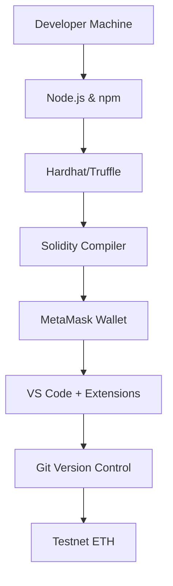
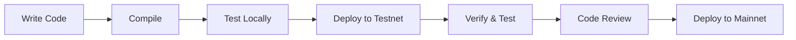

# 🛠️ Setup Development Environment

## 🎯 Mục tiêu bài học

Sau bài học này, bạn sẽ:

- Setup được môi trường phát triển blockchain hoàn chỉnh
- Biết cách sử dụng các công cụ development chính
- Có thể tạo và deploy smart contract đầu tiên
- Hiểu workflow của blockchain developer

## 📋 Required Tools Overview

### Essential Development Stack



## 🖥️ System Requirements

### Minimum specs
- **OS**: Windows 10, macOS 10.15+, Ubuntu 18.04+
- **RAM**: 8GB (16GB recommended)
- **Storage**: 100GB free space
- **Internet**: Stable connection for blockchain sync

### Recommended specs
- **RAM**: 16GB+ for running local blockchain
- **SSD**: Fast storage for blockchain data
- **Multiple monitors**: For development efficiency

## 📦 Core Installation Guide

### 1. Node.js & npm

**Install Node.js:**

```bash
# macOS (using Homebrew)
brew install node

# Windows (download from nodejs.org)
# https://nodejs.org/en/download/

# Ubuntu/Debian
curl -fsSL https://deb.nodesource.com/setup_18.x | sudo -E bash -
sudo apt-get install -y nodejs

# Verify installation
node --version  # Should show v18.x.x+
npm --version   # Should show 9.x.x+
```

**Setup npm registry:**
```bash
# Check current registry
npm config get registry

# Set to official registry (if needed)
npm config set registry https://registry.npmjs.org/
```

### 2. Hardhat Framework

**Initialize new project:**
```bash
mkdir my-blockchain-project
cd my-blockchain-project

# Initialize npm project
npm init -y

# Install Hardhat
npm install --save-dev hardhat

# Initialize Hardhat project
npx hardhat
# Choose: "Create a JavaScript project"
```

**Project structure:**
```
my-blockchain-project/
├── contracts/          # Solidity smart contracts
├── scripts/           # Deployment scripts
├── test/             # Test files
├── hardhat.config.js # Hardhat configuration
├── package.json      # Project dependencies
└── README.md
```

**Essential Hardhat plugins:**
```bash
npm install --save-dev @nomicfoundation/hardhat-toolbox
npm install --save-dev @nomiclabs/hardhat-ethers
npm install --save-dev @nomiclabs/hardhat-etherscan
npm install --save-dev dotenv
```

### 3. VS Code & Extensions

**Install VS Code:**
- Download from: https://code.visualstudio.com/

**Essential extensions:**
```bash
# Install via VS Code Extension Marketplace
Solidity (Juan Blanco)
Prettier - Code formatter
GitLens
Hardhat for Visual Studio Code
Thunder Client (for API testing)
```

**VS Code settings.json:**
```json
{
  "solidity.defaultCompiler": "remote",
  "solidity.compileUsingRemoteVersion": "v0.8.19",
  "editor.formatOnSave": true,
  "prettier.singleQuote": true,
  "prettier.semi": false
}
```

### 4. MetaMask Wallet

**Installation:**
1. Visit https://metamask.io/
2. Add to browser (Chrome/Firefox/Edge)
3. Create new wallet or import existing
4. **IMPORTANT**: Save seed phrase securely!

**Network configuration:**
```javascript
// Add custom networks
const networks = {
  localhost: {
    name: "Localhost 8545",
    rpcUrl: "http://127.0.0.1:8545/",
    chainId: 31337
  },
  goerli: {
    name: "Goerli Testnet", 
    rpcUrl: "https://goerli.infura.io/v3/YOUR_PROJECT_ID",
    chainId: 5
  },
  sepolia: {
    name: "Sepolia Testnet",
    rpcUrl: "https://sepolia.infura.io/v3/YOUR_PROJECT_ID", 
    chainId: 11155111
  }
}
```

## 🔧 Advanced Tools Setup

### 1. Remix IDE (Browser-based)

**Access Remix:**
- URL: https://remix.ethereum.org/
- No installation needed
- Great for quick prototyping

**Key features:**
- Solidity compiler
- Debugger
- Gas profiler
- Multiple deployment options

**Remix plugins:**
```javascript
// Useful plugins to enable
- Solidity Compiler
- Deploy & Run Transactions  
- File Explorer
- Debugger
- Gas Profiler
- Solidity Unit Testing
```

### 2. Git Version Control

**Install Git:**
```bash
# macOS
brew install git

# Windows (download from git-scm.com)

# Ubuntu/Debian  
sudo apt update
sudo apt install git

# Configure
git config --global user.name "Your Name"
git config --global user.email "your.email@example.com"
```

**Project .gitignore:**
```gitignore
node_modules/
.env
.env.local
.env.production
cache/
artifacts/
coverage/
typechain/
deployments/
```

### 3. Infura/Alchemy Setup

**Infura setup:**
1. Visit https://infura.io/
2. Create free account
3. Create new project
4. Copy Project ID

**Alchemy setup:**
1. Visit https://alchemy.com/
2. Create free account  
3. Create new app
4. Copy API key

**Environment variables (.env):**
```bash
# .env file (never commit to git!)
INFURA_PROJECT_ID=your_infura_project_id
ALCHEMY_API_KEY=your_alchemy_api_key
PRIVATE_KEY=your_wallet_private_key
ETHERSCAN_API_KEY=your_etherscan_api_key
```

## ⚙️ Configuration Files

### hardhat.config.js
```javascript
require("@nomicfoundation/hardhat-toolbox");
require("dotenv").config();

/** @type import('hardhat/config').HardhatUserConfig */
module.exports = {
  solidity: {
    version: "0.8.19",
    settings: {
      optimizer: {
        enabled: true,
        runs: 200
      }
    }
  },
  networks: {
    // Local development network
    localhost: {
      url: "http://127.0.0.1:8545",
      chainId: 31337
    },
    
    // Testnets
    goerli: {
      url: `https://goerli.infura.io/v3/${process.env.INFURA_PROJECT_ID}`,
      accounts: process.env.PRIVATE_KEY ? [process.env.PRIVATE_KEY] : [],
      chainId: 5
    },
    
    sepolia: {
      url: `https://sepolia.infura.io/v3/${process.env.INFURA_PROJECT_ID}`,
      accounts: process.env.PRIVATE_KEY ? [process.env.PRIVATE_KEY] : [],
      chainId: 11155111
    },
    
    // Mainnet (for production)
    mainnet: {
      url: `https://mainnet.infura.io/v3/${process.env.INFURA_PROJECT_ID}`,
      accounts: process.env.PRIVATE_KEY ? [process.env.PRIVATE_KEY] : [],
      chainId: 1
    }
  },
  
  // Etherscan verification
  etherscan: {
    apiKey: process.env.ETHERSCAN_API_KEY
  },
  
  // Gas reporting
  gasReporter: {
    enabled: true,
    currency: 'USD',
    gasPrice: 20
  }
};
```

### package.json scripts
```json
{
  "scripts": {
    "compile": "hardhat compile",
    "test": "hardhat test",
    "deploy-local": "hardhat run scripts/deploy.js --network localhost",
    "deploy-goerli": "hardhat run scripts/deploy.js --network goerli",
    "verify": "hardhat verify --network goerli",
    "node": "hardhat node",
    "clean": "hardhat clean",
    "coverage": "hardhat coverage"
  }
}
```

## 🧪 Testing Your Setup

### 1. Create First Smart Contract

**contracts/HelloWorld.sol:**
```solidity
// SPDX-License-Identifier: MIT
pragma solidity ^0.8.19;

contract HelloWorld {
    string public message;
    
    constructor(string memory _message) {
        message = _message;
    }
    
    function setMessage(string memory _newMessage) public {
        message = _newMessage;
    }
    
    function getMessage() public view returns (string memory) {
        return message;
    }
}
```

### 2. Write Test

**test/HelloWorld.test.js:**
```javascript
const { expect } = require("chai");
const { ethers } = require("hardhat");

describe("HelloWorld", function () {
  let helloWorld;
  let owner;
  
  beforeEach(async function () {
    [owner] = await ethers.getSigners();
    
    const HelloWorld = await ethers.getContractFactory("HelloWorld");
    helloWorld = await HelloWorld.deploy("Hello, Blockchain!");
    await helloWorld.deployed();
  });
  
  it("Should return the initial message", async function () {
    expect(await helloWorld.getMessage()).to.equal("Hello, Blockchain!");
  });
  
  it("Should update the message", async function () {
    await helloWorld.setMessage("Updated message");
    expect(await helloWorld.getMessage()).to.equal("Updated message");
  });
});
```

### 3. Deployment Script

**scripts/deploy.js:**
```javascript
const { ethers } = require("hardhat");

async function main() {
  const [deployer] = await ethers.getSigners();
  
  console.log("Deploying contracts with account:", deployer.address);
  console.log("Account balance:", (await deployer.getBalance()).toString());
  
  const HelloWorld = await ethers.getContractFactory("HelloWorld");
  const helloWorld = await HelloWorld.deploy("Hello from deployment!");
  
  await helloWorld.deployed();
  
  console.log("HelloWorld deployed to:", helloWorld.address);
  console.log("Transaction hash:", helloWorld.deployTransaction.hash);
}

main()
  .then(() => process.exit(0))
  .catch((error) => {
    console.error(error);
    process.exit(1);
  });
```

### 4. Run Tests

```bash
# Compile contracts
npm run compile

# Run tests
npm run test

# Check test coverage
npm run coverage

# Start local blockchain
npm run node

# Deploy to local network (in another terminal)
npm run deploy-local
```

## 🌐 Get Testnet ETH

### Faucets for testing

**Sepolia testnet:**
- https://sepoliafaucet.com/
- https://faucet.quicknode.com/ethereum/sepolia

**Goerli testnet (deprecated but still used):**
- https://goerlifaucet.com/
- https://faucets.chain.link/goerli

**Usage:**
1. Connect MetaMask to testnet
2. Copy your wallet address
3. Paste into faucet website
4. Request test ETH
5. Wait for transaction confirmation

## 🔍 Troubleshooting Common Issues

### Node.js version conflicts
```bash
# Use nvm to manage Node.js versions
curl -o- https://raw.githubusercontent.com/nvm-sh/nvm/v0.39.0/install.sh | bash

# Install and use specific version
nvm install 18
nvm use 18
```

### MetaMask connection issues
```javascript
// Check if MetaMask is installed
if (typeof window.ethereum !== 'undefined') {
  console.log('MetaMask is installed!');
} else {
  console.log('Please install MetaMask');
}

// Connect to MetaMask
async function connectWallet() {
  try {
    await window.ethereum.request({ method: 'eth_requestAccounts' });
    console.log('Wallet connected');
  } catch (error) {
    console.error('User rejected connection');
  }
}
```

### Hardhat compilation errors
```bash
# Clear cache and artifacts
npm run clean

# Reinstall dependencies
rm -rf node_modules package-lock.json
npm install

# Update Solidity compiler version in hardhat.config.js
```

### Gas estimation errors
```javascript
// Manual gas estimation
const gasEstimate = await contract.estimateGas.functionName();
const gasPrice = await ethers.provider.getGasPrice();

await contract.functionName({
  gasLimit: gasEstimate.mul(120).div(100), // 20% buffer
  gasPrice: gasPrice
});
```

## 📚 Development Workflow

### Daily development process



### Best practices

**Code organization:**
```
project/
├── contracts/
│   ├── core/           # Main business logic
│   ├── interfaces/     # Contract interfaces
│   ├── libraries/      # Reusable code
│   └── mocks/         # Testing contracts
├── scripts/
│   ├── deploy/        # Deployment scripts
│   └── tasks/         # Automation tasks
└── test/
    ├── unit/          # Unit tests
    └── integration/   # Integration tests
```

**Version control:**
```bash
# Commit frequently with clear messages
git add .
git commit -m "feat: add token transfer functionality"

# Use branching strategy
git checkout -b feature/new-smart-contract
git checkout -b hotfix/security-patch
```

## ✅ Environment Checklist

**Basic setup:**
- [ ] Node.js 18+ installed
- [ ] Hardhat project initialized  
- [ ] VS Code with Solidity extension
- [ ] MetaMask wallet configured
- [ ] Git repository created

**Advanced setup:**
- [ ] Infura/Alchemy account created
- [ ] Testnet ETH obtained
- [ ] Environment variables configured
- [ ] First contract compiled and tested
- [ ] Deployment scripts working

**Security setup:**
- [ ] Private keys in .env file
- [ ] .env added to .gitignore
- [ ] Seed phrase stored securely offline
- [ ] Two-factor authentication enabled

## 🔗 Navigation

- **Previous**: [[22-Solana]] - Alternative blockchain platforms
- **Next**: [[02-Node-js-Setup]] - Advanced Node.js configuration
- **Related**: [[11-Remix-IDE]] - Browser-based development

## ✅ Key Takeaways

1. **Proper setup is crucial** for efficient blockchain development
2. **Use testnets extensively** before mainnet deployment
3. **Security first** - never commit private keys
4. **Test everything** - unit tests prevent costly bugs
5. **Stay updated** - blockchain tooling evolves rapidly

---

**Status**: ✅ Completed | **Next**: [[02-Node-js-Setup]]
