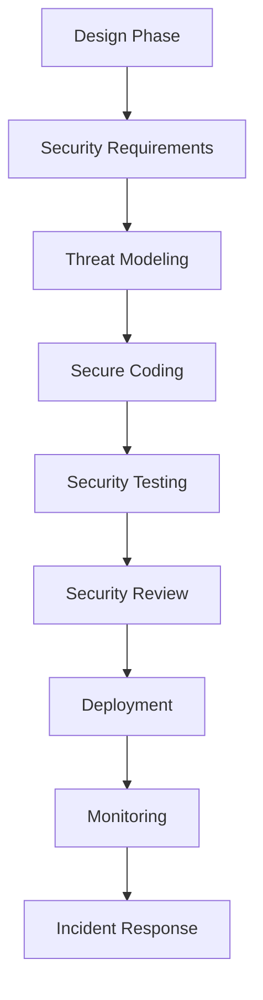

# 🛡️ Smart Contract Security: Production-Ready Defense Strategies

## 🎯 First-Principles Security Thinking

### Mindset của Security-First Development

**Assumption cơ bản**: Mọi thứ đều có thể bị hack

1. **Assume Compromise**: Giả định contract sẽ bị tấn công
2. **Defense in Depth**: Nhiều lớp bảo vệ
3. **Fail Securely**: Lỗi phải dẫn đến trạng thái an toàn
4. **Minimize Attack Surface**: Giảm thiểu điểm tấn công

### Security Development Lifecycle



## 🔒 Critical Vulnerabilities & Mitigations

### 1. Reentrancy Attacks

**Vấn đề**: External calls có thể gọi lại contract trước khi state được update

```solidity
// ❌ Vulnerable to reentrancy
contract VulnerableBank {
    mapping(address => uint256) public balances;
    
    function withdraw(uint256 amount) external {
        require(balances[msg.sender] >= amount, "Insufficient balance");
        
        // External call BEFORE state change - DANGEROUS!
        (bool success, ) = msg.sender.call{value: amount}("");
        require(success, "Transfer failed");
        
        balances[msg.sender] -= amount; // State change after external call
    }
}

// ✅ Secure implementation
contract SecureBank {
    mapping(address => uint256) public balances;
    bool private locked;
    
    modifier noReentrant() {
        require(!locked, "No reentrancy");
        locked = true;
        _;
        locked = false;
    }
    
    function withdraw(uint256 amount) external noReentrant {
        require(balances[msg.sender] >= amount, "Insufficient balance");
        
        // State change BEFORE external call - SECURE!
        balances[msg.sender] -= amount;
        
        (bool success, ) = msg.sender.call{value: amount}("");
        require(success, "Transfer failed");
    }
    
    // ✅ Alternative: Pull payment pattern
    mapping(address => uint256) public pendingWithdrawals;
    
    function requestWithdrawal(uint256 amount) external {
        require(balances[msg.sender] >= amount, "Insufficient balance");
        balances[msg.sender] -= amount;
        pendingWithdrawals[msg.sender] += amount;
    }
    
    function withdraw() external {
        uint256 amount = pendingWithdrawals[msg.sender];
        require(amount > 0, "No pending withdrawal");
        
        pendingWithdrawals[msg.sender] = 0;
        
        (bool success, ) = msg.sender.call{value: amount}("");
        require(success, "Transfer failed");
    }
}
```

### 2. Integer Overflow/Underflow

```solidity
// ✅ Safe math operations (Solidity 0.8+ has built-in checks)
contract SafeMath {
    function safeAdd(uint256 a, uint256 b) internal pure returns (uint256) {
        uint256 c = a + b;
        require(c >= a, "Addition overflow");
        return c;
    }
    
    function safeSub(uint256 a, uint256 b) internal pure returns (uint256) {
        require(b <= a, "Subtraction underflow");
        return a - b;
    }
    
    function safeMul(uint256 a, uint256 b) internal pure returns (uint256) {
        if (a == 0) return 0;
        uint256 c = a * b;
        require(c / a == b, "Multiplication overflow");
        return c;
    }
    
    // ✅ Using unchecked for gas optimization when safe
    function efficientLoop(uint256[] memory array) internal pure returns (uint256) {
        uint256 sum = 0;
        for (uint256 i = 0; i < array.length;) {
            sum += array[i];
            unchecked { ++i; } // Safe increment
        }
        return sum;
    }
}
```

### 3. Access Control Vulnerabilities

```solidity
// ✅ Comprehensive access control system
import "@openzeppelin/contracts/access/AccessControlEnumerable.sol";

contract SecureAccessControl is AccessControlEnumerable {
    bytes32 public constant ADMIN_ROLE = keccak256("ADMIN_ROLE");
    bytes32 public constant OPERATOR_ROLE = keccak256("OPERATOR_ROLE");
    bytes32 public constant AUDITOR_ROLE = keccak256("AUDITOR_ROLE");
    
    // Time-locked operations
    struct TimeLockOperation {
        bytes32 operationHash;
        uint256 timestamp;
        bool executed;
    }
    
    mapping(bytes32 => TimeLockOperation) public timeLockedOps;
    uint256 public constant TIMELOCK_DELAY = 2 days;
    
    event OperationProposed(bytes32 indexed opHash, uint256 executeAfter);
    event OperationExecuted(bytes32 indexed opHash);
    
    constructor() {
        _grantRole(DEFAULT_ADMIN_ROLE, msg.sender);
        _grantRole(ADMIN_ROLE, msg.sender);
    }
    
    // ✅ Multi-step sensitive operations
    function proposeAdminChange(address newAdmin) external onlyRole(ADMIN_ROLE) {
        bytes32 opHash = keccak256(abi.encodePacked("CHANGE_ADMIN", newAdmin, block.timestamp));
        
        timeLockedOps[opHash] = TimeLockOperation({
            operationHash: opHash,
            timestamp: block.timestamp + TIMELOCK_DELAY,
            executed: false
        });
        
        emit OperationProposed(opHash, block.timestamp + TIMELOCK_DELAY);
    }
    
    function executeAdminChange(address newAdmin, uint256 proposalTime) external {
        bytes32 opHash = keccak256(abi.encodePacked("CHANGE_ADMIN", newAdmin, proposalTime));
        TimeLockOperation storage op = timeLockedOps[opHash];
        
        require(op.timestamp != 0, "Operation not found");
        require(block.timestamp >= op.timestamp, "Timelock not expired");
        require(!op.executed, "Already executed");
        
        op.executed = true;
        _grantRole(ADMIN_ROLE, newAdmin);
        
        emit OperationExecuted(opHash);
    }
    
    // ✅ Emergency functions with proper controls
    bool public emergencyStop = false;
    
    modifier whenNotStopped() {
        require(!emergencyStop, "Emergency stop activated");
        _;
    }
    
    function emergencyStopContract() external onlyRole(ADMIN_ROLE) {
        emergencyStop = true;
    }
    
    function resumeContract() external onlyRole(ADMIN_ROLE) {
        emergencyStop = false;
    }
}
```

### 4. Oracle Manipulation

```solidity
// ✅ Secure oracle integration with multiple validation layers
contract SecureOracle {
    struct PriceData {
        uint256 price;
        uint256 timestamp;
        uint256 roundId;
    }
    
    mapping(address => PriceData) public lastValidPrices;
    
    // Multiple oracle sources
    address[] public oracles;
    uint256 public constant MAX_PRICE_DEVIATION = 500; // 5%
    uint256 public constant MAX_PRICE_AGE = 3600; // 1 hour
    uint256 public constant MIN_ORACLES = 3;
    
    function getSecurePrice(address asset) external view returns (uint256, bool) {
        require(oracles.length >= MIN_ORACLES, "Insufficient oracles");
        
        uint256[] memory prices = new uint256[](oracles.length);
        uint256 validPrices = 0;
        
        // Collect prices from all oracles
        for (uint256 i = 0; i < oracles.length; i++) {
            try IPriceOracle(oracles[i]).getPrice(asset) returns (uint256 price, uint256 timestamp) {
                if (block.timestamp - timestamp <= MAX_PRICE_AGE && price > 0) {
                    prices[validPrices] = price;
                    validPrices++;
                }
            } catch {
                // Oracle failed, continue
            }
        }
        
        require(validPrices >= MIN_ORACLES, "Not enough valid prices");
        
        // Calculate median price
        uint256 medianPrice = _getMedian(prices, validPrices);
        
        // Validate against last known good price
        PriceData memory lastPrice = lastValidPrices[asset];
        if (lastPrice.price > 0) {
            uint256 deviation = _calculateDeviation(medianPrice, lastPrice.price);
            if (deviation > MAX_PRICE_DEVIATION) {
                return (lastPrice.price, false); // Return last valid price
            }
        }
        
        return (medianPrice, true);
    }
    
    function _getMedian(uint256[] memory prices, uint256 length) 
        internal 
        pure 
        returns (uint256) 
    {
        // Sort array
        for (uint256 i = 0; i < length - 1; i++) {
            for (uint256 j = 0; j < length - i - 1; j++) {
                if (prices[j] > prices[j + 1]) {
                    uint256 temp = prices[j];
                    prices[j] = prices[j + 1];
                    prices[j + 1] = temp;
                }
            }
        }
        
        if (length % 2 == 0) {
            return (prices[length / 2 - 1] + prices[length / 2]) / 2;
        } else {
            return prices[length / 2];
        }
    }
    
    function _calculateDeviation(uint256 newPrice, uint256 oldPrice) 
        internal 
        pure 
        returns (uint256) 
    {
        uint256 diff = newPrice > oldPrice ? newPrice - oldPrice : oldPrice - newPrice;
        return (diff * 10000) / oldPrice; // Basis points
    }
}
```

### 5. Flash Loan Attacks

```solidity
// ✅ Flash loan attack protection
contract FlashLoanProtection {
    mapping(address => uint256) public lastBlockInteraction;
    uint256 public constant FLASH_LOAN_DELAY = 1; // 1 block delay
    
    modifier noFlashLoan() {
        require(
            lastBlockInteraction[tx.origin] < block.number,
            "No flash loan attacks"
        );
        lastBlockInteraction[tx.origin] = block.number;
        _;
    }
    
    // ✅ Price manipulation protection using TWAP
    struct TWAPData {
        uint256 cumulativePrice;
        uint256 lastUpdate;
        uint256 period;
    }
    
    mapping(address => TWAPData) public twapData;
    
    function updateTWAP(address asset, uint256 currentPrice) internal {
        TWAPData storage data = twapData[asset];
        
        if (data.lastUpdate == 0) {
            data.cumulativePrice = currentPrice;
            data.lastUpdate = block.timestamp;
            data.period = 0;
        } else {
            uint256 timeElapsed = block.timestamp - data.lastUpdate;
            data.cumulativePrice += currentPrice * timeElapsed;
            data.period += timeElapsed;
            data.lastUpdate = block.timestamp;
        }
    }
    
    function getTWAPPrice(address asset) public view returns (uint256) {
        TWAPData memory data = twapData[asset];
        require(data.period > 0, "No TWAP data");
        return data.cumulativePrice / data.period;
    }
    
    // ✅ MEV protection
    mapping(address => uint256) public lastTransactionBlock;
    
    modifier antiMEV() {
        require(
            lastTransactionBlock[tx.origin] != block.number,
            "MEV protection: same block"
        );
        lastTransactionBlock[tx.origin] = block.number;
        _;
    }
}
```

## 🔧 Security Testing Framework

### 1. Automated Security Testing

```typescript
// Hardhat security testing setup
import { ethers } from "hardhat";
import { expect } from "chai";
import { loadFixture } from "@nomicfoundation/hardhat-network-helpers";

describe("Security Tests", function() {
    async function deploySecureContract() {
        const [owner, attacker, user] = await ethers.getSigners();
        
        const SecureContract = await ethers.getContractFactory("SecureContract");
        const contract = await SecureContract.deploy();
        
        return { contract, owner, attacker, user };
    }
    
    describe("Reentrancy Protection", function() {
        it("Should prevent reentrancy attacks", async function() {
            const { contract, attacker } = await loadFixture(deploySecureContract);
            
            // Deploy malicious contract
            const MaliciousContract = await ethers.getContractFactory("MaliciousContract");
            const malicious = await MaliciousContract.deploy(contract.address);
            
            // Fund the malicious contract
            await contract.connect(attacker).deposit({ value: ethers.parseEther("1") });
            
            // Attempt reentrancy attack
            await expect(
                malicious.connect(attacker).attack()
            ).to.be.revertedWith("No reentrancy");
        });
    });
    
    describe("Access Control", function() {
        it("Should prevent unauthorized access", async function() {
            const { contract, attacker } = await loadFixture(deploySecureContract);
            
            await expect(
                contract.connect(attacker).adminFunction()
            ).to.be.revertedWith("AccessControl: account missing role");
        });
        
        it("Should properly handle role transitions", async function() {
            const { contract, owner, user } = await loadFixture(deploySecureContract);
            
            // Grant role
            await contract.connect(owner).grantRole(await contract.ADMIN_ROLE(), user.address);
            
            // Verify role
            expect(await contract.hasRole(await contract.ADMIN_ROLE(), user.address)).to.be.true;
            
            // User should now be able to call admin function
            await expect(contract.connect(user).adminFunction()).to.not.be.reverted;
        });
    });
    
    describe("Economic Security", function() {
        it("Should prevent economic exploits", async function() {
            const { contract, attacker } = await loadFixture(deploySecureContract);
            
            // Test for price manipulation
            const initialPrice = await contract.getPrice();
            
            // Attempt to manipulate price with large trade
            await contract.connect(attacker).largeTrade(ethers.parseEther("1000"));
            
            const newPrice = await contract.getPrice();
            const priceChange = Math.abs(Number(newPrice - initialPrice)) / Number(initialPrice);
            
            // Price shouldn't change more than 5%
            expect(priceChange).to.be.lessThan(0.05);
        });
    });
});
```

### 2. Fuzzing Tests

```solidity
// Foundry invariant testing
contract InvariantTest is Test {
    SecureContract contract;
    
    function setUp() public {
        contract = new SecureContract();
    }
    
    // ✅ Invariant: Total supply should equal sum of balances
    function invariant_totalSupplyEqualsBalances() public {
        uint256 totalSupply = contract.totalSupply();
        uint256 sumOfBalances = 0;
        
        // In real test, iterate through all token holders
        for (uint256 i = 0; i < contract.getHolderCount(); i++) {
            address holder = contract.getHolderAt(i);
            sumOfBalances += contract.balanceOf(holder);
        }
        
        assertEq(totalSupply, sumOfBalances);
    }
    
    // ✅ Invariant: Contract balance should always be sufficient
    function invariant_contractSolvency() public {
        uint256 contractBalance = address(contract).balance;
        uint256 totalLiabilities = contract.getTotalLiabilities();
        
        assertGe(contractBalance, totalLiabilities);
    }
    
    // ✅ Fuzz testing for edge cases
    function testFuzz_transferAmount(uint256 amount) public {
        // Bound the amount to reasonable range
        amount = bound(amount, 1, type(uint128).max);
        
        // Setup
        address user = address(0x1);
        contract.mint(user, amount);
        
        uint256 balanceBefore = contract.balanceOf(user);
        
        // Act
        vm.prank(user);
        contract.transfer(address(0x2), amount);
        
        // Assert
        assertEq(contract.balanceOf(user), balanceBefore - amount);
        assertEq(contract.balanceOf(address(0x2)), amount);
    }
}
```

### 3. Formal Verification

```solidity
// ✅ Specifications for formal verification
contract VerifiableContract {
    uint256 public totalSupply;
    mapping(address => uint256) public balances;
    
    // @notice Specification: Transfer should preserve total supply
    // @dev totalSupply == sum(balances[i] for all i)
    function transfer(address to, uint256 amount) external {
        require(balances[msg.sender] >= amount, "Insufficient balance");
        require(to != address(0), "Invalid recipient");
        
        balances[msg.sender] -= amount;
        balances[to] += amount;
        
        // Post-condition: total supply unchanged
        assert(totalSupply == getTotalBalances());
    }
    
    function getTotalBalances() internal view returns (uint256) {
        // In practice, this would iterate through all holders
        // For verification, we maintain this as an invariant
        return totalSupply;
    }
    
    // @notice Specification: Mint should increase total supply
    // @dev totalSupply_after == totalSupply_before + amount
    function mint(address to, uint256 amount) external {
        uint256 oldTotalSupply = totalSupply;
        
        require(to != address(0), "Invalid recipient");
        require(amount > 0, "Invalid amount");
        
        balances[to] += amount;
        totalSupply += amount;
        
        // Post-condition: total supply increased by amount
        assert(totalSupply == oldTotalSupply + amount);
    }
}
```

## 🔍 Security Audit Process

### 1. Automated Analysis Tools

```bash
# Slither - Static analysis
slither . --detect all --filter-paths node_modules

# Mythril - Symbolic execution
myth analyze contracts/MyContract.sol

# Semgrep - Pattern-based analysis
semgrep --config=p/solidity contracts/

# Manticore - Dynamic analysis
manticore contracts/MyContract.sol --contract MyContract
```

### 2. Manual Review Checklist

```typescript
interface SecurityChecklist {
  accessControl: {
    ownershipTransfer: boolean;
    roleBasedAccess: boolean;
    multiSigRequirement: boolean;
    timelockMechanism: boolean;
  };
  
  externalCalls: {
    checksEffectsInteractions: boolean;
    reentrancyProtection: boolean;
    callSuccessHandling: boolean;
    gasLimitConsideration: boolean;
  };
  
  arithmeticOperations: {
    overflowProtection: boolean;
    underflowProtection: boolean;
    divisionByZeroCheck: boolean;
    precisionLoss: boolean;
  };
  
  stateManagement: {
    properInitialization: boolean;
    stateTransitionValidation: boolean;
    emergencyStop: boolean;
    upgradeability: boolean;
  };
  
  economicSecurity: {
    priceManipulationProtection: boolean;
    flashLoanAttackPrevention: boolean;
    mevProtection: boolean;
    oracleValidation: boolean;
  };
}
```

### 3. Bug Bounty Program Structure

```solidity
// ✅ Bug bounty contract
contract BugBountyProgram {
    struct Bounty {
        uint256 amount;
        Severity severity;
        bool paid;
        address reporter;
    }
    
    enum Severity {
        Low,    // $1,000
        Medium, // $5,000
        High,   // $25,000
        Critical // $100,000
    }
    
    mapping(bytes32 => Bounty) public bounties;
    mapping(Severity => uint256) public bountyAmounts;
    
    event BugReported(bytes32 indexed bugId, address reporter, Severity severity);
    event BountyPaid(bytes32 indexed bugId, address reporter, uint256 amount);
    
    constructor() {
        bountyAmounts[Severity.Low] = 1000 * 1e18;      // $1,000
        bountyAmounts[Severity.Medium] = 5000 * 1e18;   // $5,000
        bountyAmounts[Severity.High] = 25000 * 1e18;    // $25,000
        bountyAmounts[Severity.Critical] = 100000 * 1e18; // $100,000
    }
    
    function reportBug(
        string memory description,
        string memory proofOfConcept,
        Severity severity
    ) external returns (bytes32) {
        bytes32 bugId = keccak256(abi.encodePacked(
            description,
            proofOfConcept,
            msg.sender,
            block.timestamp
        ));
        
        bounties[bugId] = Bounty({
            amount: bountyAmounts[severity],
            severity: severity,
            paid: false,
            reporter: msg.sender
        });
        
        emit BugReported(bugId, msg.sender, severity);
        return bugId;
    }
    
    function payBounty(bytes32 bugId) external onlyOwner {
        Bounty storage bounty = bounties[bugId];
        require(!bounty.paid, "Already paid");
        require(bounty.reporter != address(0), "Bug not found");
        
        bounty.paid = true;
        
        payable(bounty.reporter).transfer(bounty.amount);
        
        emit BountyPaid(bugId, bounty.reporter, bounty.amount);
    }
}
```

## 🚨 Incident Response Framework

### 1. Emergency Response Contract

```solidity
// ✅ Emergency response system
contract EmergencyResponse {
    enum EmergencyLevel {
        Normal,
        Warning,
        Critical,
        Shutdown
    }
    
    EmergencyLevel public currentLevel = EmergencyLevel.Normal;
    address[] public emergencyResponders;
    mapping(address => bool) public authorizedResponders;
    
    struct EmergencyAction {
        bytes4 functionSelector;
        EmergencyLevel requiredLevel;
        uint256 confirmationsRequired;
        mapping(address => bool) confirmations;
        uint256 confirmationCount;
        bool executed;
    }
    
    mapping(bytes32 => EmergencyAction) public emergencyActions;
    
    modifier onlyEmergencyResponder() {
        require(authorizedResponders[msg.sender], "Not authorized");
        _;
    }
    
    modifier emergencyLevelRequired(EmergencyLevel level) {
        require(uint8(currentLevel) >= uint8(level), "Insufficient emergency level");
        _;
    }
    
    function raiseEmergencyLevel(EmergencyLevel newLevel) 
        external 
        onlyEmergencyResponder 
    {
        require(uint8(newLevel) > uint8(currentLevel), "Cannot downgrade");
        currentLevel = newLevel;
        
        if (newLevel == EmergencyLevel.Shutdown) {
            _emergencyShutdown();
        }
    }
    
    function proposeEmergencyAction(
        bytes4 functionSelector,
        EmergencyLevel requiredLevel,
        uint256 confirmationsRequired
    ) external onlyEmergencyResponder returns (bytes32) {
        bytes32 actionId = keccak256(abi.encodePacked(
            functionSelector,
            block.timestamp,
            msg.sender
        ));
        
        EmergencyAction storage action = emergencyActions[actionId];
        action.functionSelector = functionSelector;
        action.requiredLevel = requiredLevel;
        action.confirmationsRequired = confirmationsRequired;
        
        return actionId;
    }
    
    function confirmEmergencyAction(bytes32 actionId) 
        external 
        onlyEmergencyResponder 
    {
        EmergencyAction storage action = emergencyActions[actionId];
        require(!action.executed, "Already executed");
        require(!action.confirmations[msg.sender], "Already confirmed");
        
        action.confirmations[msg.sender] = true;
        action.confirmationCount++;
        
        if (action.confirmationCount >= action.confirmationsRequired) {
            _executeEmergencyAction(actionId);
        }
    }
    
    function _executeEmergencyAction(bytes32 actionId) internal {
        EmergencyAction storage action = emergencyActions[actionId];
        action.executed = true;
        
        // Execute the emergency action
        // Implementation depends on specific action
    }
    
    function _emergencyShutdown() internal {
        // Pause all critical functions
        // Trigger emergency withdrawal mechanisms
        // Notify external systems
    }
}
```

### 2. Monitoring & Alerting

```typescript
// Real-time security monitoring
class SecurityMonitor {
    private alerts: Map<string, AlertRule> = new Map();
    
    constructor(private contract: Contract, private webhook: string) {
        this.setupDefaultAlerts();
        this.startMonitoring();
    }
    
    private setupDefaultAlerts() {
        // Large transaction alert
        this.alerts.set('large_transaction', {
            condition: (event) => event.value > ethers.parseEther("100"),
            severity: 'HIGH',
            message: 'Large transaction detected'
        });
        
        // Multiple failed transactions
        this.alerts.set('failed_transactions', {
            condition: this.detectFailedTransactionPattern,
            severity: 'MEDIUM',
            message: 'Multiple failed transactions detected'
        });
        
        // Price manipulation
        this.alerts.set('price_manipulation', {
            condition: this.detectPriceManipulation,
            severity: 'CRITICAL',
            message: 'Potential price manipulation detected'
        });
        
        // Unusual contract interaction
        this.alerts.set('unusual_interaction', {
            condition: this.detectUnusualInteraction,
            severity: 'MEDIUM',
            message: 'Unusual contract interaction pattern'
        });
    }
    
    private async startMonitoring() {
        // Monitor all contract events
        this.contract.on("*", (event) => {
            this.checkAlerts(event);
        });
        
        // Monitor mempool for potential attacks
        this.monitorMempool();
        
        // Check contract state periodically
        setInterval(() => {
            this.performHealthCheck();
        }, 60000); // Every minute
    }
    
    private checkAlerts(event: any) {
        for (const [name, rule] of this.alerts) {
            if (rule.condition(event)) {
                this.triggerAlert(name, rule, event);
            }
        }
    }
    
    private async detectFailedTransactionPattern(event: any): Promise<boolean> {
        // Check if there are multiple failed transactions from same address
        const recentFailures = await this.getRecentFailedTransactions(event.from);
        return recentFailures.length > 5;
    }
    
    private async detectPriceManipulation(event: any): Promise<boolean> {
        // Check for sudden large price movements
        if (event.name === 'PriceUpdate') {
            const priceChange = Math.abs(event.newPrice - event.oldPrice) / event.oldPrice;
            return priceChange > 0.1; // 10% change
        }
        return false;
    }
    
    private async detectUnusualInteraction(event: any): Promise<boolean> {
        // Check for interactions from new contracts
        const code = await ethers.provider.getCode(event.from);
        return code !== '0x' && !this.isKnownContract(event.from);
    }
    
    private async triggerAlert(name: string, rule: AlertRule, event: any) {
        const alert = {
            name,
            severity: rule.severity,
            message: rule.message,
            event,
            timestamp: new Date().toISOString(),
            txHash: event.txHash,
            blockNumber: event.blockNumber
        };
        
        console.log(`🚨 SECURITY ALERT: ${alert.message}`);
        
        // Send to webhook
        await this.sendWebhookAlert(alert);
        
        // Store in database
        await this.storeAlert(alert);
        
        // If critical, trigger emergency response
        if (rule.severity === 'CRITICAL') {
            await this.triggerEmergencyResponse(alert);
        }
    }
    
    private async performHealthCheck() {
        const healthChecks = [
            this.checkContractBalance,
            this.checkOracleHealth,
            this.checkGovernanceState,
            this.checkSystemParameters
        ];
        
        for (const check of healthChecks) {
            try {
                await check();
            } catch (error) {
                console.error(`Health check failed:`, error);
                await this.triggerAlert('health_check_failed', {
                    condition: () => true,
                    severity: 'HIGH',
                    message: `Health check failed: ${error.message}`
                }, { error });
            }
        }
    }
}
```

## 📊 Security Metrics & KPIs

### 1. Security Dashboard

```typescript
interface SecurityMetrics {
  vulnerabilities: {
    total: number;
    bySeverity: {
      critical: number;
      high: number;
      medium: number;
      low: number;
    };
    resolved: number;
    averageResolutionTime: number; // in hours
  };
  
  auditCoverage: {
    codeLines: number;
    coveredLines: number;
    testCoverage: number; // percentage
    formalVerificationCoverage: number; // percentage
  };
  
  incidentResponse: {
    averageDetectionTime: number; // in minutes
    averageResponseTime: number; // in minutes
    incidentsThisMonth: number;
    falsePositives: number;
  };
  
  economicSecurity: {
    totalValueLocked: number;
    maxSingleUserExposure: number;
    concentrationRisk: number;
    liquidityRisk: number;
  };
}

class SecurityDashboard {
  async generateReport(): Promise<SecurityMetrics> {
    return {
      vulnerabilities: await this.getVulnerabilityMetrics(),
      auditCoverage: await this.getAuditCoverage(),
      incidentResponse: await this.getIncidentMetrics(),
      economicSecurity: await this.getEconomicMetrics()
    };
  }
  
  private async getVulnerabilityMetrics() {
    // Query vulnerability database
    const vulnerabilities = await this.queryVulnerabilities();
    
    return {
      total: vulnerabilities.length,
      bySeverity: this.groupBySeverity(vulnerabilities),
      resolved: vulnerabilities.filter(v => v.status === 'resolved').length,
      averageResolutionTime: this.calculateAverageResolutionTime(vulnerabilities)
    };
  }
}
```

## 🔗 Integration Security

### 1. Cross-Chain Security

```solidity
// ✅ Secure cross-chain bridge
contract SecureBridge {
    mapping(uint256 => mapping(bytes32 => bool)) public processedTransactions;
    mapping(uint256 => uint256) public chainNonces;
    
    struct CrossChainTransaction {
        address from;
        address to;
        uint256 amount;
        uint256 sourceChain;
        uint256 targetChain;
        uint256 nonce;
        bytes32 hash;
    }
    
    event CrossChainTransfer(
        address indexed from,
        address indexed to,
        uint256 amount,
        uint256 indexed sourceChain,
        uint256 targetChain,
        bytes32 txHash
    );
    
    // ✅ Validator consensus mechanism
    mapping(address => bool) public validators;
    mapping(bytes32 => mapping(address => bool)) public validatorSignatures;
    mapping(bytes32 => uint256) public signatureCount;
    
    uint256 public requiredSignatures = 3;
    uint256 public validatorCount = 5;
    
    function initiateTransfer(
        address to,
        uint256 amount,
        uint256 targetChain
    ) external {
        require(amount > 0, "Invalid amount");
        require(to != address(0), "Invalid recipient");
        
        // Lock tokens on source chain
        _lockTokens(msg.sender, amount);
        
        uint256 nonce = chainNonces[block.chainid]++;
        bytes32 txHash = keccak256(abi.encodePacked(
            msg.sender,
            to,
            amount,
            block.chainid,
            targetChain,
            nonce
        ));
        
        emit CrossChainTransfer(msg.sender, to, amount, block.chainid, targetChain, txHash);
    }
    
    function validateTransfer(
        CrossChainTransaction memory transaction,
        bytes memory signature
    ) external {
        require(validators[msg.sender], "Not a validator");
        
        bytes32 txHash = _hashTransaction(transaction);
        require(!validatorSignatures[txHash][msg.sender], "Already signed");
        
        // Verify signature
        address signer = _recoverSigner(txHash, signature);
        require(signer == msg.sender, "Invalid signature");
        
        validatorSignatures[txHash][msg.sender] = true;
        signatureCount[txHash]++;
        
        // Execute if enough signatures
        if (signatureCount[txHash] >= requiredSignatures) {
            _executeTransfer(transaction);
        }
    }
    
    function _executeTransfer(CrossChainTransaction memory transaction) internal {
        require(
            !processedTransactions[transaction.sourceChain][transaction.hash],
            "Already processed"
        );
        
        processedTransactions[transaction.sourceChain][transaction.hash] = true;
        
        // Mint tokens on target chain
        _mintTokens(transaction.to, transaction.amount);
    }
}
```

### 2. DeFi Integration Security

```solidity
// ✅ Secure DeFi integration patterns
contract SecureDeFiIntegration {
    using SafeERC20 for IERC20;
    
    // Slippage protection
    uint256 public maxSlippage = 300; // 3%
    
    // Protocol whitelist
    mapping(address => bool) public approvedProtocols;
    
    // Circuit breakers for each protocol
    mapping(address => uint256) public protocolLimits;
    mapping(address => uint256) public protocolUsage;
    mapping(address => uint256) public lastResetTime;
    
    modifier validProtocol(address protocol) {
        require(approvedProtocols[protocol], "Protocol not approved");
        _;
    }
    
    modifier withinProtocolLimit(address protocol, uint256 amount) {
        _resetDailyLimit(protocol);
        require(
            protocolUsage[protocol] + amount <= protocolLimits[protocol],
            "Protocol limit exceeded"
        );
        protocolUsage[protocol] += amount;
        _;
    }
    
    function swapWithSlippageProtection(
        address tokenIn,
        address tokenOut,
        uint256 amountIn,
        uint256 minAmountOut,
        address dexProtocol
    ) external validProtocol(dexProtocol) withinProtocolLimit(dexProtocol, amountIn) {
        // Get expected output
        uint256 expectedOutput = IQuoter(dexProtocol).getAmountOut(tokenIn, tokenOut, amountIn);
        
        // Check slippage
        uint256 maxSlippageAmount = (expectedOutput * maxSlippage) / 10000;
        require(minAmountOut >= expectedOutput - maxSlippageAmount, "Slippage too high");
        
        // Execute swap with additional checks
        uint256 balanceBefore = IERC20(tokenOut).balanceOf(address(this));
        
        IERC20(tokenIn).safeTransfer(dexProtocol, amountIn);
        IDEXProtocol(dexProtocol).swap(tokenIn, tokenOut, amountIn, minAmountOut);
        
        uint256 balanceAfter = IERC20(tokenOut).balanceOf(address(this));
        uint256 actualOutput = balanceAfter - balanceBefore;
        
        require(actualOutput >= minAmountOut, "Insufficient output");
    }
    
    function _resetDailyLimit(address protocol) internal {
        if (block.timestamp / 1 days > lastResetTime[protocol] / 1 days) {
            protocolUsage[protocol] = 0;
            lastResetTime[protocol] = block.timestamp;
        }
    }
}
```

## 🎯 Security Best Practices Summary

### 1. Development Checklist

- [ ] **Access Control**: Proper role-based permissions
- [ ] **Reentrancy**: Protection against recursive calls  
- [ ] **Integer Safety**: Overflow/underflow protection
- [ ] **External Calls**: Checks-effects-interactions pattern
- [ ] **Oracle Security**: Multiple sources, validation, TWAP
- [ ] **Economic Security**: Flash loan protection, MEV resistance
- [ ] **Upgrade Safety**: Timelock, multi-sig, emergency pause
- [ ] **State Management**: Proper initialization, validation
- [ ] **Error Handling**: Graceful failure modes
- [ ] **Gas Limits**: DoS prevention via gas optimization

### 2. Testing Requirements

- [ ] **Unit Tests**: 100% function coverage
- [ ] **Integration Tests**: Cross-contract interactions
- [ ] **Fuzz Testing**: Edge case discovery
- [ ] **Invariant Testing**: State consistency checks
- [ ] **Security Tests**: Attack scenario simulation
- [ ] **Gas Testing**: Optimization verification
- [ ] **Formal Verification**: Critical function proofs

### 3. Audit Process

- [ ] **Automated Analysis**: Slither, Mythril, Semgrep
- [ ] **Manual Review**: Expert security audit
- [ ] **Formal Verification**: Mathematical proofs
- [ ] **Economic Analysis**: Game theory evaluation
- [ ] **Integration Testing**: Live testnet deployment
- [ ] **Bug Bounty**: Community security testing
- [ ] **Continuous Monitoring**: Production surveillance

---

**Status**: 🛡️ Production-ready security framework | **Update**: July 2025
