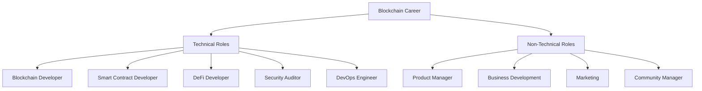
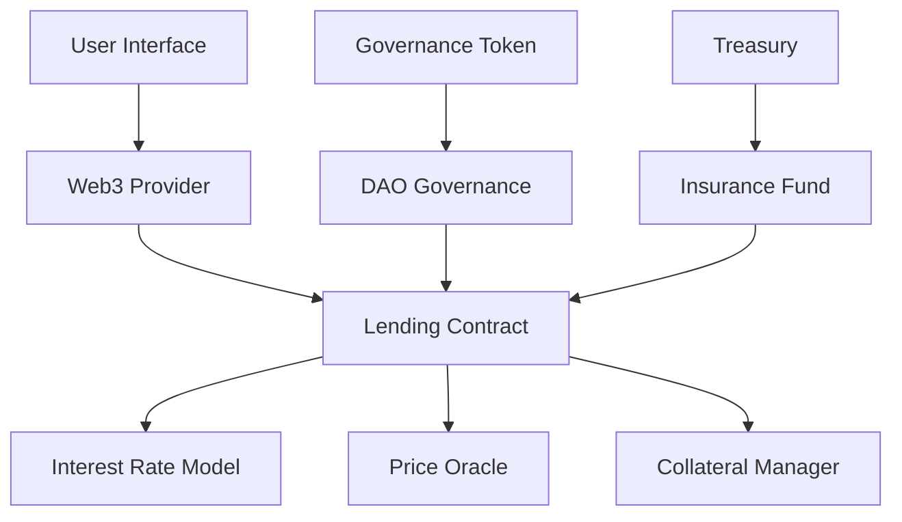

# 🚀 Blockchain Career Guide

## 🎯 Mục tiêu chương này

Cung cấp hướng dẫn chi tiết để:

- Định hướng nghề nghiệp trong blockchain
- Xây dựng portfolio mạnh mẽ
- Prepare cho interview process
- Tìm việc remote trong Web3

## 🗺️ Blockchain Career Landscape

### Career Paths Overview



### Technical Roles Deep Dive

**1. Blockchain Developer**
- **Salary range**: $80k - $200k+
- **Skills needed**: Solidity, Web3.js, React, Node.js
- **Responsibilities**: Build DApps, smart contracts, integrations

**2. Smart Contract Developer**
- **Salary range**: $100k - $250k+
- **Skills needed**: Solidity, Security auditing, Gas optimization
- **Responsibilities**: Design and implement smart contracts

**3. DeFi Developer**
- **Salary range**: $120k - $300k+
- **Skills needed**: DeFi protocols, MEV, Yield farming
- **Responsibilities**: Build DeFi products, protocols

**4. Security Auditor**
- **Salary range**: $150k - $400k+
- **Skills needed**: Security analysis, Common vulnerabilities
- **Responsibilities**: Audit smart contracts, find bugs

### Market Demand Analysis

| Role | Demand Level | Remote % | Experience Required |
|------|-------------|----------|-------------------|
| **Blockchain Developer** | Very High 🔥🔥🔥 | 90% | 1-2 years |
| **Smart Contract Dev** | Extremely High 🔥🔥🔥🔥 | 95% | 2-3 years |
| **DeFi Developer** | High 🔥🔥 | 85% | 3-5 years |
| **Security Auditor** | High 🔥🔥 | 80% | 5+ years |

## 💼 Skills Matrix by Role

### Entry Level (0-2 years)

**Must-have skills:**
```javascript
const entryLevelSkills = {
  technical: [
    "Solidity basics",
    "JavaScript/TypeScript", 
    "Web3.js or Ethers.js",
    "React.js fundamentals",
    "Git version control"
  ],
  blockchain: [
    "Blockchain fundamentals",
    "Ethereum ecosystem",
    "MetaMask integration",
    "Basic smart contracts",
    "Testnet deployment"
  ],
  tools: [
    "Remix IDE",
    "Hardhat/Truffle",
    "VS Code",
    "GitHub",
    "Etherscan"
  ]
}
```

**Nice-to-have:**
- Basic DeFi knowledge
- NFT standards (ERC-721, ERC-1155)
- Layer 2 solutions awareness
- Basic security principles

### Mid Level (2-5 years)

**Advanced skills:**
```javascript
const midLevelSkills = {
  technical: [
    "Advanced Solidity patterns",
    "Gas optimization",
    "Security best practices",
    "Testing frameworks",
    "CI/CD pipelines"
  ],
  blockchain: [
    "Multiple blockchain platforms",
    "Cross-chain development",
    "DeFi protocol integration",
    "Oracle usage",
    "Governance systems"
  ],
  architecture: [
    "System design",
    "Scalability solutions",
    "Performance optimization",
    "Database design",
    "API development"
  ]
}
```

### Senior Level (5+ years)

**Expert skills:**
```javascript
const seniorLevelSkills = {
  leadership: [
    "Technical leadership",
    "Architecture decisions",
    "Code review",
    "Mentoring junior devs",
    "Project management"
  ],
  advanced: [
    "Protocol design",
    "Tokenomics modeling",
    "Security auditing",
    "MEV strategies",
    "Governance design"
  ],
  business: [
    "Product strategy",
    "Business requirements",
    "Stakeholder management",
    "Risk assessment",
    "Compliance knowledge"
  ]
}
```

## 📝 Portfolio Development

### Portfolio Structure

```
portfolio/
├── 01-personal-website/     # Your main portfolio site
├── 02-simple-token/         # ERC-20 token project
├── 03-defi-app/            # DeFi application
├── 04-nft-marketplace/     # NFT project
├── 05-dao-governance/      # DAO project
├── 06-security-audit/      # Security findings
└── 07-contributions/       # Open source contributions
```

### Essential Projects to Build

**Project 1: ERC-20 Token (Beginner)**
```solidity
// Features to include:
- Basic ERC-20 implementation
- Mintable/Burnable functionality
- Access control (Ownable)
- Comprehensive tests
- Frontend integration

// Skills demonstrated:
- Solidity fundamentals
- Testing with Hardhat
- Web3 integration
- UI/UX design
```

**Project 2: DeFi Staking Platform (Intermediate)**
```solidity
// Features to include:
- Stake tokens to earn rewards
- Multiple reward pools
- Compound interest calculation
- Emergency withdrawal
- Admin functions

// Skills demonstrated:
- DeFi mechanics
- Mathematical calculations
- Time-based rewards
- Security considerations
```

**Project 3: NFT Marketplace (Advanced)**
```solidity
// Features to include:
- ERC-721 token creation
- Marketplace contract
- Auction mechanism
- Royalty distribution
- IPFS integration

// Skills demonstrated:
- NFT standards
- Complex state management
- Event handling
- Decentralized storage
```

### Portfolio Website Template

**index.html structure:**
```html
<!DOCTYPE html>
<html lang="en">
<head>
    <meta charset="UTF-8">
    <meta name="viewport" content="width=device-width, initial-scale=1.0">
    <title>Your Name - Blockchain Developer</title>
    <link rel="stylesheet" href="styles.css">
</head>
<body>
    <!-- Hero Section -->
    <section id="hero">
        <h1>Blockchain Developer</h1>
        <p>Building the future of decentralized applications</p>
        <div class="social-links">
            <a href="https://github.com/yourusername">GitHub</a>
            <a href="https://linkedin.com/in/yourprofile">LinkedIn</a>
            <a href="https://twitter.com/yourhandle">Twitter</a>
        </div>
    </section>

    <!-- Skills Section -->
    <section id="skills">
        <h2>Technical Skills</h2>
        <div class="skill-grid">
            <div class="skill-category">
                <h3>Blockchain</h3>
                <ul>
                    <li>Solidity</li>
                    <li>Ethereum</li>
                    <li>Web3.js</li>
                    <li>Smart Contracts</li>
                </ul>
            </div>
            <!-- More skill categories -->
        </div>
    </section>

    <!-- Projects Section -->
    <section id="projects">
        <h2>Featured Projects</h2>
        <div class="project-grid">
            <!-- Project cards -->
        </div>
    </section>

    <!-- Contact Section -->
    <section id="contact">
        <h2>Get In Touch</h2>
        <p>email@example.com</p>
    </section>
</body>
</html>
```

## 📄 Resume & Cover Letter

### Blockchain Developer Resume Template

```
[Your Name]
Blockchain Developer
📧 email@example.com | 📱 +1234567890
🌐 portfolio-website.com | 💼 linkedin.com/in/yourprofile | 🔗 github.com/yourusername

PROFESSIONAL SUMMARY
Passionate Blockchain Developer with [X] years of experience building decentralized applications and smart contracts. Expertise in Solidity, Web3.js, and DeFi protocols. Proven track record of delivering secure, gas-optimized solutions for startups and established companies.

TECHNICAL SKILLS
• Blockchain: Solidity, Ethereum, Web3.js, Ethers.js, Hardhat, Truffle
• Frontend: React.js, Next.js, TypeScript, HTML/CSS, Tailwind CSS
• Backend: Node.js, Express.js, MongoDB, PostgreSQL
• Tools: Git, Docker, CI/CD, AWS, Vercel
• Security: Smart contract auditing, OpenZeppelin, Security best practices

EXPERIENCE
Blockchain Developer | Company Name | Date - Date
• Developed and deployed 15+ smart contracts handling $2M+ in transactions
• Built DeFi staking platform with 95% gas optimization
• Led security audit resulting in 0 critical vulnerabilities
• Collaborated with cross-functional team of 8 developers

Smart Contract Developer | Previous Company | Date - Date  
• Implemented ERC-20 and ERC-721 token standards
• Created automated testing suite with 100% code coverage
• Reduced smart contract deployment costs by 40%
• Mentored 3 junior developers in blockchain best practices

PROJECTS
DeFi Staking Platform | GitHub Link | Live Demo
• Built yield farming platform with multiple reward pools
• Implemented compound interest calculations and emergency withdrawal
• Tech stack: Solidity, React.js, Web3.js, Hardhat

NFT Marketplace | GitHub Link | Live Demo
• Created full-featured NFT marketplace with auction mechanism
• Integrated IPFS for decentralized metadata storage
• Tech stack: Solidity, Next.js, Ethers.js, IPFS

EDUCATION
Bachelor of Computer Science | University Name | Year
Blockchain Certification | Institution Name | Year

CERTIFICATIONS & ACHIEVEMENTS
• Ethereum Developer Certification
• Hackathon Winner - ETHGlobal (Project Name)
• Open source contributor - 50+ GitHub stars
• Technical blog with 10k+ monthly readers
```

### Cover Letter Template

```
Dear Hiring Manager,

I am writing to express my strong interest in the Blockchain Developer position at [Company Name]. With [X] years of experience in blockchain development and a passion for decentralized technologies, I am excited to contribute to your team's mission of [company mission/goal].

In my previous role at [Previous Company], I successfully:
• Developed and deployed 15+ smart contracts handling over $2M in transactions
• Led the development of a DeFi staking platform that achieved 95% gas optimization
• Conducted comprehensive security audits resulting in zero critical vulnerabilities
• Collaborated with cross-functional teams to deliver projects on time and within budget

What particularly excites me about [Company Name] is [specific reason related to company]. Your recent work on [specific project/initiative] aligns perfectly with my experience in [relevant experience].

I am particularly proud of my work on [specific project], where I [specific achievement]. This project demonstrates my ability to [relevant skills] and my commitment to building secure, user-friendly blockchain applications.

I would welcome the opportunity to discuss how my technical skills and passion for blockchain technology can contribute to [Company Name]'s continued success. Thank you for considering my application.

Best regards,
[Your Name]
```

## 🎯 Job Search Strategy

### Where to Find Blockchain Jobs

**Specialized Job Boards:**
- **CryptoJobs**: https://crypto.jobs/
- **Web3.career**: https://web3.career/
- **AngelList**: https://angel.co/
- **Gitcoin**: https://gitcoin.co/jobs

**Traditional Platforms:**
- **LinkedIn**: Use keywords "blockchain", "web3", "solidity"
- **Indeed**: Filter for remote blockchain positions
- **Stack Overflow Jobs**: Developer-focused listings
- **RemoteOK**: Remote-first job board

**Company Categories:**

| Company Type | Examples | Pros | Cons |
|-------------|----------|------|------|
| **DeFi Protocols** | Uniswap, Aave, Compound | Cutting-edge tech | High pressure |
| **Exchanges** | Coinbase, Binance, FTX | Stable income | Less innovation |
| **Infrastructure** | Chainlink, The Graph | Impact on ecosystem | Complex systems |
| **Consulting** | ConsenSys, Deloitte | Variety of projects | Travel required |

### Application Process

**Step 1: Research & Target (Week 1-2)**
```javascript
const jobSearchProcess = {
  research: [
    "Identify 20-30 target companies",
    "Research company culture and values", 
    "Find employee contacts on LinkedIn",
    "Read company blogs and whitepapers"
  ],
  preparation: [
    "Update portfolio with latest projects",
    "Customize resume for each application",
    "Prepare company-specific cover letters",
    "Practice coding challenges"
  ]
}
```

**Step 2: Apply & Network (Week 3-6)**
```javascript
const applicationStrategy = {
  applications: {
    target: "5-10 applications per week",
    focus: "Quality over quantity",
    tracking: "Use spreadsheet to track applications"
  },
  networking: {
    linkedin: "Connect with blockchain professionals",
    twitter: "Engage with Web3 community",
    discord: "Join project Discord servers",
    events: "Attend virtual blockchain meetups"
  }
}
```

**Step 3: Interview Process (Week 4-8)**
```javascript
const interviewStages = {
  phone_screen: {
    duration: "30 minutes",
    focus: "Culture fit, basic technical questions",
    preparation: "Research company, practice elevator pitch"
  },
  technical_interview: {
    duration: "60-90 minutes", 
    focus: "Coding challenge, architecture questions",
    preparation: "Practice Solidity, review common patterns"
  },
  final_round: {
    duration: "2-4 hours",
    focus: "Team fit, project walkthrough",
    preparation: "Prepare detailed project explanations"
  }
}
```

## 💡 Interview Preparation

### Technical Interview Topics

**Solidity Fundamentals:**
```solidity
// Be prepared to explain concepts like:

// 1. Storage vs Memory vs Calldata
function example(uint[] memory data) public {
    uint[] storage storageArray = myArray;
    uint[] calldata calldataArray = data;
}

// 2. Gas optimization techniques
function optimized() external {
    uint256 localVar = storageVar; // Cache storage reads
    
    unchecked {
        localVar++; // Skip overflow checks when safe
    }
    
    storageVar = localVar;
}

// 3. Security patterns
modifier onlyOwner() {
    require(msg.sender == owner, "Not owner");
    _;
}

function withdraw() external onlyOwner {
    (bool success, ) = msg.sender.call{value: address(this).balance}("");
    require(success, "Transfer failed");
}
```

**Common Interview Questions:**

1. **What is the difference between transfer, send, and call?**
```solidity
// transfer: 2300 gas limit, throws on failure
payable(recipient).transfer(amount);

// send: 2300 gas limit, returns bool
bool success = payable(recipient).send(amount);

// call: No gas limit, returns bool and data
(bool success, ) = payable(recipient).call{value: amount}("");
```

2. **Explain the proxy pattern:**
```solidity
// Proxy contract delegates calls to implementation
contract Proxy {
    address public implementation;
    
    fallback() external payable {
        address impl = implementation;
        assembly {
            calldatacopy(0, 0, calldatasize())
            let result := delegatecall(gas(), impl, 0, calldatasize(), 0, 0)
            returndatacopy(0, 0, returndatasize())
            
            switch result
            case 0 { revert(0, returndatasize()) }
            default { return(0, returndatasize()) }
        }
    }
}
```

3. **How would you prevent reentrancy attacks?**
```solidity
// Using OpenZeppelin's ReentrancyGuard
import "@openzeppelin/contracts/security/ReentrancyGuard.sol";

contract SecureContract is ReentrancyGuard {
    mapping(address => uint256) public balances;
    
    function withdraw() external nonReentrant {
        uint256 balance = balances[msg.sender];
        require(balance > 0, "No balance");
        
        balances[msg.sender] = 0; // State change before external call
        
        (bool success, ) = msg.sender.call{value: balance}("");
        require(success, "Transfer failed");
    }
}
```

### System Design Questions

**Question: Design a DeFi lending protocol**



**Key components to discuss:**
- Collateralization ratios
- Interest rate calculations
- Liquidation mechanisms
- Oracle price feeds
- Governance system

### Behavioral Questions

**STAR Method examples:**

**Question: "Tell me about a challenging project you worked on."**

**Situation**: Our DeFi protocol was experiencing high gas costs
**Task**: Reduce gas consumption by 40% without compromising security
**Action**: 
- Analyzed contract bytecode and identified optimization opportunities
- Implemented packed structs and bit manipulation
- Used unchecked blocks for safe operations
- Optimized storage layout

**Result**: Achieved 45% gas reduction, saving users $50k+ monthly in fees

## 🎓 Continuous Learning

### Stay Updated Resources

**Daily Reading:**
- **DeFi Pulse**: https://defipulse.com/
- **The Block**: https://www.theblock.co/
- **Messari**: https://messari.io/
- **Bankless**: https://banklesshq.com/

**Technical Resources:**
- **Ethereum Yellow Paper**: Technical specification
- **EIPs**: https://eips.ethereum.org/
- **OpenZeppelin Blog**: Security best practices
- **Trail of Bits Blog**: Security research

**Podcasts:**
- Bankless Podcast
- Unchained Podcast  
- The Defiant Podcast
- Epicenter Podcast

### Certification Programs

**Professional Certifications:**
- **Consensys Academy**: Ethereum Developer Program
- **B9lab**: Ethereum Developer Course
- **Ivan on Tech Academy**: Blockchain courses
- **Chainlink**: Oracle development

**Free Learning:**
- **Crypto Zombies**: Learn Solidity through games
- **Buildspace**: Project-based learning
- **Patrick Collins**: YouTube tutorials
- **Austin Griffith**: Scaffold-ETH tutorials

## 💰 Salary Negotiation

### Market Research

**Salary ranges by location (2024):**

| Location | Entry Level | Mid Level | Senior Level |
|----------|------------|-----------|--------------|
| **US (Remote)** | $80k-120k | $120k-200k | $200k-400k+ |
| **Europe (Remote)** | €60k-90k | €90k-150k | €150k-300k+ |
| **Asia-Pacific** | $50k-80k | $80k-140k | $140k-250k+ |

**Total compensation includes:**
- Base salary
- Equity/tokens
- Signing bonus
- Annual bonus
- Benefits (health, vacation, etc.)

### Negotiation Strategy

**Research phase:**
```javascript
const negotiationPrep = {
  marketResearch: [
    "Check Glassdoor for company salaries",
    "Use levels.fyi for tech compensation",
    "Ask peers in blockchain community",
    "Research company funding/revenue"
  ],
  valueProposition: [
    "Quantify your impact in previous roles",
    "Highlight relevant blockchain experience",
    "Demonstrate problem-solving abilities",
    "Show passion for the space"
  ]
}
```

**Negotiation tactics:**
1. **Always negotiate**: Even if first offer seems good
2. **Focus on total compensation**: Not just base salary
3. **Ask for what you want**: Don't be afraid to aim high
4. **Have alternatives**: Multiple offers strengthen position
5. **Be professional**: Maintain positive relationship

## 🌐 Remote Work Success

### Remote Work Setup

**Essential tools:**
```javascript
const remoteWorkStack = {
  communication: [
    "Slack/Discord for team chat",
    "Zoom/Google Meet for video calls",
    "Loom for async video updates",
    "Calendly for meeting scheduling"
  ],
  development: [
    "GitHub for code collaboration",
    "Notion/Obsidian for documentation",
    "Figma for design collaboration", 
    "Linear/Jira for project management"
  ],
  blockchain: [
    "Tenderly for debugging",
    "Etherscan for transaction analysis",
    "DeFi Pulse for protocol monitoring",
    "Dune Analytics for data analysis"
  ]
}
```

**Best practices:**
- **Set boundaries**: Clear work hours and availability
- **Over-communicate**: Regular updates and status reports
- **Document everything**: Decisions, processes, learnings
- **Stay connected**: Regular video calls with team
- **Continuous learning**: Stay updated with latest developments

### Building Remote Relationships

**Team integration:**
- Participate in virtual coffee chats
- Contribute to team discussions
- Offer help to colleagues
- Share learnings and insights

**Community involvement:**
- Join Web3 Discord servers
- Attend virtual meetups and conferences
- Contribute to open source projects
- Write technical blog posts

## ✅ Career Action Plan

### Month 1-2: Foundation
- [ ] Complete blockchain fundamentals course
- [ ] Build first ERC-20 token project
- [ ] Set up professional GitHub profile
- [ ] Create LinkedIn profile optimized for blockchain
- [ ] Join 3-5 Web3 Discord communities

### Month 3-4: Skill Building
- [ ] Learn advanced Solidity patterns
- [ ] Build DeFi staking platform
- [ ] Contribute to open source project
- [ ] Write first technical blog post
- [ ] Network with 20 blockchain professionals

### Month 5-6: Job Search
- [ ] Create portfolio website
- [ ] Apply to 30+ positions
- [ ] Complete 5+ technical interviews
- [ ] Negotiate job offer
- [ ] Start new blockchain role!

## 🔗 Navigation

- **Previous**: [[12-Portfolio-Project]] - Capstone project
- **Next**: Advanced career topics
- **Related**: [[01-Setup-Development-Environment]] - Technical foundation

## ✅ Key Success Factors

1. **Strong technical foundation**: Master Solidity and Web3 tools
2. **Impressive portfolio**: Build 3-5 high-quality projects
3. **Active networking**: Engage with Web3 community
4. **Continuous learning**: Stay updated with latest developments
5. **Persistence**: Job search takes time, don't give up!

---

**Status**: 🚀 Ready to launch your career | **Timeline**: 6 months to first role
